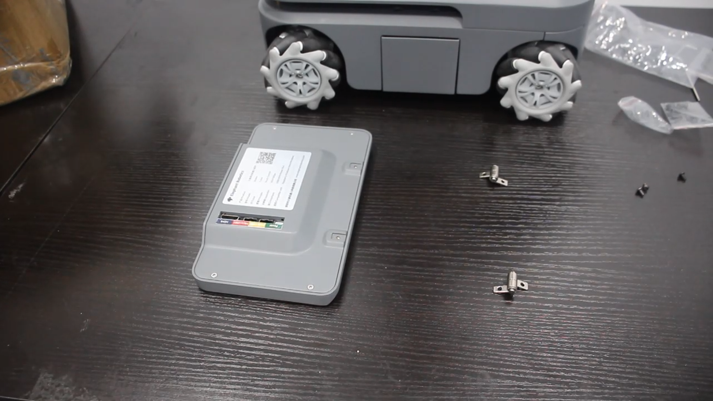
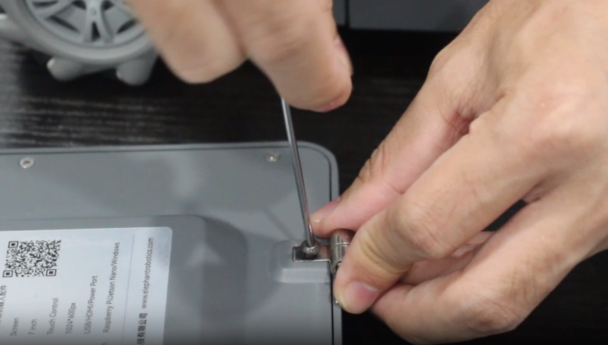
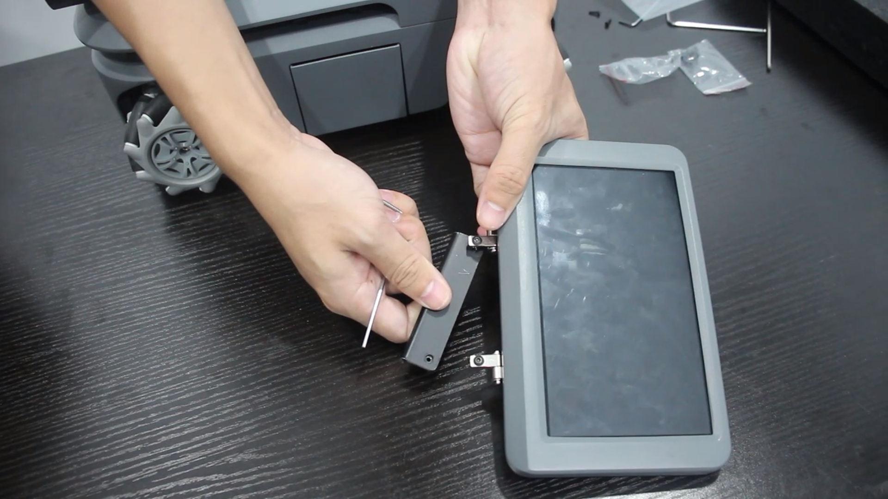
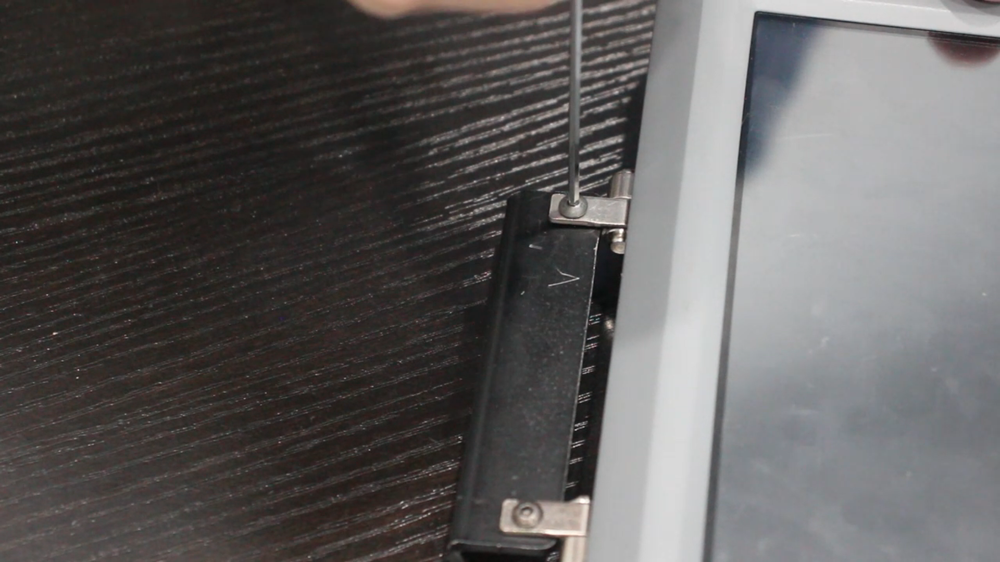
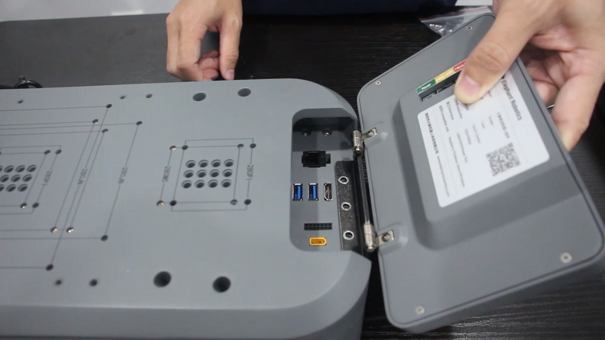
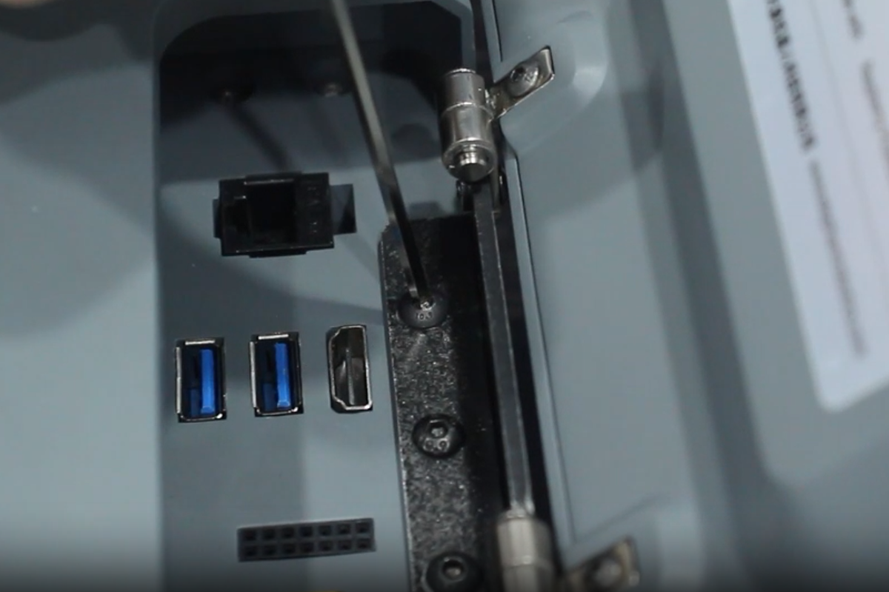
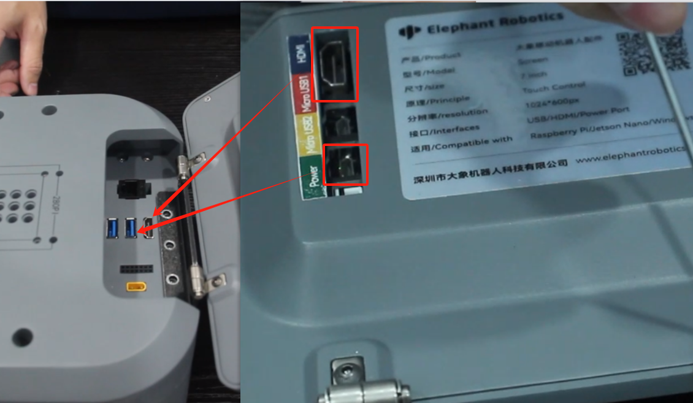

# **7-inch IPS High-Definition Touch Screen**

> **Compatible models:** myAGV PI 2023, myAGV Jetson Nano 2023

The 7-inch IPS high-definition touchscreen is a small-sized LCD display with clear high-definition and wide-angle viewing characteristics. It also features touch functionality, allowing
users to interact through simple touch gestures. It can be integrated for use with the myAGV 2023 series.

## Product parameters

| **Parameter** | **Specification**                    |
| ------------- | ------------------------------------- |
| Display Size  | 7 inches                              |
| Principle     | Touch Control                         |
| Resolution    | 1024 * 600px                          |
| Interfaces    | USB/HDMI/Power                        |
| Compatibility | Raspberry Pi/NVIDIA/Windows           |
| Weight        | Approximately 350g                    |
| Compatibility | myAGV PI 2023, myAGV Jetson Nano 2023 |

## How to use

1.Take out the IPS touch screen, hinges and matching screws from the accessory box.

2.Fix with screws.

3.Take out the connector and tighten the screws according to the position shown in the picture.

4.Tighten the screws into the three screw holes corresponding to the connector.

5.Connect the HDMI cable and power cable to myAGV

## Mall link: 

-   [Taobao](https://item.taobao.com/item.htm?id=745304010906&spm=a312a.7700824.w4002-23353347473.51.3a00b6e28MpDla)
-   [shopify](https://shop.elephantrobotics.com/collections/myagv/products/7-inch-ips-high-definition-touchscreen)

----

[← Accessories Tools Page](../1.4-AccessoriesTools.md#touch-screen) | [Next Page →](../1.4.2-BackupBattery/1-BackupBattery.md)

