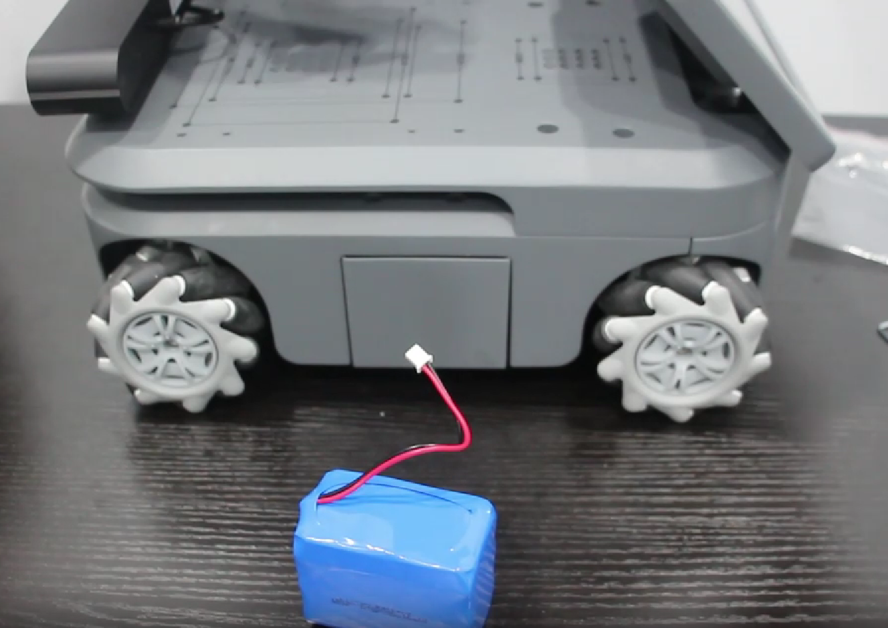
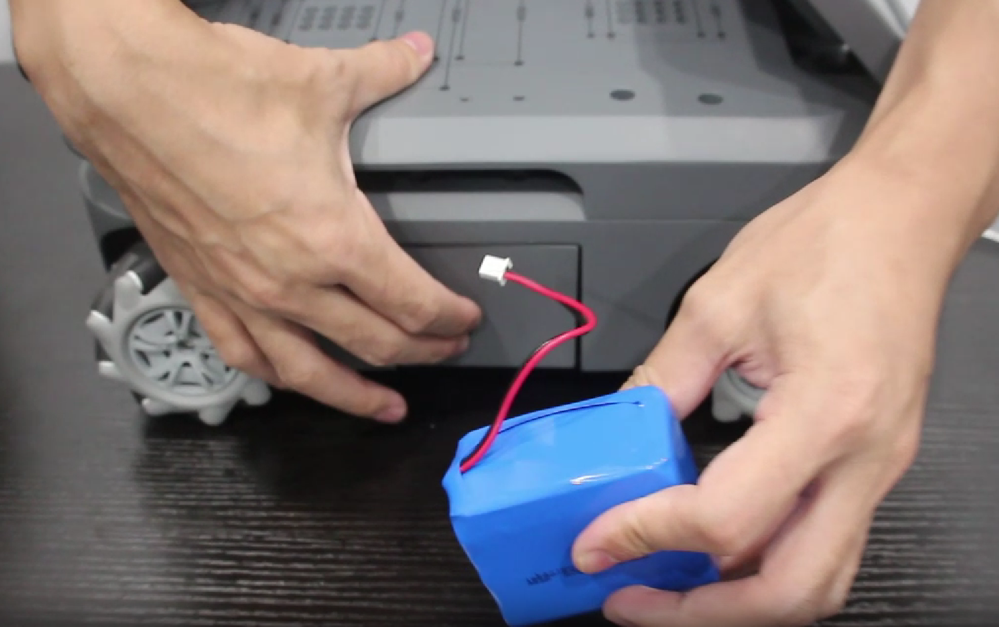
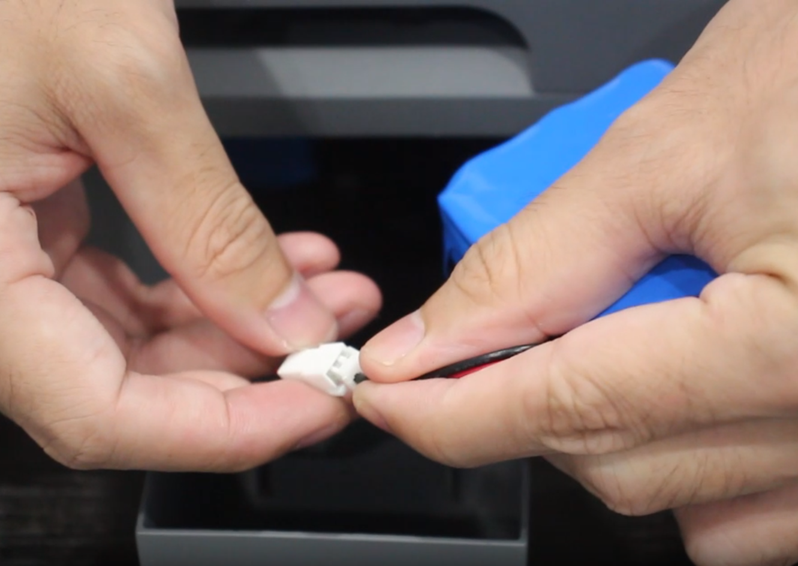
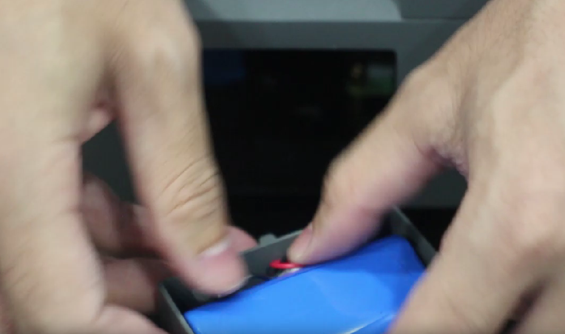
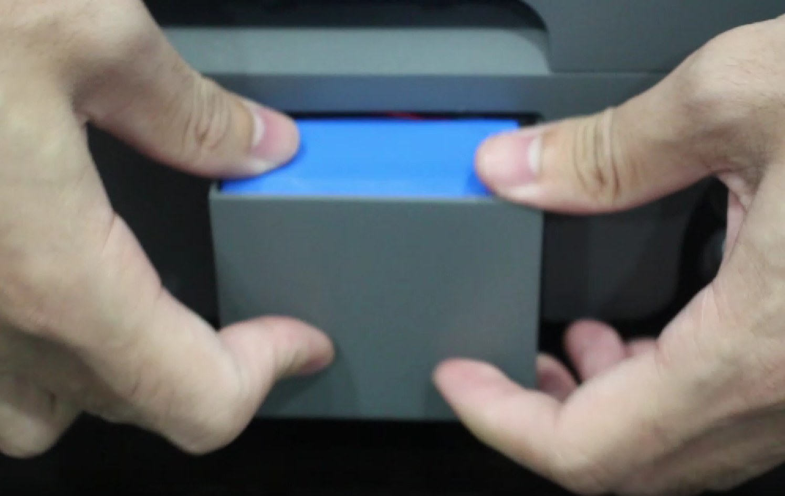
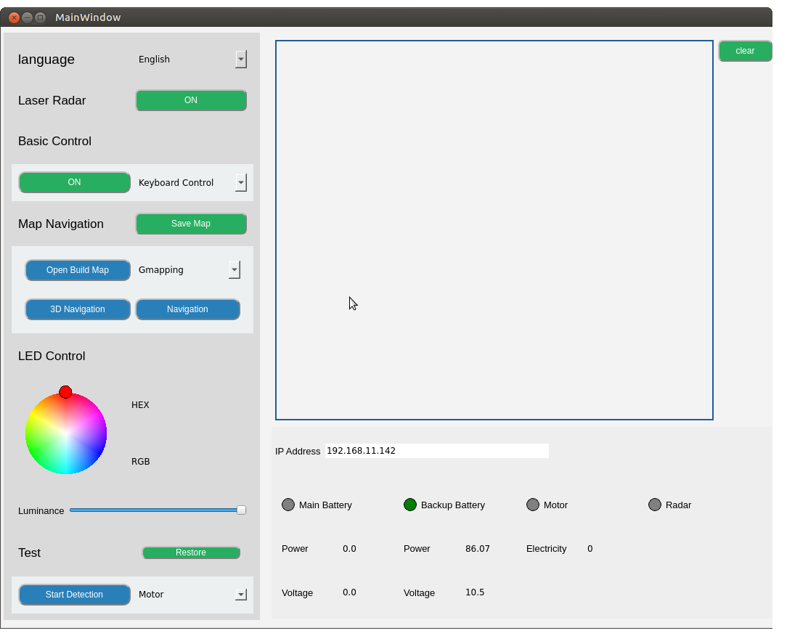

# Backup Battery

> **Compatible models:** myAGV PI 2023, myAGV Jetson Nano 2023

With the same specifications as the primary battery of myAGV 2023 and a quick installation method, it extends the runtime of the myAGV 2023 series.

## Product parameters

| **Parameter** | **Specification**                    |
| ------------- | ------------------------------------- |
| Capacity      | 6400mAh                                |
| Voltage       | 11.1V                                  |
| Compatibility | myAGV PI 2023 , myAGV Jetson Nano 2023 |

## How to use

1.Take out the spare battery from the accessory box and find the battery compartment on the left side of myAGV.

2.Press both sides of the battery compartment by hand, and the battery compartment shell will automatically pop out, connecting the positive and negative interfaces of the backup battery.

3.Put the battery upright into the battery compartment, and then insert the white plug into the empty position to prevent interference with the shell installation.

> How do I know if the battery is properly installed and recognized?

Please open the [myAGV_UI](../../../../5-BasicApplication/5.2-ApplicationUse/5.2.3-myagv_UI/user_manual.md). The indicator light of the backup battery will light up and the voltage value can be returned, indicating that the installation is successful.

## Mall link: 

-   [Taobao](https://item.taobao.com/item.htm?id=745304010906&spm=a312a.7700824.w4002-23353347473.51.3a00b6e28MpDla)
-   [shopify](https://shop.elephantrobotics.com/collections/myagv/products/spare-battery-for-myagv-2023)

----

[← Accessories Tools Page](../1.4-AccessoriesTools.md#touch-screen)