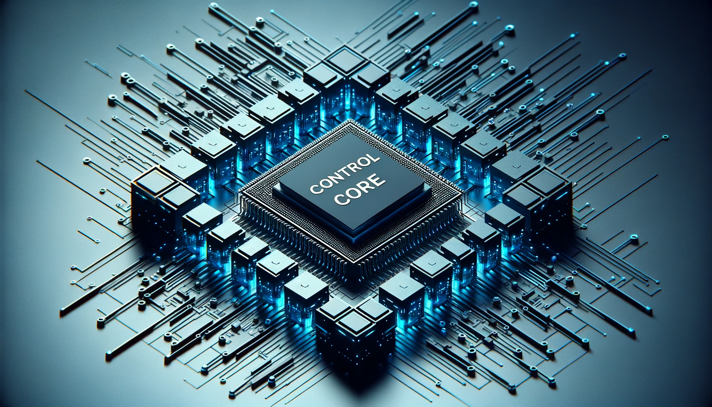

# Control core parameter

## 1 Master controller specification table

| Index            | Parameter          |
| ---------------- | ------------------ |
| Main Control     | raspberry pi       |
| CPU              | Broadcom BCM2711，  64-bit 1.5GHz quad-core |
| GPU              | 500 MHz VideoCore VI |
| Memory           | 4 GB                |
| Net Interface    | *1                  |
| Bluetooth        | 2.4G/5G             |
| Wireless         | 802.11ac            |
| Core Video Interface | HDMI*1          |
| USB              | USB 2.0 *2          |
| Ethernet         | RJ45*1              |
| IO               | G7, G8, G9, G10, G11, G17,   G18, G22, G23, G24, G25, G27 |

---

 [← Previous Page](../2-ProductFeature/2.1-MachineSpecification.md)| [Next Page →](../2-ProductFeature/2.3-MechanicalStructureParameter.md)