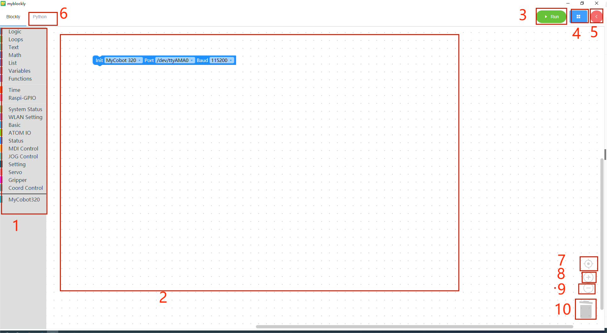
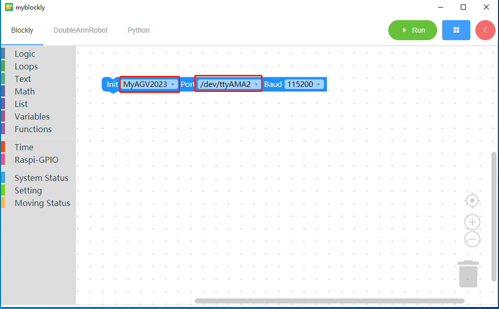
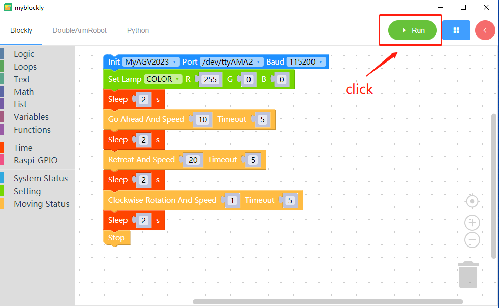
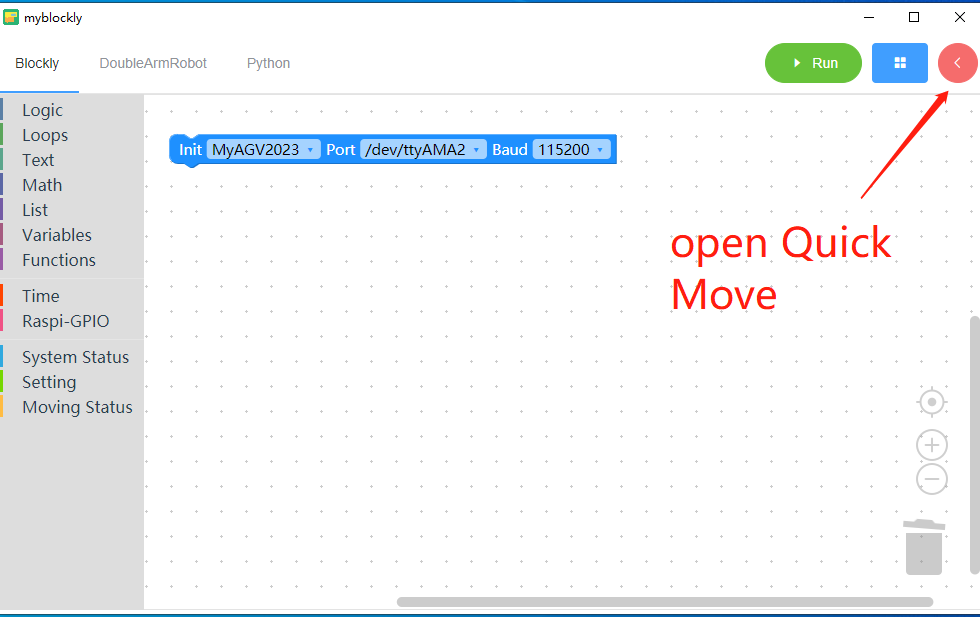
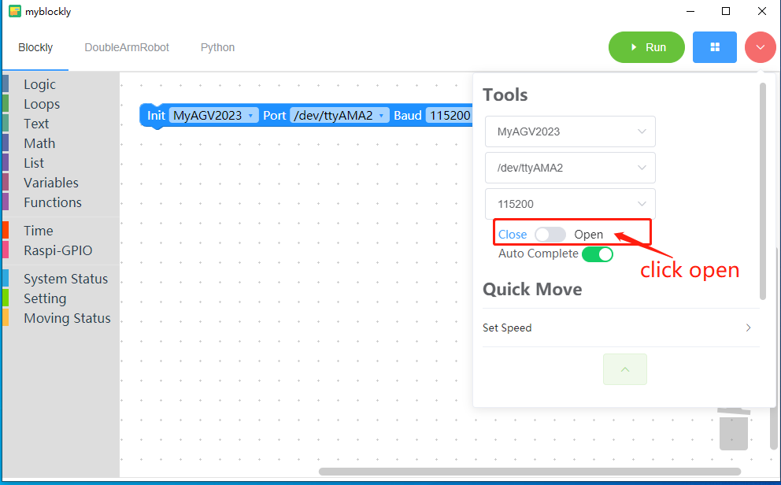
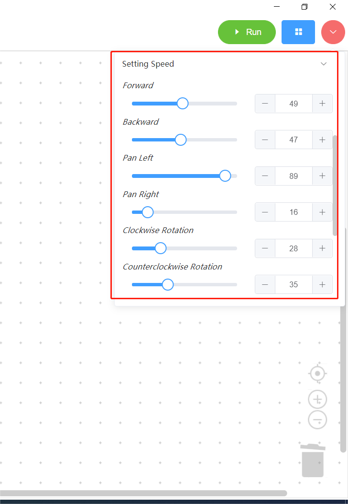
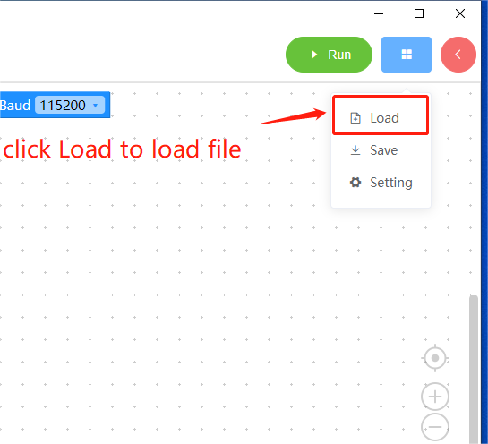

# 3 myBlockly interface display and use of basic functions

| serial number | illustrate                                                   |
| :------------ | ------------------------------------------------------------ |
| 1             | Toolbox bar: Click on a specific category to select different building blocks |
| 2             | Workspace: You can drag the building blocks of the toolbox to the workspace for use |
| 3             | Run button: Run the code in the workspace                    |
| 4             | The following menu will pop up after clicking:  - Save: Save the current workspace  - Load: Load the saved workspace  - Settings: Enter the settings page, where you can set the language and theme |
| 5             | After clicking, the control panel will pop up. In the panel, you can quickly control the movement of the robotic arm by clicking "+/-" in the joint control or coordinate control bar. 6 After clicking, you can view the python code generated in the workspace. 7 Center the workspace. 8 Enlarge the workspace. 9 Reduce the workspace. |
| 6             | Click to view the python code generated by the workspace     |
| 7             | Center the workspace                                         |
| 8             | Zoom into workspace                                          |
| 9             | Reduce work area                                             |
| 10            | Trash can: Drag the building blocks in the workspace here to delete the building blocks; click the trash can at the same time to view and restore the deleted building blocks |

## **Program running**

Open myBlockly, select the machine as `myAGV 2023`, select the port, and select the baud rate as `115200`.

**`myAGV 2023 Pi` version port is `/dev/ttyAMA2`;**

Drag some blocks into the workspace and click Run button.

According to the above building blocks, the machine will do the following actions:

\- Set the machine RGB light mode to flash mode and  color to Red 255.

\- Wait 2 seconds.

\- The machine is moving forward at a speed of 10,with a default motion time of 5 seconds.

\- Wait 2 seconds

\- The machine is moving backward at a speed of 20,with a default motion time of 5 seconds.

\- Wait 2 seconds

\- The machine is spinning clockwise at the speed of 1,with a default motion time of 5 seconds.

\- Wait 2 seconds

\- Machine stop.

**Using the control panel**

1. Open Quick Move

  

2. Connect machine

  

3. Set speed

  You can customize the speed in each direction of motion.

  

4. Motion control section

  

  \- Forward button: Click this button to control the machine forward movement.

  \- Back button: Click this button to control the backward movement of the machine.

  \- Left movement button: Click this button to control the left movement of the machine.

  \- Right movement button: Click this button to control the right movement of the machine.

  \- Clockwise button: Click this button to control the machine to move clockwise.

  \- Counterclockwise button: Click this button to control the counterclockwise movement of the machine.

  \- Motion stop button: Click this button to stop the machine.

## **Program saving and loading**

MyBlockly's program is saved in *.json format. Click the blue box in the upper right corner of the interface. When the "Save" option appears, click it to save the program.

Also click the blue box and click the "Load" option to import the saved program.

 
 
 
 
 

>**The basic function demonstration is completed, you can check the other information in [here](https://download-elephantrobotics.oss-cn-shenzhen.aliyuncs.com/software/myblockly/README/agv-myblockly%E4%BD%BF%E7%94%A8%E8%AF%B4%E6%98%8E%E4%B9%A6-en.pdf)**