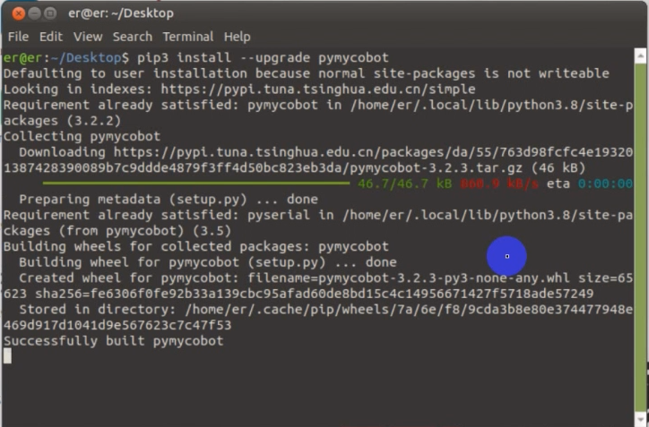

# Environment Building

pymycobot is a Python package used for serial communication with myCobot. It supports Python2, Python3.5 and later versions.

Before using pymycobot, make sure to build a Python environment. Follow the steps below to install Python.

## 1 Download and Installation of Python


At present, Python has two versions: `2.x` and `3.x`. These two versions are incompatible with each other. This section takes the version `3.x` as an example due to its increasing popularity.

### 1.1 Installing Python

The Raspberry Pi version comes with an Ubuntu (V-20.04) system and a built-in Python development environment, so you don't need to build and manage it.

## 2 Preparations

Enter the following command in the terminal: 

```
pip install --upgrade pymycobot 
```



## 3 Simple Demo

Create a new Python file, and type the following codes.

```python
from pymycobot.mycobot import MyAgv
import time

MA = MyAgv('/dev/ttyAMA2', 115200)

# forward
MA.go_ahead(10,2)

# backward
MA.retreat(10,2)

# move left
MA.pan_left(10,2)

# move right
MA.pan_right(10,2)
```


## 4 Run the example file:

```
python3 move_agv.py
```

The agv will move in four directions for 5 seconds by default.

---

[← Previous Page](../README.md) | [Next Page →](6.1.2-API.md)