# 深度相机

> **兼容型号：** myAGV Jetson Nano 2023

Astra Pro 2 深度相机目前只在myAGV JN版本上使用。而且Astra Pro 2 深度相机是选配产品，需要[额外购买](https://item.taobao.com/item.htm?id=745304010906&spm=a312a.7700824.w4002-23353347473.51.3a00b6e28MpDla&skuId=5309239682811)。

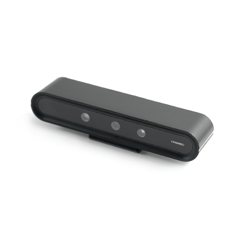

Astra Pro 2 深度相机是基于 3D 结构光成像技术获取物体的深度图像，同时利用彩色相机采集物体的彩色图像，Astra Pro 2 适用于 0.6m-6m 距离进行 3D 物品和空间扫描的智能产品，可实现测量距离内的物体深度数据测量。

## Astra Pro 2基本参数

|   参数   |              规格              |
| :------: | :----------------------------: |
|   名称   |          Astra Pro 2           |
|   型号   |           A20113-000           |
| 工作距离 |           0.6m - 6m            |
|   尺寸   |     164.85× 36.00 × 40 mm      |
|   重量   |             145g±5             |
|   功耗   | 平均功耗＜2.0W，峰值功耗＜2.5W |
|   基线   |              55mm              |
|   接口   |        USB Type A 公头         |
| 供电方式 |            USB 2.0             |
| 供电建议 |            5V 0.5A             |
| 工作温度 |           10°C-40°C            |
| 测量精度 |             3mm@1m             |

## Astra Pro 2深度图像参数

|       参数       |                             规格                             |           备注           |
| :--------------: | :----------------------------------------------------------: | :----------------------: |
| 分辨率<br/>@帧率 | 1280x1024@7fps<br/>1280x960@7fps<br/>640x480@10/15/30fps<br/>320x240@10/15/30fps<br/>160x120@10/15/30fps |                          |
|     深度 FOV     |                    H58.4° V45.5° D70°±5°                     |        1m 处测量         |
|     深度格式     |                         Y16/Y12/Y11                          | 深度单位<br />0.1mm、1mm |

## Astra Pro 2彩色图像参数

|       参数       |                             规格                             |
| :--------------: | :----------------------------------------------------------: |
| 分辨率<br/>@帧率 | 1280x960@7fps<br/>640x480@10/15/30fps<br/>320x240@10/15/30fps |
|     彩色 FOV     |                    H62.7° V49° D75.1°±5°                     |
|     图像格式     |                             UYVY                             |

## Astra Pro 2参数

|   参数   |          规格          |
| :------: | :--------------------: |
| 操作系统 |     Windows/ Linux     |
| 适用场景 |          室内          |
|  安全性  |      Class1 激光       |
| 相机原理 |       单目结构光       |
|   认证   | RoHS 2.0/REACH/Class 1 |
## 安装教程

1.取出Astra Pro 2 深度相机和安装零部件。

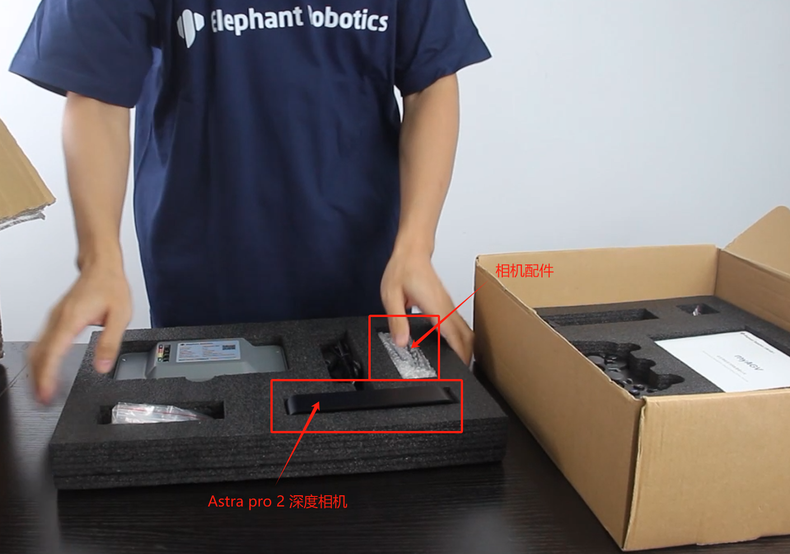

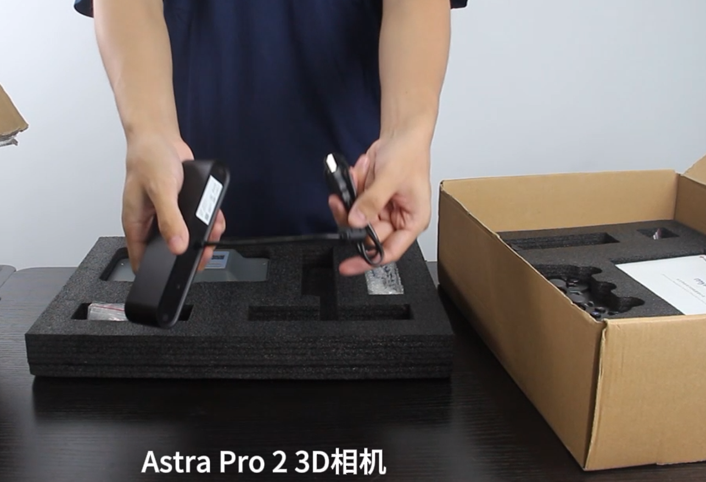

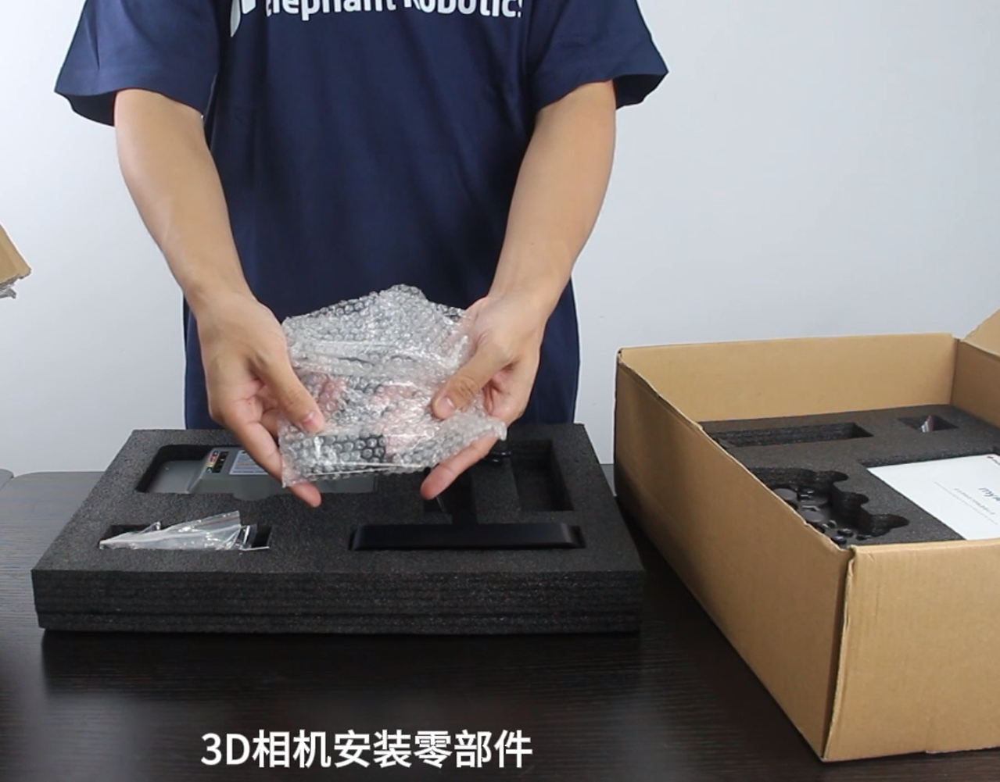

2.取出2个M2*4螺丝，将连接件和深度相机进行固定。

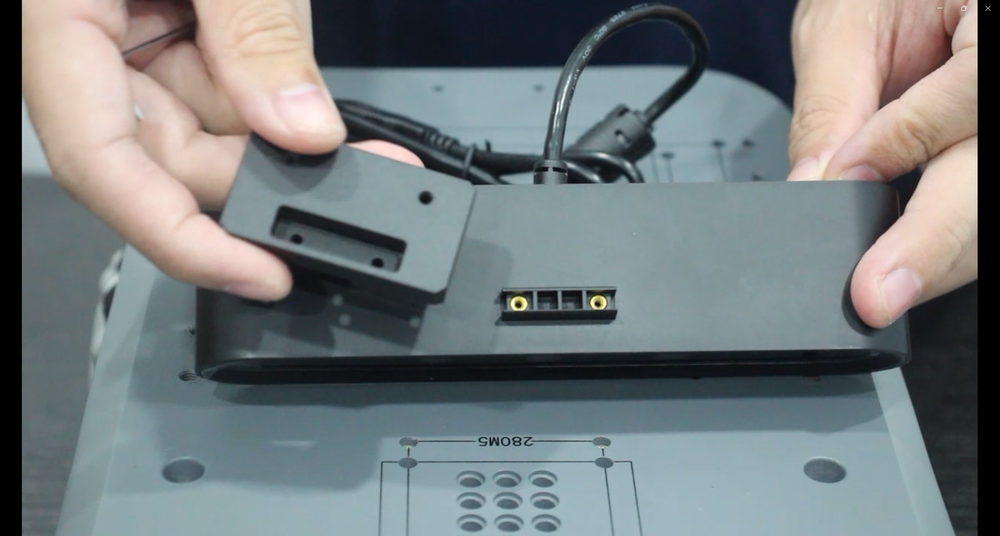

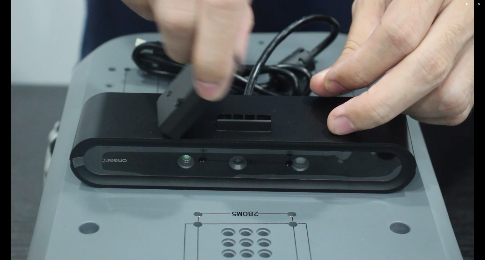

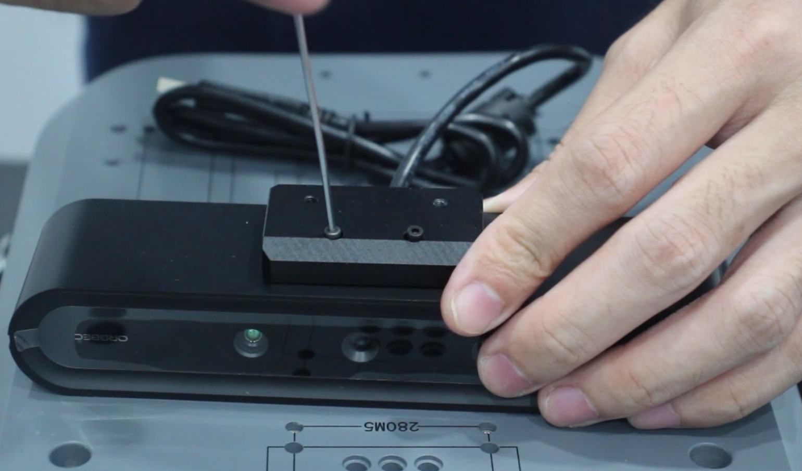

3.使用内六角扳手将4颗M4*8螺丝拆卸下来。

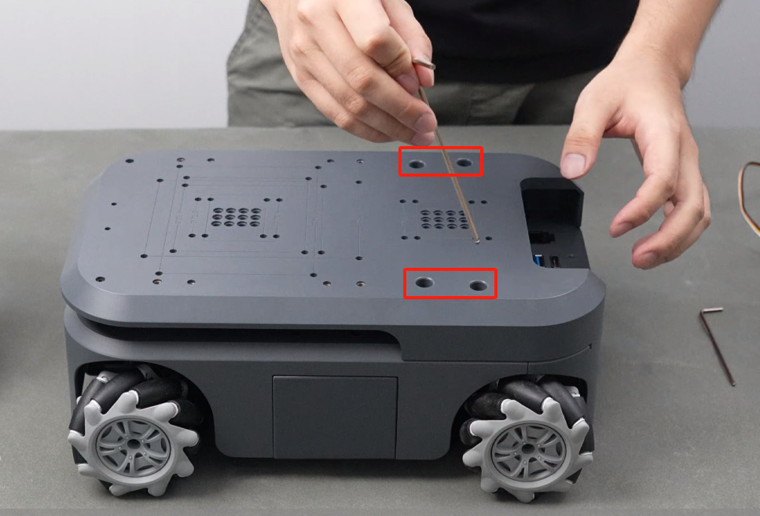

4.使用内六角扳手将2颗M2.5*2螺丝拆卸下来


5.将外壳翻转，使相机的螺丝孔对齐。

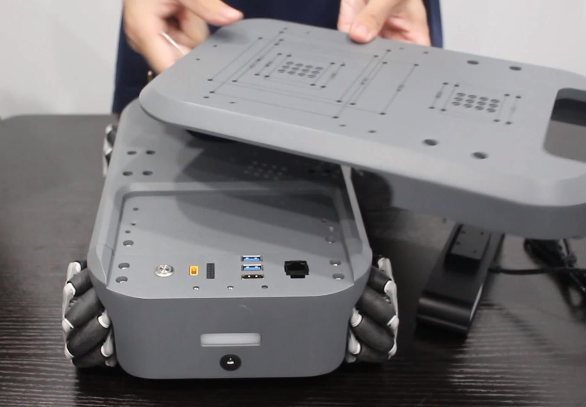

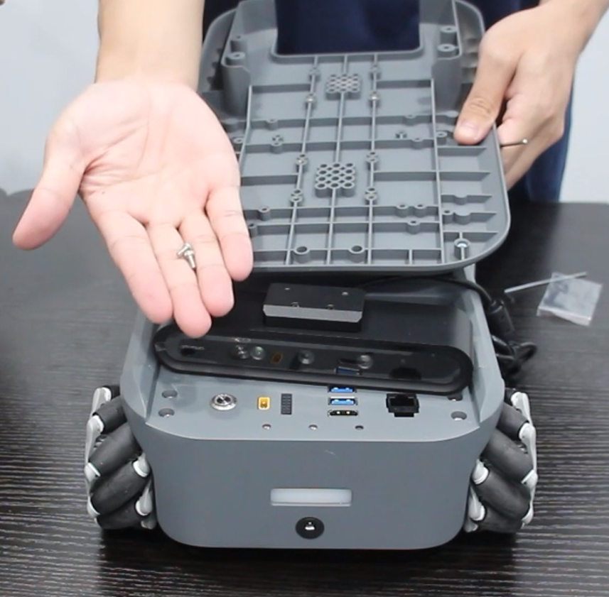

6.拧上M4*4螺丝进行安装。

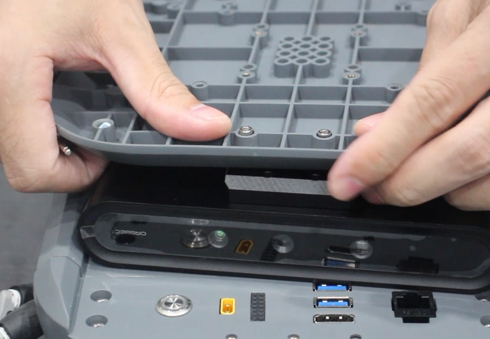

7.相机usb线接到myAGV的usb接口

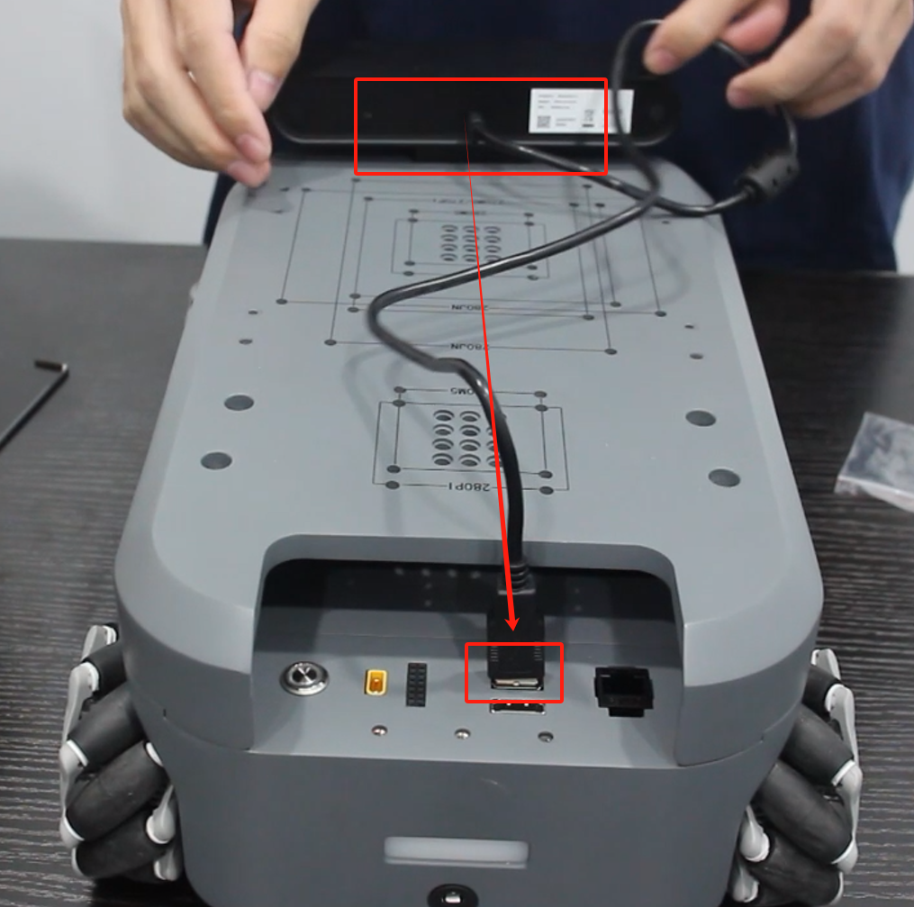

## 使用教程

Astra Pro 2 深度相机目前主要以ros开发

```
roslaunch orbbec_camera astra_pro2.launch
```

用户可以调用的ros话题

- `/camera/color/camera_info`: The color camera info.
- `/camera/color/image_raw`: The color stream image.
- `/camera/depth/camera_info`: The depth camera info.
- `/camera/depth/image_raw`: The depth stream image.
- `/camera/depth/points`: The point cloud, only available when `enable_point_cloud` is `true`.
- `/camera/depth_registered/points`: The colored point cloud, only available when `enable_colored_point_cloud` is `true`.
- `/camera/left_ir/camera_info`: The left IR camera info.
- `/camera/left_ir/image_raw`: The left IR stream image.
- `/camera/right_ir/camera_info`: The right IR camera info.
- `/camera/right_ir/image_raw`: The right IR stream image.
- `/diagnostics`: The diagnostic information of the camera, Currently, the diagnostic information only includes the temperature of the camera.

其他详情可以参考[myAGV-rtabmap建图](../../../6-SDKDevelopment/6.2-ApplicationBaseROS1/6.2.8-Rtabmap.md)


## 购买链接：

- [淘宝](https://item.taobao.com/item.htm?id=745304010906&spm=a312a.7700824.w4002-23353347473.51.3a00b6e28MpDla&skuId=5309239682811)
- [shopify](https://shop.elephantrobotics.com/collections/myagv-smart-navigation-robot/products/astra-pro-2-for-myagv-jetson-nano-2024)

---

[← 周边配件页](../1.4-AccessoriesTools.md#touch-screen)
