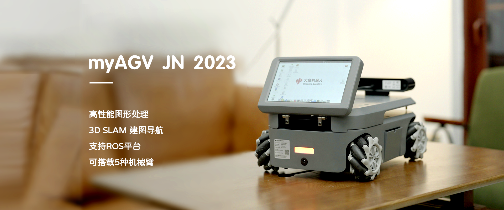

# myAGV 2023

## 产品介绍

myAGV Jetson Nano 2023 是myAGV的升级款，该底盘采用**英伟达 Jetson Nano B01**为核心处理器，是为应对客户的**图像视觉处理**需求，采用竞赛级麦克纳姆轮，全包裹金属车架；ROS开发平台内置三种slam算法，满足建图、导航方向的学习；提供丰富的扩展接口，可搭载my系列机械臂，实现移动抓取，完成更多应用。

## 支持扩展开发

myAGV Jetson Nano 2023 鼓励用户参与扩展开发，以充分发挥其潜力：

- **编程语言**：支持 Python、ROS1 等，提供多种编程选择。

- **硬件接口**：包括 IO、USB 等，便于连接各种传感器和执行器。

- **软件库**：提供丰富的开放源代码库和应用程序接口，以简化开发流程。 

## 文档学习内容

通过阅读官方文档，您将获得以下收获：

- **基本设置**：安装、配置和初始操作指南。
- **编程指南**：如何使用各种语言和平台对 myAGV Jetson Nano 2023 进行控制和编程。
- **定制开发**：如何利用扩展接口和软件库进行定制应用程序开发。
- **成功故事**：深入了解 myAGV Jetson Nano 2023 在不同领域的应用。
- **维护和故障排除**：维护提示和常见问题的解决方案。

## 购买地址

如果您有兴趣购买该设备，请点击下面的链接。

- 淘宝: https://shop504055678.taobao.com
- shopify: https://shop.elephantrobotics.com/

## 章节摘要

现在您已经掌握了产品的基本功能和应用，让我们一起深入了解更多详细信息。本手册的下一部分将引导您进入各个子章节，让您更全面地了解我们产品的设计理念、目标用户群、推荐使用场景以及支持的附件和工具。

请根据您的兴趣和要求选择以下部分：

[1.1-设计理念](1.1-DesignPhilosophy.md)  
在本节中，我们将介绍产品的设计原则和理念，帮助您更好地理解产品为何具有特定的功能和优势。

[1.2-适用人群](1.2-SuitableUsers.md)  
了解哪些用户群体最适合使用该产品，以及该产品如何满足不同用户的不同需求。

[1.3-应用场景](1.3-ApplicationScenario.md)  
在本部分中，我们将阐明该产品在各种情况下的最佳应用方法，使您能够充分利用其功能。

[1.4-周边配件](1.4-AccessoriesTools/1.4-AccessoriesTools.md)  
检查支持的附件和工具，确保您能充分发挥产品的潜力。

请根据您的兴趣点击相应链接，获取更多详细信息。如果您有任何疑问或需要进一步帮助，请随时联系我们的客户支持团队。我们将竭诚为您提供支持和指导。感谢您选择我们的产品，我们期待为您提供卓越的用户体验！ 

## 感谢阅读 

非常感谢您抽出时间阅读 myAGV Jetson Nano 2023 用户手册。我们希望本手册能帮助您更好地理解和有效使用这款机器人，从而激发您的创造力。如果您有任何疑问或需要进一步帮助，请随时联系我们的客户支持团队。我们期待看到您使用 myAGV Jetson Nano 2023 完成的创新项目，并欢迎您加入我们快速成长中的开发人员社区。 

---

如果您已经阅读了本章的所有内容，请继续阅读下一章。 

[下一章 →](../2-ProductFeature/README.md) 
