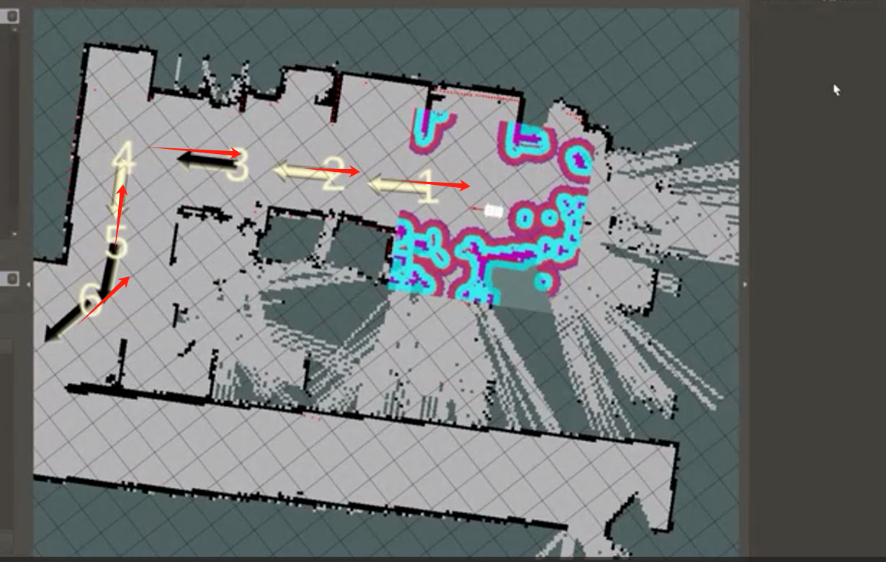

# 软件问题

## mystudio相关

**Q：关于mystudio下载固件的细节**

1. 一般情况下，出厂已经内置固件，除非在机器异常情况，否则无需重新刷固件
2. 下载固件的过程中需要连接网络
3. 选择对应机型的固件，不要选错其他机型


## python相关

**Q:运行提示缺少库文件Q:遇到报错信息：ModuleNotFoundError: No module named “pymycobot”，如何处理？**

- A: 报错原因可能是pymycobot异常，对应的解决方法是重新安装pymycobot，指令是 `pip3 install pymycobot --upgrade --user`
  
**Q:AGV用距离或角度控制的API有无？**

- A:目前AGV API 中的距离控制是由时间和速度计算组合决定的。目前还没有专门用于指定移动距离或车轮角度的 API。如果您需要行驶特定的距离，可以计算距离转换所需的时间和速度。

**Q:AGV JN运行启动激光雷达文件时缺少scripts文件夹该怎么解决？**

- A：由于AGV JN镜像版本比较老，目前无法通过重新烧录镜像的方法解决这个问题
需要在GitHub文件当中下载缺少的源文件，导入进AGV即可
具体链接如下：
https://github.com/elephantrobotics/myagv_ros/tree/myagv_ros_2023JN/myagv_odometry 


## ROS相关

**Q：启动不了雷达里程计如何处理或建图有异常如何？**

- A：输入下面两个指令使能雷达

```bash
//跳转到激光雷达启动目录
cd myagv_ros/src/myagv_odometry/scripts
//上电使能雷达,上电后雷达就会通过串口发送数据
./start_ydlidar.sh
```

如果在系统内置的myagv_ros包中没有start_ydlidar.sh此文件，请重新下载myagv_ros包，指令是：git clone https://github.com/elephantrobotics/myagv_ros/tree/myagv_ros_2023Pi
或者选择对应的分支之后，点击“Code”然后点击下载“Download ZIP”将ros包下载到本地之后再使用U盘将ros包放在AGV的系统中。


如果机型是AGV-JN请切换至AGV-JN分支


注意事项：
1. 更换后需要将原来home/er目录下的myagv_ros文件夹删除，将新下载的ROS源码包解压后放在home/er目录下并更改名字为myagv_ros，即完全替换myagv_ros源码
2. 完成myagv_ros的替换后，需要编译一下，对应的操作是在myagv_ros目录下输入指令：catkin_make进行编译，等编译显示进度100%后，可正常启动雷达建图功能


**Q：为什么在AGV导航的时会出现转圈的行为，这个行为正常吗？**

AGV的转圈的行为是目前存在且正常的，转圈行为主要有两个主要原因:
1.小车的里程计精度不足，中途发送误差就得需要转圈，计算误差，修正定位
2.小车导航目标点容忍值太低了，虽然地图上到达目标点了，但是小车认为自己离目的点差一点点距离，就会在目标点附近一直转圈。出厂已经设置好合适的容忍值，但是用户可以尝试修改容忍值看看，修改的文件参数方法参考下图，可按0.05的增量依次增加下图圈注的2个参数


目前对于这种出现转圈的行为目前没有比较好的解决方案，当AGV转圈无法继续继续前往下一个定位点的时候，请尝试手动推一下AGV，改变AGV的位置,让AGV能更接近导航点。

**Q: 树莓派版及jetson nano机器使用ROS过程不太流畅，有时候很卡,有没有优化方法？**

树莓派及jetson nano虽然是一款功能强大的小型计算机，但是由于其硬件配置较为有限，因此在运行一些需要大量计算资源的任务时，出现卡顿的现象是正常的。比如在运行ROS开发时，如果涉及到图像识别等需要大量计算资源的任务，性能可能无法满足要求，导致卡顿现象的出现。
这个问题很大程度上是由于硬件性能不足，算力不够导致的，需要自己针对具体情况进行优化和改进，建议尝试使用以下方法去优化：
①优化代码：通过对代码进行优化，减少不必要的计算，提高代码的执行效率，从而减少树莓派及jetson nano的负担。
②升级硬件：可以考虑使用更高性能的树莓派型号，或者使用其他性能更好，算力更高的硬件平台，如NVIDIA NX系列主板等。
③分布式计算：可以将任务分散到多个设备上进行处理，从而减轻单个设备的负担，提高整个系统的性能。

**Q:  AGV使用雷达多点导航有偏差问题如何处理?**


导致多点导航有偏差的原因有以下2个：
①AGV里程计精度不够。在累计跑了多个点之后偏移量已累加，一部分可通过AMCL给进行修正，但无法全部修正，目前问题是存在的，暂时无法解决，需要等待里程计算法优化或者硬件的升级。
②导航操作不当，如何设置了循环导航模式，在设置了多个点，跑完最后一个点后，小车会跑第一个点位，完成一次循环。但是由于轮子里程计误差，返程时没办法规划路径，小车可能会出现从最后一个点直接跑第二点，无法到达第一个点的情况。所以建议，如果在使用循环的情况下多增加多几个点位完成这个循环，如下图所示，尽量形成一个闭环。



**Q：关于AGV建图算法输入源是什么，cartographer是否支持**

A：cartographer建图算法还在开发中，暂时没有确切的上线时间。

**Q：雷达建图算法的输入是什么？**

A:gmapping建图算法，需要激光雷达作为输入。
rtabmap建图算法，需要激光雷达和3d相机作为输入。

**Q：如何利用小车普通的摄像头作为输入的算法**

A:目前没有使用2d摄像头作为输入的案例，建议查看ORB-SLAM用法，需要用户自己研究，目前myagv在视觉slam上做的开发是基于3d相机，目前myagv前面的相机仅用来识别aruco码。

**Q: 能否调整建图算法里，小车的前进速度?**

A:导航时的速度可以调整，但是不太推荐去调，因为速度的参数不确定是否会影响到导航整体的效果
下图中圈注是导航时最大、最小前进速度，要快点的话，就把0.2改大一点点


**Q：为什么在雷达多点导航的时候，会出现跳过中间设置的一些点位的情况？**
A：有两方面的原因及优化的方法
①建立的地图匹配度不高，建议在建图时让AGV多跑几圈，让雷达充分扫描使建图准确
②在多点导航的时候，前后两点导航距离过长，定位偏差相对较大，路径规划难度增加，导致导航失败了就会跳过对应点位，导航到下一个点，所以建议在起始点和目标点之前多增加几个导航点位。
