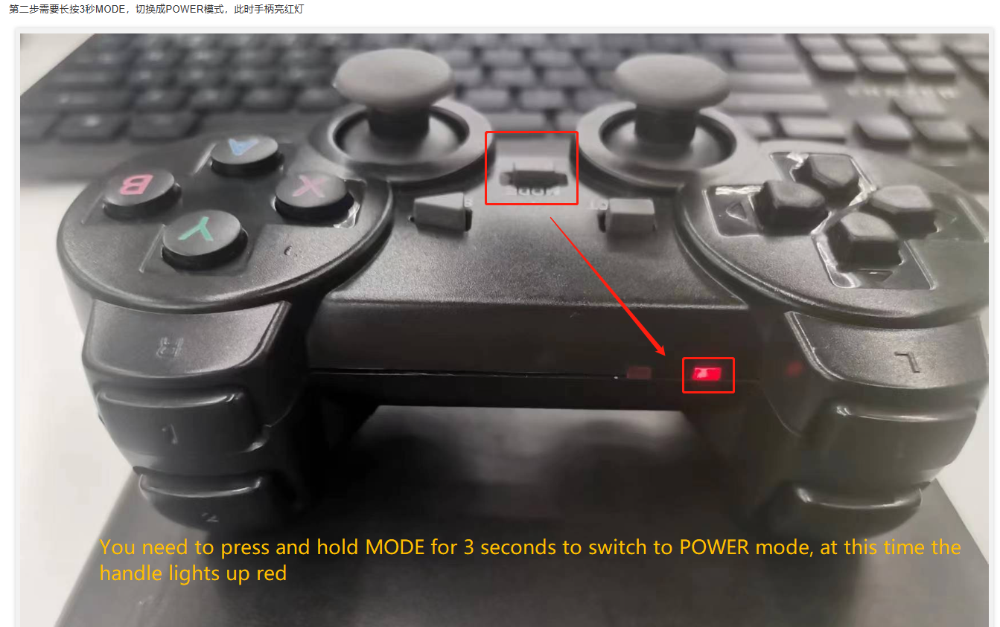
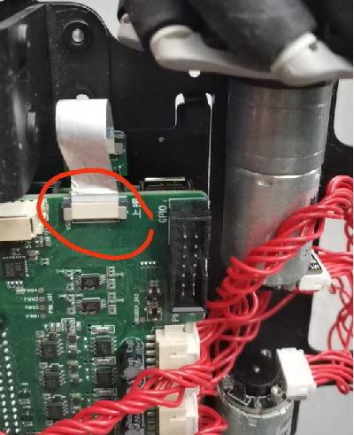

# 硬件问题

**Q:AGV雷达型号是什么？雷达的性能参数可以提供吗？**

- A: YDLIDAR X2L
关于fov水平是0-360°，垂直是0-1.75°
点数的4000，每秒测距 4000 次


**Q：7寸屏幕的安装方法在哪里？无法显示怎么处理？**

请参考屏幕安装与连接方法链接：
AGV安装屏幕：
https://docs.qq.com/doc/DU1p0VnBCRkFIQk9J 
https://docs.qq.com/doc/DU2xWd29ldkFHcFNR 

**Q：AGVJN是否内置网卡？**

A：是的，已内置无线网卡

**Q：AGV能和myArm300pi作为复合机器人使用吗，怎么用呢？**

A：AGV与myarm300复合机器人启动步骤如下：
1. 在myarm中启动Server.py文件，
下载路径：https://github.com/elephantrobotics/pymycobot/blob/main/demo/Server.py 
注意：需要Server.py文件并将文件里的波特率1000000更改成115200
2. 在myAGV中启动Client.py文件,Client.py里的控制代码支持自定义,例如

```python
from pymycobot import MyArmSocket
import time
mc = MyArmSocket("192.168.10.97",9000)  
for i in range(3):
    mc.send_angles([0, 0, 0, 0, 0, 0, 0], 50)
    print(mc.get_angles())
    time.sleep(2)

    mc.send_angles([90, 0, 0, 0, 0, 0, 0], 50)
    print(mc.get_angles())
    time.sleep(2)

```

**Q：agv可以用其他的3d相机吗，比如d435，应该怎么找他的launch文件？**

A：目前英特尔那个d435相机还没适配，现在只有奥比中光的，如果想用这个英特尔相机建议参考3d建图算法给的开发手册自己开发

**Q：AGV手柄使用异常怎么处理？**




**Q:  充电充不进去怎么办？**

1. 请确认使用的是我们提供的电源适配器
2. 你能告诉我判断这台AGV充电一个小时充不进去的现场是否是接配套的屏幕后，屏幕不显示任何系统画面还是AGV电源开关打开后，电源按键灯不亮吗？
3. 如果在AGV电源灯亮起来之后，你否有尝试更换HDMI屏幕查看是否能进去AGV的系统，进一步查看AGV的电机是否能正常控制？
4. 如果AGV电源灯不亮，你能接上电源适配器后，将AGV的一个侧舱盖打开，拍一下内部图给我看下吗，我需要看下内部是否有指示灯
5. 当AGV充电1小时的过程中，你确认AGV的电源按键是关闭的吗？在电源按键被按下，也就是AGV启动的状态下，属于边充电边使用，充电效果会相对较差。所以在充电时，电源按键开关需要关闭，你是这样操作进行充电的吗？
6. 下图圈注的2个端子是充电的连接关键，需要看下是否有线缆脱落，可以尝试重新拔插一下这2端子线


**Q: 有什么方法可以查看电池是否满电吗？**

A: 大约充电1小时后，可开机在系统里面的可视化UI查看可电压值和电流值

**Q：主电池和备用电池可以一起充电吗？备用电池可以放在小车上充电不？**

A：将备用电池放在电池仓中，在低于11V左右就会开始充电，会优先充主电池，接着充备用电池

**Q：识别不到串口号/dev/ttyACM0怎么处理？**

将右后轮处拆开，重新安装串口线，再使用指令ls /dev/tt* 检查是否正常识别，注意不能蛮力拔出串口排线，应将塑料片轻轻提起来再取出排线，可参考csi排线的拆取。




**Q：电机控制引脚是哪个？**

请参考下面4组引脚，其中2个引脚控制1个电机，但我们仅提供集成的电机控制接口，关于引脚的使用我们无法提供支持，需要自己进行二次开发。
32 33 
25 26 
27 14
18 23

**Q：请问是否可以提供小车的4个电机和驱动板电机接口的线序对应图？**


**Q：小车的扩展板怎么拆换？**

A：参考视频：https://drive.google.com/file/d/1NYZTkAqMKsrFyl1-HzsuKRmJr6ksMpvL/view?usp=sharing 

**Q：csi摄像头的拆装有需要注意的地方吗？**

A：请注意，安装或取出CSI排线时，请轻轻提拉或推入塑料片，不要直接拉动CSI排线本身。
CSI排线的取出（Removal of the CSI ribbon cable）


CSI排线的安装（Installation of the CSI ribbon cable）


**Q：myCobot Pro 600机械臂工作时的功率是多少呀？**

- A: 240W 48V 5A

**Q: 600/630的基坐标原点在哪里？**

600/630的基坐标原点在②所在的位置（如图所示），而非①所在的位置


**Q: Re-zero calibration in cmd: this is not necessary, （编码器异常问题排查-600）**

- A: 可能是因为之前长时间未使用，导致电机编码器出现错误。现在请拆卸机械手 J2 和 J3 的外壳，检查编码器中是否有红灯，找到编码器的线，按下它，编码器中出现绿灯，就可以正常使用了。


**Q：630主控是什么？原生系统是什么？**

- A：树莓派4B 8G内存   debian系统


**Q:为什么树莓派会造成无法进入操作系统的现象?**

- A:两种可能，第一种是瞬间电流导致TF卡和树莓派系统镜像损坏，也可能是TF卡容量不足造纸系统挂机，因为出厂内存留给客户的并不多大部分都是被mycobot_ros这个文件夹占用，可以让客户在产品还未发生黑屏现象提示内存不足的时候删除除了该型号产品以外的文件夹保留产品使用空间。如果内存数据过多，满了的情况下是无法开机的。

**Q:600/630的充电器DC接口的规格是什么？**


