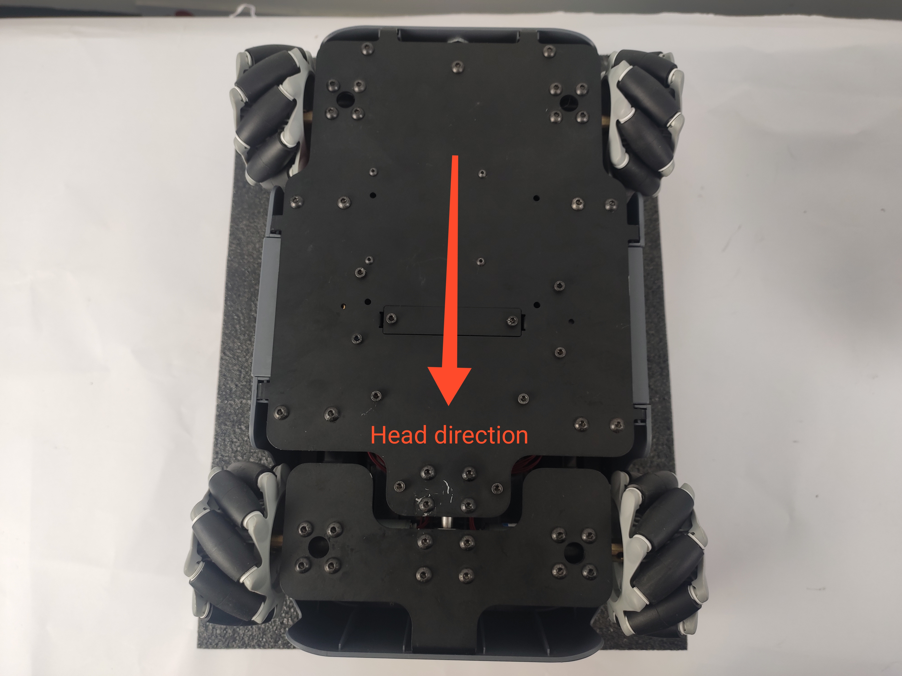

# 产品开箱指南

## 1 产品开箱视频指南

<video id="my-video" class="video-js" controls preload="auto" width="100%"
poster="" data-setup='{"aspectRatio":"16:9"}'>
  <source src="https://static.elephantrobotics.com/wp-content/uploads/2023/12/myAGV-2023%E5%BC%80%E7%AE%B1_cn.mp4"></video>

## 2 产品开箱图解补充

**为什么需要按照步骤取出产品**

在本节中，我们强烈建议按照规定的步骤取出产品。这不仅有助于确保产品在运输过程中不受损害，还能将意外故障的风险降至最低。请仔细阅读以下图解指南，以确保您的产品在开箱过程中的安全。

- **1** 检查包装箱是否损坏。如有损坏，请及时联系物流公司和您所在地区的供应商。

- **2** 最上面的箱子是配件箱。打开里面的配件盒，对照标准清单检查是否有遗漏物品。标准配件盒如下图所示。

| 序号 | 产品                              |
| ---- | --------------------------------- |
| 1    | 12.6V 2A 电源适配器和直流电源接口 |
| 2    | 积木插件                          |
| 3    | 产品手册                          |
| 4    | 操纵杆                            |
| 5    | 跳线                              |
| 6    | HDMI 电缆                         |

- **3** 然后取下泡沫板，就可以看到 myagv 的主体了。抓住 myagv 的两侧，将其取出。

- **4** 取出 myagv 后，请检查 myagv 的机械轮是否安装正确。由于麦克纳姆轮的特性，左上角的车轮与右下角的车轮安装方向相同。同样，右上角的车轮与左下角的车轮安装方向相同。

- **5** 恭喜你完成了开箱过程。

---

[← 上一页](4.1-ProductStandardList.md) | [下一页 →](4.3-PowerOnDetectionGuide.md)
