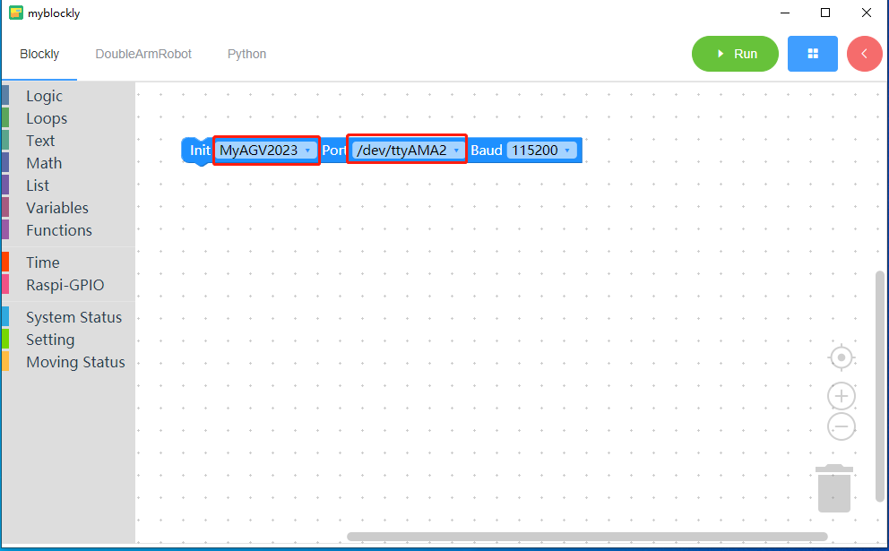
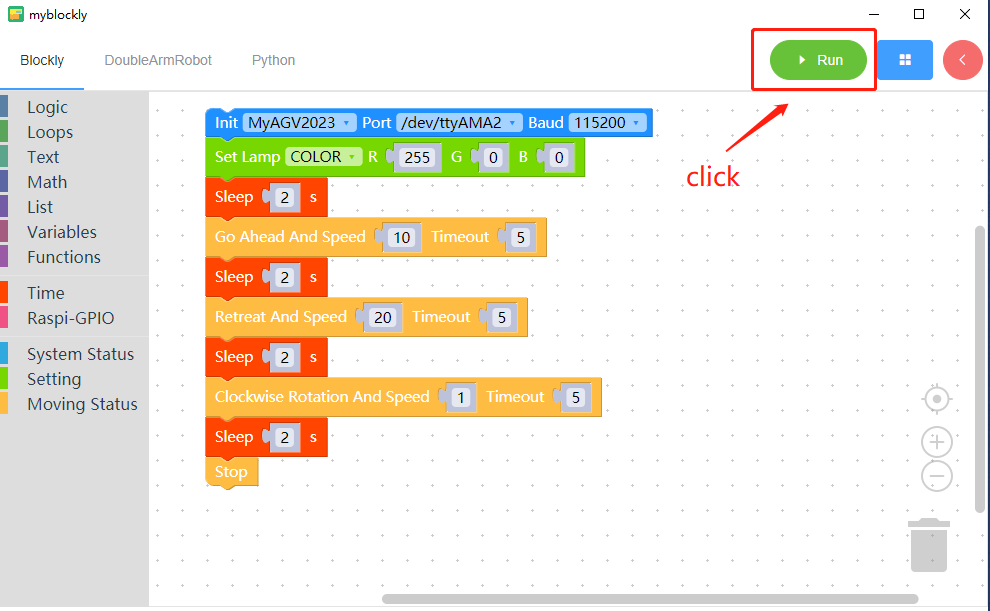
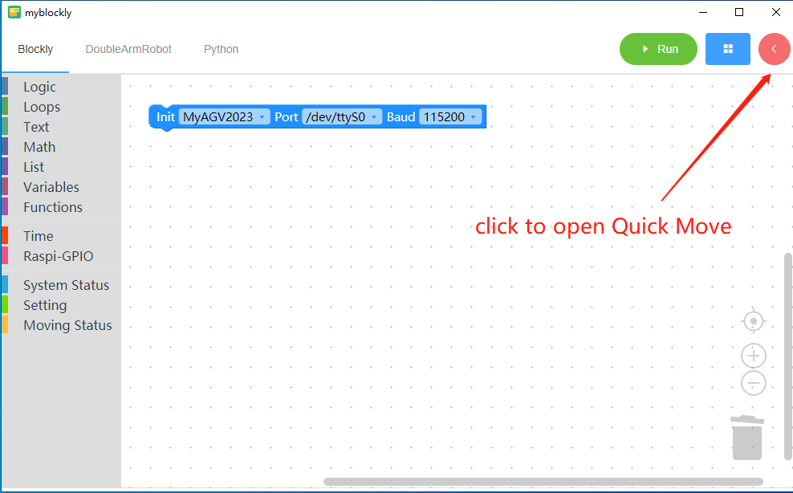
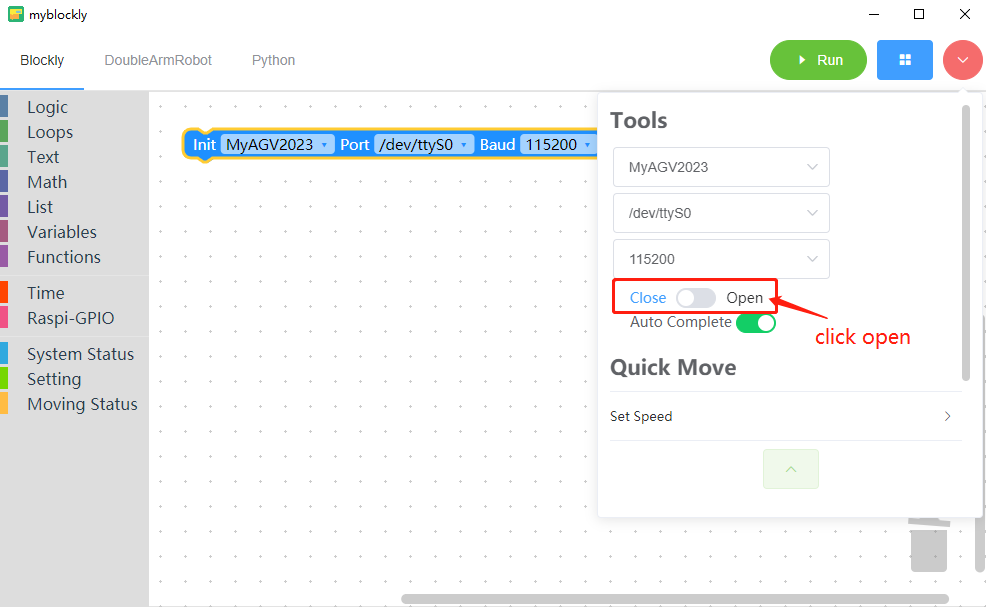
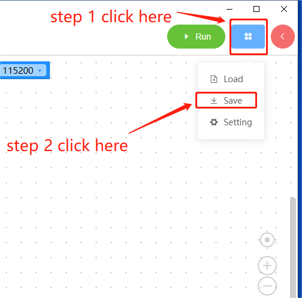
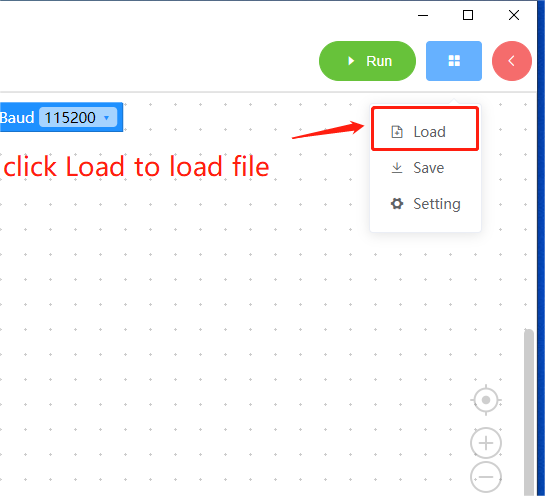

# 3 myBlockly 界面的显示和基本功能的使用

| 编号 | 图解说明                                                                                                                                                                                           |
| :--- | -------------------------------------------------------------------------------------------------------------------------------------------------------------------------------------------------- |
| 1    | 工具箱栏：点击特定类别，选择不同的构建模块                                                                                                                                                         |
| 2    | 工作区：您可以将工具箱中的构件拖到工作区中使用                                                                                                                                                     |
| 3    | 运行按钮：在工作区中运行代码                                                                                                                                                                       |
| 4    | 点击后将弹出以下菜单：  - 保存：保存当前工作区  - 加载：加载已保存的工作区  - 设置：进入设置页面，您可以在此设置语言和主题。                                                        |
| 5    | 点击后，控制面板将弹出。在面板中，您可以通过点击关节控制或坐标控制栏中的 "+/-"来快速控制机械臂的运动。6 点击后，您可以查看工作区中生成的 python 代码。7 将工作区居中。8 放大工作区。9 缩小工作区。 |
| 6    | 点击查看工作区生成的 python 代码                                                                                                                                                                   |
| 7    | 将工作区居中                                                                                                                                                                                       |
| 8    | 放大工作区                                                                                                                                                                                         |
| 9    | 缩小工作区域                                                                                                                                                                                       |
| 10   | 垃圾桶：将工作区中的积木拖到此处可删除积木；同时点击垃圾桶可查看并恢复已删除的积木                                                                                                                 |

## **计划运行**

打开 myBlockly，选择机器为 `myAGV 2023`，选择端口，并选择波特率为 `115200`。

**`myAGV 2023 Jetson Nano` 版本端口为 `/dev/ttyS0`;**

将一些程序块拖入工作区，然后点击运行按钮。

根据上述构件，机器将执行以下操作：

\- 将机器的 RGB 灯光模式设为闪光灯模式，颜色设为红色 255。

\- 等待 2 秒钟。

\- 机器以 10,000 的速度向前运动，默认运动时间为 5 秒。

\- 等待 2 秒钟

\- 机器以 20,000 的速度向后运动，默认运动时间为 5 秒。

\- 等待 2 秒钟

\- 机器以 1 的速度顺时针旋转，默认运动时间为 5 秒。

\- 等待 2 秒钟

\- 机器停止。

**使用控制面板**

1. 打开快速移动

2. 连接机器

3. 设定速度

您可以自定义每个运动方向的速度。

  

4. 运动控制部分

  

\- 前进按钮：单击此按钮可控制机器向前移动。

\- 后退按钮：单击此按钮可控制机器后退。

\- 后退按钮：单击此按钮可控制机器后退。

\- 右移动按钮：单击此按钮可控制机器右移。

\- 顺时针按钮：单击此按钮可控制机器顺时针移动。

\- 逆时针按钮：单击此按钮可控制机器的逆时针运动。

\- 运动停止按钮：单击此按钮可停止机器。

## **程序保存和加载**

MyBlockly 的程序以 \*.json 格式保存。点击界面右上角的蓝色方框。当出现 "保存 "选项时，点击它保存程序。

同时点击蓝色方框并点击 "加载 "选项，导入已保存的程序。

 
 
 
 
 

> **基本功能演示完成后，您可以在以下页面查看其他信息 [here](https://download-elephantrobotics.oss-cn-shenzhen.aliyuncs.com/software/myblockly/README/myblockly%E4%BD%BF%E7%94%A8%E8%AF%B4%E6%98%8E%E4%B9%A6-en.pdf)**

---

[← 上一页](./2-install_uninstall.md) | [下一页 →](./4-Q&A.md)
