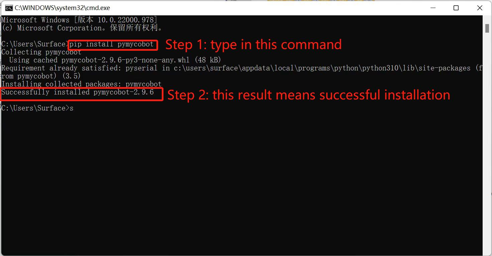

# 10 Q&A

本章列出了使用 myBlockly 控制机械臂的常见问题，以供参考。

**Q1：运行 myBlockly 时，出现错误信息 `ModuleNotFoundError: No module named 'pymycobot'`**

A: 这是因为在设置 Python 环境时没有安装 pymycobot 库。要安装 pymycobot 库，需要打开终端（Win 键 + R 键），输入 `pip install pymycobot --upgrade --user`点击回车键，即可看到 "成功安装 pymycobot"。

**Q2：由于未添加 `sleep` 方法模块，机械臂没有响应**

A: 操作机械臂的程序需要一定时间才能完成，因此在完成一个动作后，需要连接一个 `sleep` 模块，让机械臂在进行下一个动作前有足够的时间（所需时间取决于具体情况和机器，机械臂的默认设置是运行 myBlockly 时休眠时间最短不少于 0.5 秒），否则机械臂将无法实现理想的动作。

**Q3：右上角的 `Run` 按钮无法点击，呈灰绿色。**

A: 新版 myBlockly 增加了检测机械臂串行通信的功能。如果机械臂当前已与电脑连接，则需要进行检查：

(1) 是否有后台程序占用机械臂的串行端口；

(2) 右侧红色箭头下的工具栏是否关闭。如果打开，则需要手动关闭。

**Q4：为什么运行程序后会出现大量错误？**

A: 运行程序前，您需要确认一些信息：

(1) 请确认机器人串行端口号和波特率正确无误。

如何检查串行端口号

- 在 Windows 系统中，找到设备管理器并检查端口。 如果端口（COM 和 LPT）显示 USB-Enhanced-SERIAL CH9102，则说明是 CP34X 芯片。  
  如果端口（COM 和 LPT）显示 Silicon Labs CP210x USB 至 UART 桥接器，则表示该芯片为 CP210X。这两个名称对应的端口就是机械臂的串行端口。
- 打开 Linux 系统的终端，输入 ls/dev/tty\* 并按 Enter。显示的就是机械臂的序列号。其中 AMA0 或 USB0 等就是机械臂的序列号。
- 在 Mac 系统上打开终端，输入 cd/dev/ 并按 Enter，然后运行 ls -al tty 查找，如 /dev/tty.usbserial-10。

(2) 请确认波特率是否正确。`myAGV Jetson Nano 2023` 的波特率为 `115200`。

(3) 请确认蓝色框中的型号、串行端口号和波特率与右侧小工具栏中的一致，并与机械臂相匹配。

**Q5: 错误 MyCobot._int_() 需要 2 个位置参数，但给出了 3 个。**

A: 这个错误会出现在旧版本的 myBlockly 中，因为 myBlockly 和 pymycobot 的版本不兼容。只需更新 myBlockly 和 pymycobot 驱动程序库的版本即可。

**Q6: 程序运行结果显示，子进程以代码 1 退出。**
A: 这不是错误。所有程序运行后都会返回二进制数 1。这意味着所有程序都已成功运行。

---

[← 上一页](./3-interface_description.md) | [下一页 →](./5-api.md)
