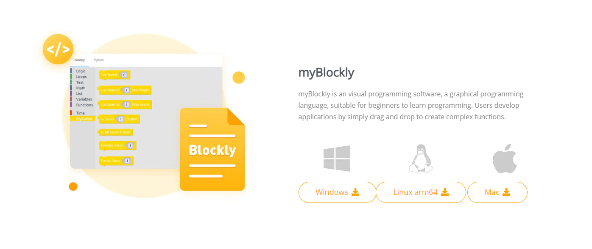
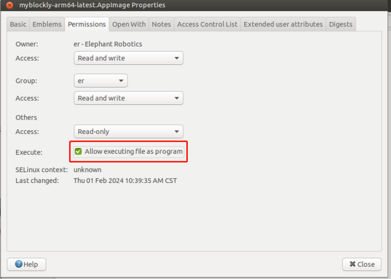
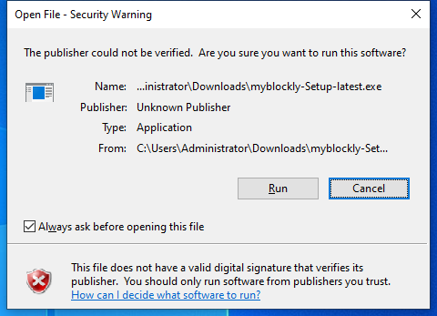
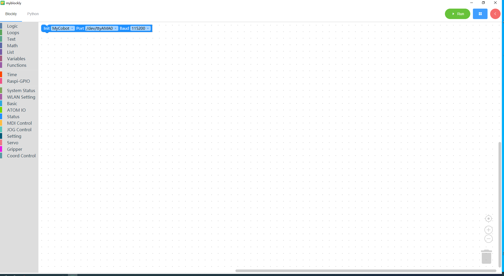
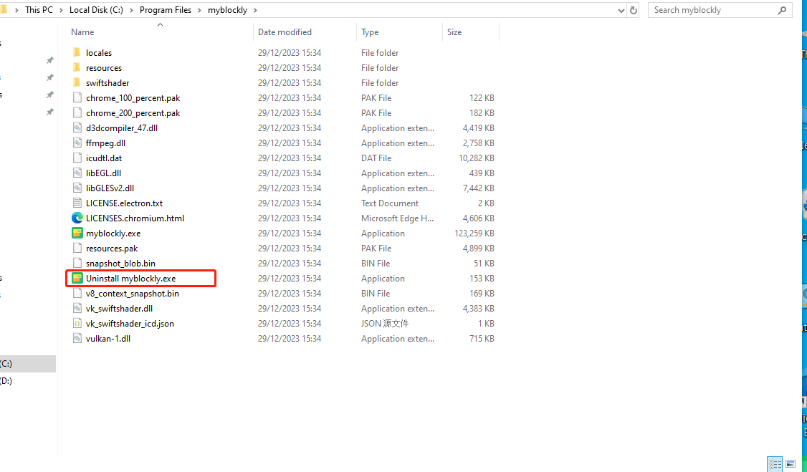

# 2 下载并安装 myBlockly

### 下载

下载链接 **[官方网站地址](https://www.elephantrobotics.com/en/downloads/)**

您需要根据操作系统下载不同的安装包。

不同的后缀代表不同的系统，请下载相应的版本：

- \*.AppImage : Linux 系统
- \*.dmg : Mac 系统
- \*.exe : Window 系统

## 安装

### 为 Linux 安装 myblockly

从官方网站下载 Linux 版本的 myblockly，你会得到如下所示的安装包

选择 `myblockly-arm64-latest.AppImage`，右键单击打开它，单击 `Properties` 打开它

点击进入 `Permissions`

在 `Permissions` 页面，选中 `Allow executing file as program`，然后单击 `Close` 按钮关闭弹出窗口

关闭弹出窗口后，双击安装包 `myblockly-arm64-latest.AppImage`，打开 myblockly

### 用于 Windows 安装

双击打开名为 `myblockly-arm64-latest.AppImage` 的文件

点击 `Run`

点击 `Install` 后，等待 myblockly 安装完成

安装完成后，点击 `Finish` 按钮打开并运行 myblockly

### 为 MacOS 安装 myblockly

从官方网站下载 Mac 版 myblockly，获得如下所示的安装包。双击打开。

**注意**：对于 MacOS，安装前请确保系统 "首选项->安全与隐私->常规" 和 允许来自应用商店和公认开发者的应用程序 已启用。

## 卸载

### 对于 Linux，卸载 myblockly

**直接删除安装包即可**

> 安装包的默认名称是 `myblockly-arm64-latest.AppImage`

### 卸载 Mac 版 myblockly

**只需将 myblockly 移至应用中的垃圾桶即可**

### 在 Windows 中卸载 myblockly

进入 myblockly 的文件目录，点击运行 `Uninstall myblockly.exe`

点击 `Uninstall`

myblockly 已卸载，单击 `Finish` 退出

## 更新

如果您想更新 myblockly，请访问 [官方网站](https://www.elephantrobotics.com/en/downloads/) 下载最新版本。

---

[← 上一页](./1-myBlocklyFirstUse.md) | [下一页 →](./3-interface_description.md)
