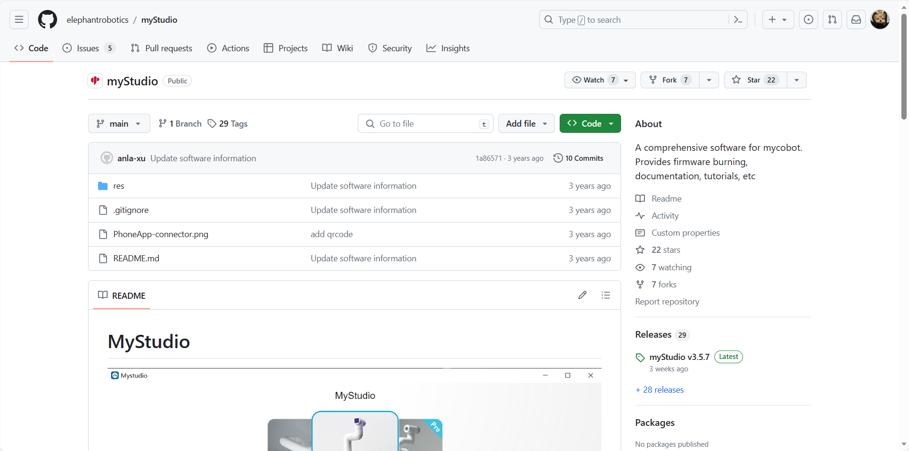
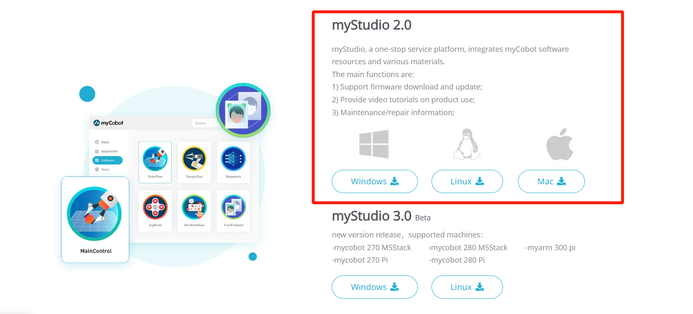
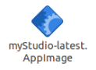
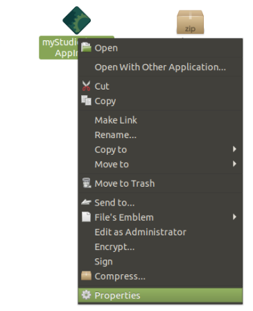
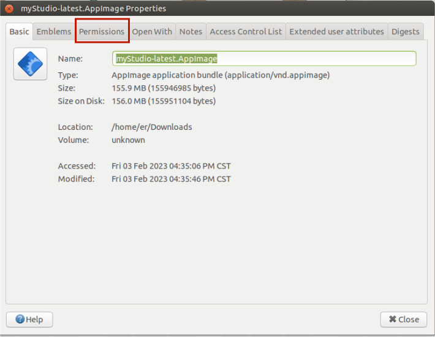
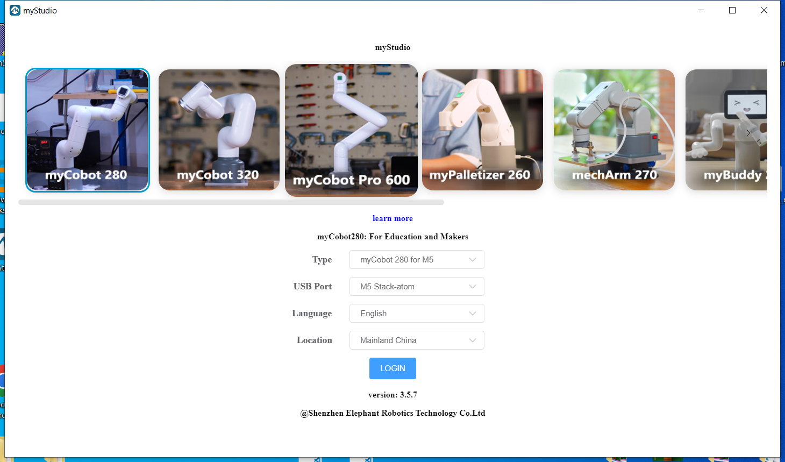
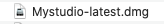
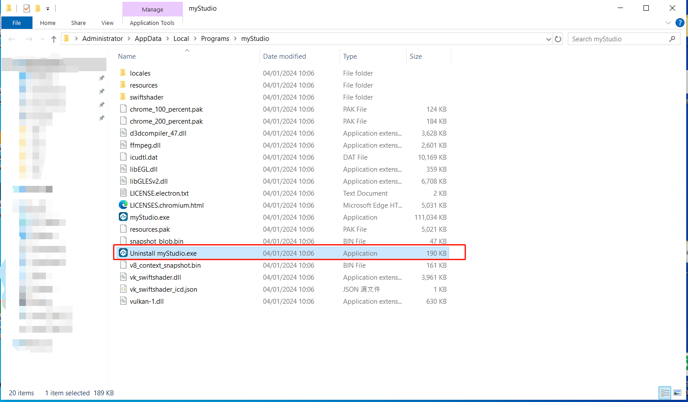
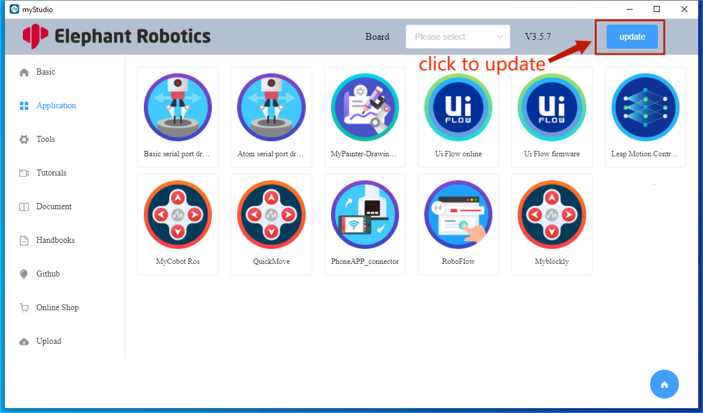

# 1 设置 myStudio 环境

## 下载

> 注意：安装 myStudio 时，安装路径不能有空格。

> **myAGV Jetson Nano 2023 系统镜像已安装 myStudio**
>
> **因此，您无需重新下载。**

**下载链接**

> 您应在 myAGV Jetson Nano 2023 系统中下载：Linux 系统版本

**1. [GitHub](https://github.com/elephantrobotics/myStudio)**

- 输入下载地址后，点击右侧的 `myStudio`，选择相应的版本进行下载。

- 不同的后缀代表不同的系统，请下载相应的版本：

  - \*.AppImage - Linux 系统
  - \*.dmg - Mac 系统
  - \*.exe - 窗口系统

**2. [官方网站地址](https://www.elephantrobotics.com/download/)**

您可以根据自己的计算机系统选择下载 `myStudio 2.0`。

## 安装

### 为 Linux 安装 myStudio

从官方网站下载 myStudio Linux 版本，获取安装包，如下所示

用鼠标右键选择 `myStudio-latest.AppImage`，点击 `Properties` 打开它

点击进入 `Permissions`

在 `Permissions` 页面，选中 `Allow executing file as program`，然后单击 `Close` 按钮关闭弹出窗口

关闭弹出窗口后，双击安装包 `myStudio-latest.AppImage` 打开 myStudio

### 为 Windows 安装 myStudio

双击打开名为 `Mystudio_Setup_latest.exe` 的文件，然后单击 `Run`。

点击 `Next>`

点击 `Install` 后，等待 myStudio 安装完成

安装完成后，单击 `Finish` 按钮打开并运行 myStudio

### 为 MacOS 安装 myStudio

从官方网站下载 Mac 版 myblockly，获得如下所示的安装包。双击打开。

**注意**：对于 MacOS，安装前请确保系统 "Preferences->Security & Privacy->General"和 "Allow Apps from App Store and Recognized Developers"已启用。

## 卸载

### 对于 Linux 系统，卸载 myStudio

**直接删除安装包即可**

> 安装包的默认名称是 `myStudio-latest.AppImage`

### 卸载适用于 Mac 的 myStudio

**只需将 myStudio 移至应用中的垃圾桶即可**

### 卸载适用于 Windows 系统的 myStudio

进入 myStudio 的文件目录，点击运行`Uninstall myStudio.exe`

点击 `Next>`

myblockly 已卸载，单击 `Finish` 退出

## 更新

**在 myStudio 中，您可以单击 `Update` 按钮更新以下内容**

---

[← 上一页](./README.md) | [下一页 →](./2-install_driver.md)