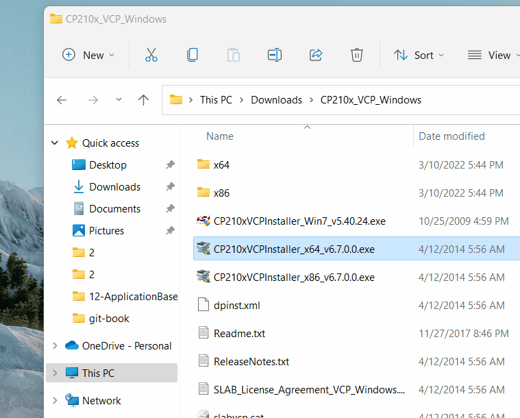
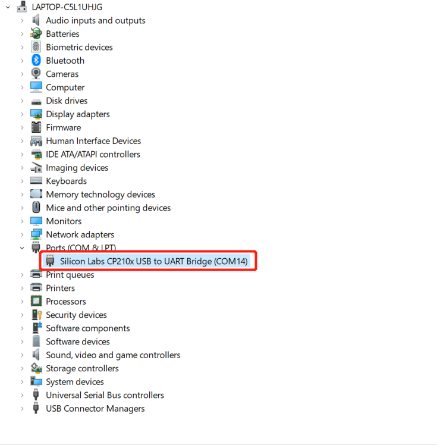

# 2 安装驱动程序

> **注意**：无需在 myAGV Pi 2023 系统中下载和安装驱动程序。

用户可点击下面的按钮，根据所使用的操作系统下载相应的 **CP210X** 或 **CP34X** 驱动程序压缩包。解压压缩包后，根据操作系统的位数选择相应的安装包进行安装。

目前有两个驱动芯片版本，**CP210X**（适用于 CP2104 版本）和**CP34X**（适用于 CH9102 版本）驱动压缩包。如果您不确定设备使用的是哪种 USB 芯片，可以同时安装两种驱动程序。(**CH9102_VCP_SER_MacOS**在安装过程中可能会出现错误，但实际上安装已经完成，请忽略该错误)。

对于 Mac OS，安装前请确保系统 "Preferences->Security & Privacy->General" 并允许 App Store 和认可开发者访问。

- 下载底部的 **M5Stack-basic** 串行端口驱动程序

  - **CP210X**

    - [ **Windows10** ](https://download.elephantrobotics.com/software/drivers/CP210x_VCP_Windows.zip)
    - [ **MacOS** ](https://download.elephantrobotics.com/software/drivers/CP210x_VCP_MacOS.zip)
    - [ **Linux** ](https://download.elephantrobotics.com/software/drivers/CP210x_VCP_Linux.zip)

  - **CP34X**

    - [ **Windows10** ](https://download.elephantrobotics.com/software/drivers/CH9102_VCP_SER_Windows.exe)

    - [ **MacOS** ](https://download.elephantrobotics.com/software/drivers/CH9102_VCP_MacOS.zip)

- 在最后下载**Atom**串行端口驱动程序

  - [ **Windows10** ](https://download.elephantrobotics.com/software/drivers/CDM21228_Setup.zip)

## 1.3 如何区分 CP210X 和 CP34X 芯片

- 如下图所示，打开 **设备管理器**，查看 **端口（COM 和 LPT）**

- 如果 **端口（COM 和 LPT）** 显示 **USB-Enhanced-SERIAL CH9102**，则为**CP34X 芯片**。

- 如果 **端口（COM 和 LPT）** 显示 **Silicon Labs CP210x USB to UART Bridge**，则为**CP210X 芯片**。

---

[← 上一页](./1-setup.md) | [下一页 →](./3-flash_firmwares.md)