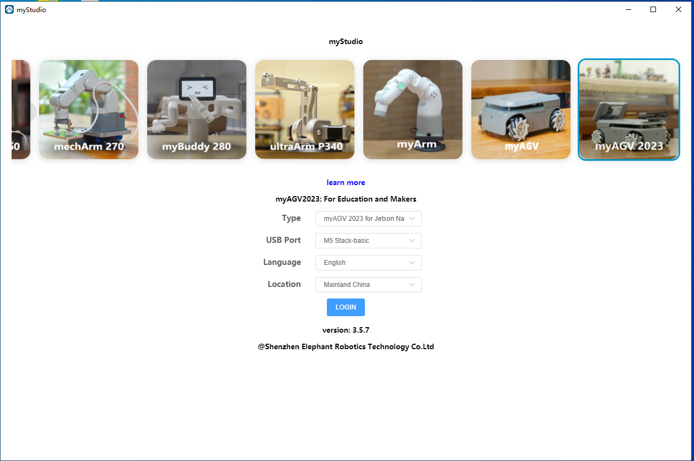

# myStudio

## 1 myStudio 设计初衷

- myStudio 是使用机器人的一站式平台。

- 用户可以根据自己的使用场景选择不同的固件并下载，同时还可以在线学习相关教材和浏览教程视频，非常方便。

## 2 myStudio 最新版本和支持的平台

- 最新版本： V3.5.7

- 可用平台

  - Windows
  - Mac
  - Linux arm64

## 3 myStudio 功能

- 刻录和更新固件。
- 提供机器人使用教程，如用户手册、视频教程、问答等。
- 保养和维修信息。

**跳转到各部分：**

- [设置](1-setup.md)
- [安装驱动程序](2-install_driver.md)
- [闪存固件](3-flash_firmwares.md)
- [其他功能](4-other_function.md)

---

[← 基础功能使用页](../../README.md#52-应用用途) | [下一页 →](./1-setup.md)