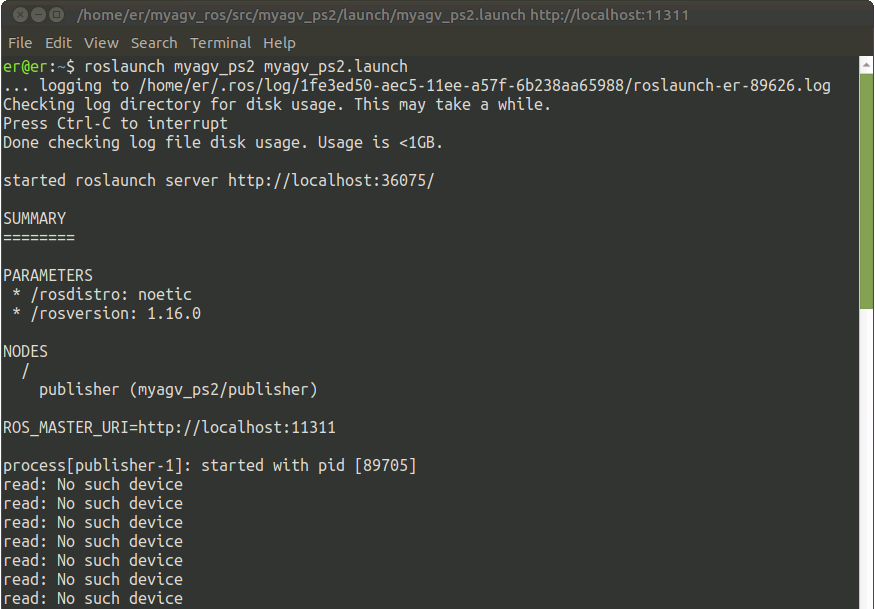
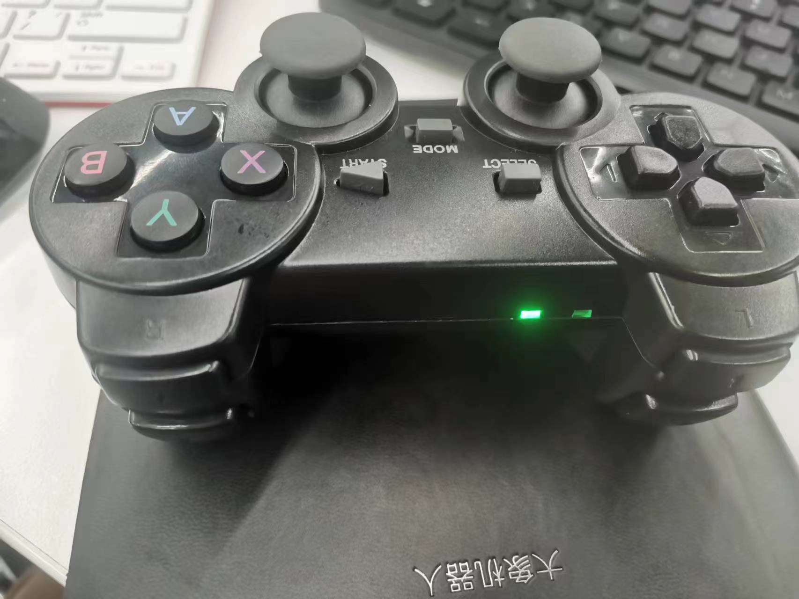
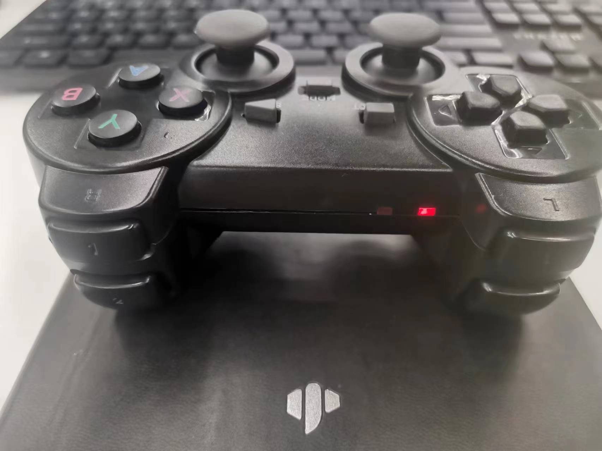
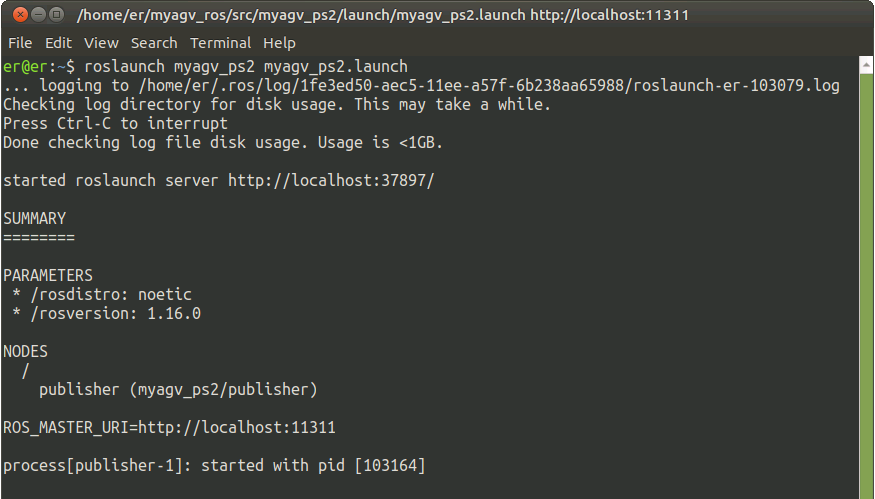
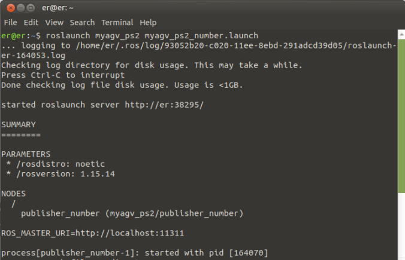

# 基于 ROS 的基本控制

基本控制包括 **键盘控制和操纵杆控制**。我们先来讨论键盘控制方法：

- 1 启动小车底层的通信。

首先，检查激光雷达是否已通电并启用。如果没有接通电源，请使用终端通过脚本文件接通电源并启动激光雷达。如果激光雷达已经接通电源并正在旋转，则可以跳过接通电源并启用激光雷达（./start_ydlidar.sh）的步骤。

```bash
cd myagv_ros/src/myagv_odometry/scripts

./start_ydlidar.sh
```

打开激光雷达电源后，打开终端控制台（快捷键<kbd>Ctrl</kbd>+<kbd>Alt</kbd>+<kbd>T</kbd>），在命令行中输入以下命令：

```bash
roslaunch myagv_odometry myagv_active.launch
```

打开 SLAM 激光扫描和小车车轮所需的启动文件。如果您看到

> myAGV initialized successful!
> ......
> Now YDLIDAR is scanning ......

它表示汽车激光雷达和车轮之间的通信成功。终端将显示如下状态：


- 2 启动键盘通信

打开一个新的终端控制台，在终端命令行中输入以下命令：

```bash
roslaunch myagv_teleop myagv_teleop.launch
```


| 按键 | 方向               |
| :--- | :----------------- |
| i    | 向前移动           |
| ,    | 向后移动           |
| j    | 向左移动           |
| l    | 向右移动           |
| u    | 逆时针旋转         |
| o    | 顺时针旋转         |
| k    | 停止               |
| m    | 顺时针反向旋转     |
| .    | 逆时针反向旋转     |
| q    | 提高线速度和角速度 |
| z    | 降低线速度和角速度 |
| w    | 提高线速度         |
| x    | 降低线速度         |
| e    | 增加角速度         |
| c    | 降低角速度         |

**手柄控制**

- 1 启动小车底层的通信。

首先，检查激光雷达是否已通电并启用。如果没有接通电源，请使用终端通过脚本文件接通电源并启动激光雷达。如果激光雷达已经接通电源并正在旋转，则可以跳过接通电源并启用激光雷达（./start_ydlidar.sh）的步骤。

```bash
cd myagv_ros/src/myagv_odometry/scripts

./start_ydlidar.sh
```

打开激光雷达电源后，打开终端控制台（快捷键<kbd>Ctrl</kbd>+<kbd>Alt</kbd>+<kbd>T</kbd>），在命令行中输入以下命令：

```bash
roslaunch myagv_odometry myagv_active.launch
```

打开 SLAM 激光扫描和汽车车轮所需的启动文件。如果您看到

> myAGV initialized successful!
> ......
> Now YDLIDAR is scanning ......

它表示汽车激光雷达和车轮之间的通信成功。终端将显示如下状态：


- 2 启动操纵杆控制文件

目前支持两种操纵杆，每种操纵杆需要运行不同的文件。

- 1 型操纵杆

Jetson nano手柄控制启动方式跟树莓派启动方式存在差异，需要根据下面步骤进行操作

第一步将蓝牙手柄的USB接收器插到小车上，打开一个新的控制台终端，在命令行中输入：

```bash
cd myagv_ros
roslaunch myagv_ps2 myagv_ps2.launch 
```

此时会出现手柄的终端出现：read: No such device，此时手柄亮绿灯





第二步需要长按3秒MODE，切换成POWER模式，此时手柄亮红灯



第三步键盘通过ctrl+c关闭myagv_ps2.launch手柄的程序后再次roslaunch myagv_ps2 myagv_ps2.launch 启动手柄的程序。此时可以开始用手柄控制



如果成功走到这里了，就可以成功用手柄控制小车的行走了。手柄上有7个按钮来控制小车运动，如图所示，1~4控制小车前进后退和左右运动，5控制小车逆时针旋转，6控制小车顺时针旋转，7为停止按钮。


- 2 型操纵杆

将蓝牙操纵杆的 USB 接收器插入汽车。打开一个新的终端控制台，在命令行中输入以下命令：

```bash
roslaunch myagv_ps2 myagv_ps2_number.launch
```

> 如果出现错误，表明缺少 "myagv_ps2_number.launch "文件，请访问 Github 下载最新的 ROS 软件包并重新安装使用。



如果您成功到达这一步，您就可以用操纵杆控制汽车的运动了。如图所示，操纵杆上有 7 个按钮可以控制汽车的运动：按钮 1~4 控制小车的前进、后退、左转和右转；按钮 5 控制逆时针旋转，按钮 6 控制顺时针旋转，按钮 7 是停止按钮。


---

[← 上一页](6.2.3-Using_Common_ROS_Tools.md) | [下一页 →](6.2.5-Real-time_Mapping_with_Gmapping.md)
