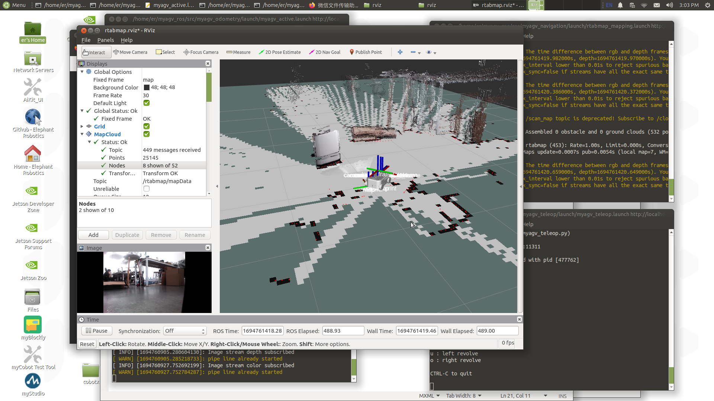
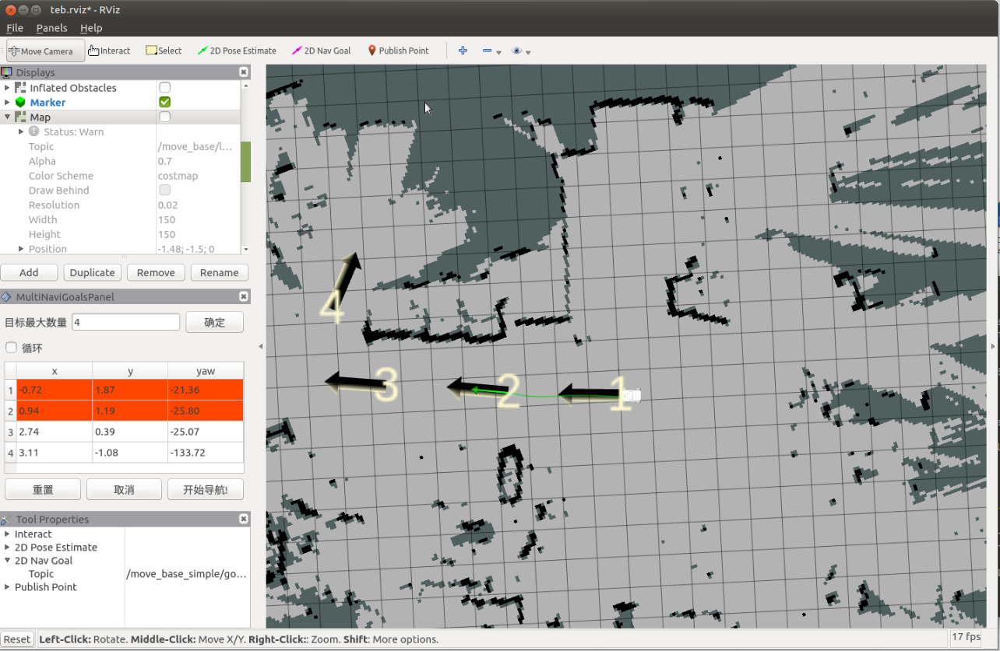
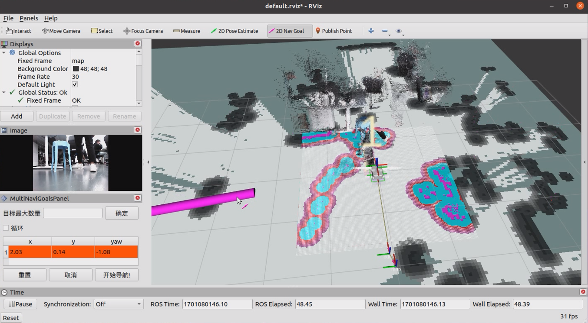
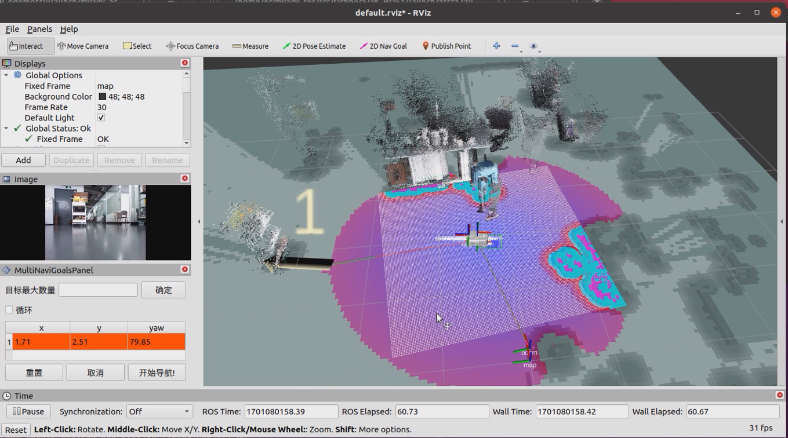
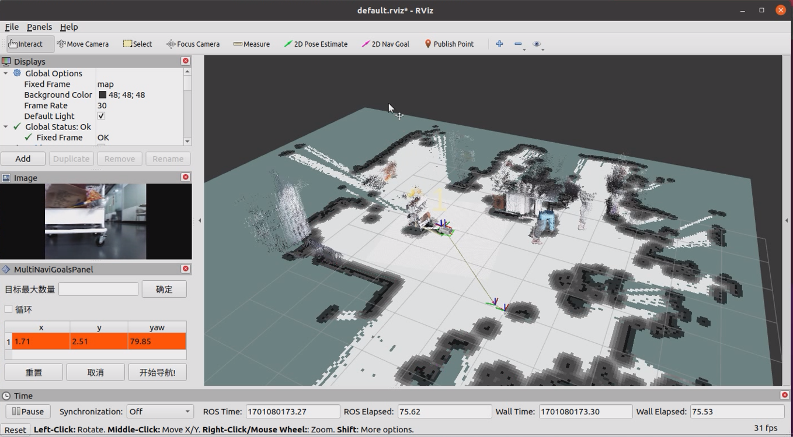

# myAGV-rtabmap建图

## 1.打开slam激光扫描launch文件

先检测激光雷达是否上电使能，没有开启则需要终端通过脚本文件上电启动激光雷达，如果雷达上电使能，则可以跳过上电使能雷达步骤。

```bash
//跳转到激光雷达启动目录
cd myagv_ros/src/myagv_odometry/scripts
//上电使能雷达,上电后雷达就会通过串口发送数据
./start_ydlidar.sh
```

上电使能雷达后，打开3个控制台终端(快捷键<kbd>Ctrl</kbd>+<kbd>Alt</kbd>+<kbd>T</kbd>)，分别在命令行中输入以下指令:

```bash
//启动里程计和激光雷达
roslaunch myagv_odometry myagv_active.launch
//启动深度相机对应的launch文件
roslaunch orbbec_camera astra_pro2.launch
//启动rtabamp建图算法
roslaunch 3d_navigation_active.launch
```

## 2.打开键盘控制文件

重新打开一个控制台终端，在终端命令行中输入：

```bash
cd myagv_ros
roslaunch myagv_teleop myagv_teleop.launch
```


| 按键 | 方向               |
| ---- | ------------------ |
| i    | 前进               |
| ，   | 后退               |
| j    | 向左运动           |
| l    | 向右运动           |
| u    | 逆时针旋转         |
| o    | 顺时针旋转         |
| k    | 停止               |
| m    | 顺时针后退         |
| .    | 逆时针后退         |
| q    | 增加线速度和角速度 |
| z    | 减小线速度和角速度 |
| w    | 只增加线速度       |
| x    | 只减小线速度       |
| e    | 只增加角速度       |
| c    | 只减小角速度       |



现在小车可以在键盘的控制下开始移动了，操控小车在所需建图的空间内转一圈吧。与此同时，可以看到在Rviz空间里我们的地图也会跟着小车的移动一点点的把地图构建出来了。
***注意：在用键盘操作小车的时候，确保运行myagv_teleop.launch文件的终端是当前选中的窗口，否则键盘控制程序无法识别键盘的按键。而且速度越慢，建图效果越好，建议线速度设置0.2，角速度设置0.4进行键盘控制***
键盘控制小车移动建完图后，使用ctrl+c停止建图节点，就会~/.ros/rtabmap.db生成地图数据。

## 3.导航使用

除了键盘控制外，还可以进行同时建图和导航，同样在上电使能雷达后，myagv打开3个控制台终端(快捷键<kbd>Ctrl</kbd>+<kbd>Alt</kbd>+<kbd>T</kbd>)，分别在命令行中输入以下指令:

```bash
//启动里程计和激光雷达
roslaunch myagv_odometry myagv_active.launch
//启动深度相机对应的launch文件
roslaunch orbbec_camera astra_pro2.launch
//启动rtabamp建图算法
roslaunch 3d_navigation_active.launch
```

1.左下角导航操作区说明

① 可设置目标点的最大数量：要求所设置目标点个数不能大于该参数（可以小于）

② 是否循环：若勾选，导航至最后一个目标点后，将重新导航至第一个目标点。例：1->2->3->1->2->3->···，该选项必须在开始导航前勾选

③ 任务目标点列表： x/y/yaw，地图上给定目标点的位姿（xy坐标与航向角yaw)。

* 设置完目标最大数量，保存后，该列表会生成对应数量的条目
* 每给出一个目标点，此处会读取到目标点的坐标与朝向

④ 开始导航：开始任务

⑤ 取消：取消当前目标点导航任务，机器人停止运动。再次点击开始导航后，会从下一个任务点开始。

例：1->2->3，在1->2的过程中点击取消，机器人停止运动，点击开始导航后，机器人将从当前坐标点去往3。

⑥ 重置：将清空当前所有目标点


2.设置任务目标点个数，点击确认保存。然后点击ToolBar上的2D Nav Goal，在地图上给定目标点。（每次设置都需要先点击2D Nav Goal），目标点有朝向区分，箭头顶端为车头方向。点击开始导航，导航开始，在rviz中看到起点到目标点位间有一条小车的规划路径，小车会沿着路线运动到目标点位。



3.实际使用效果

效果如下：通过rviz发布导航点，同时导航与建图，到达导航点







---

[← 上一页](6.2.7-Navigation-Map_Navigation.md) | [下一章 →](../../7-ExamplesRobotsUsing/280pi.md)
