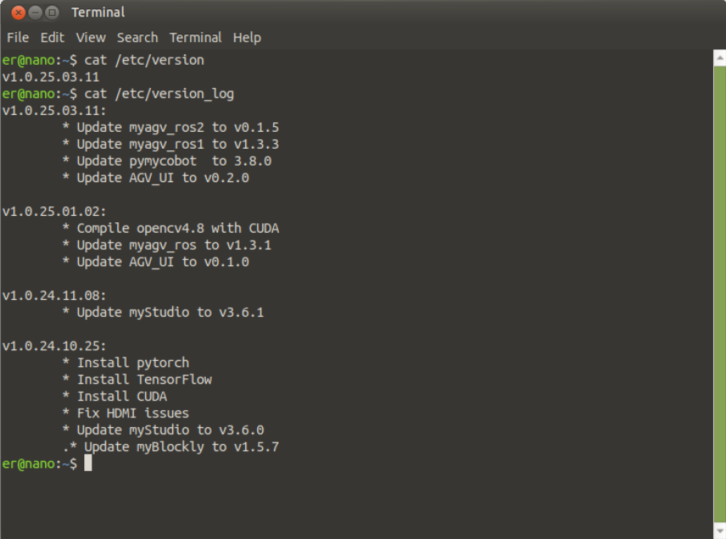
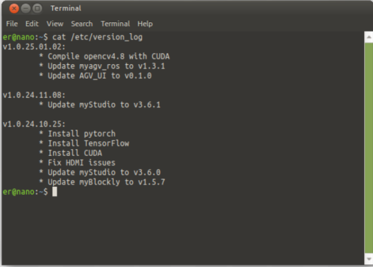
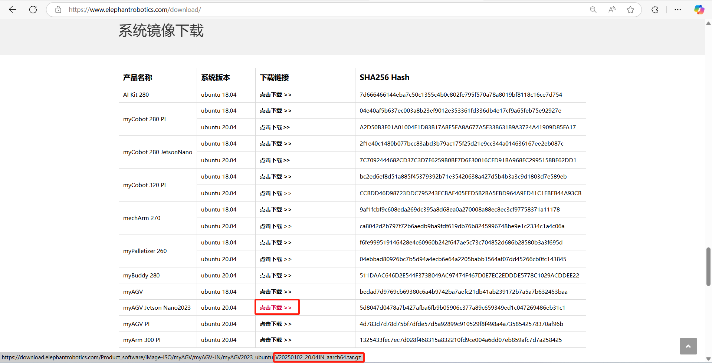
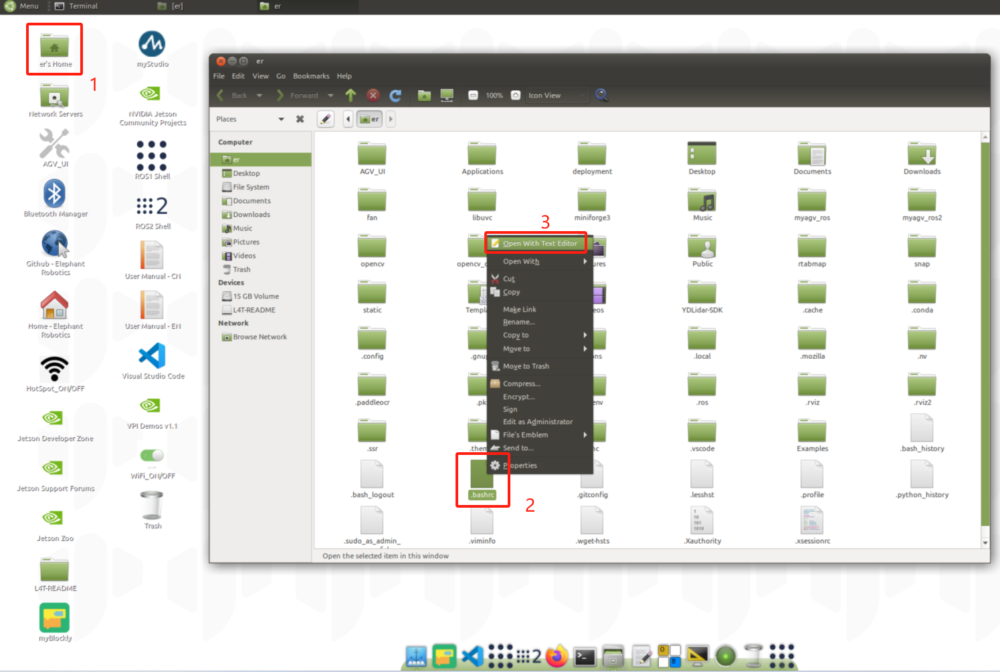
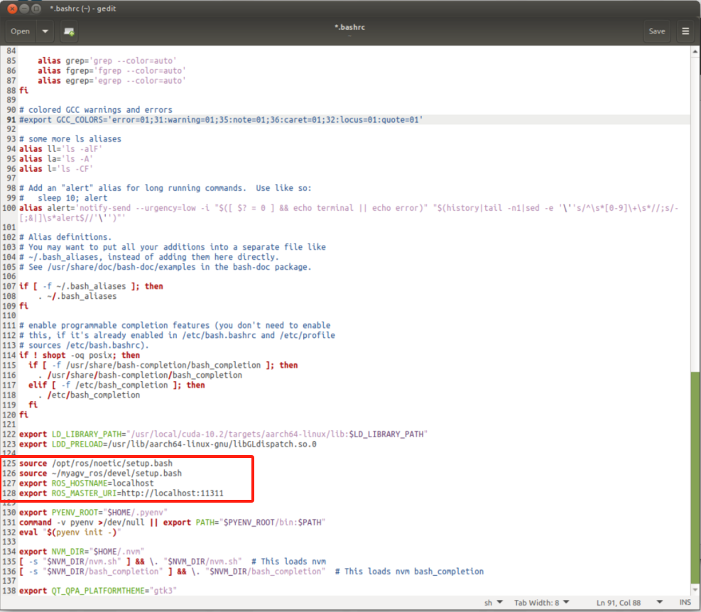
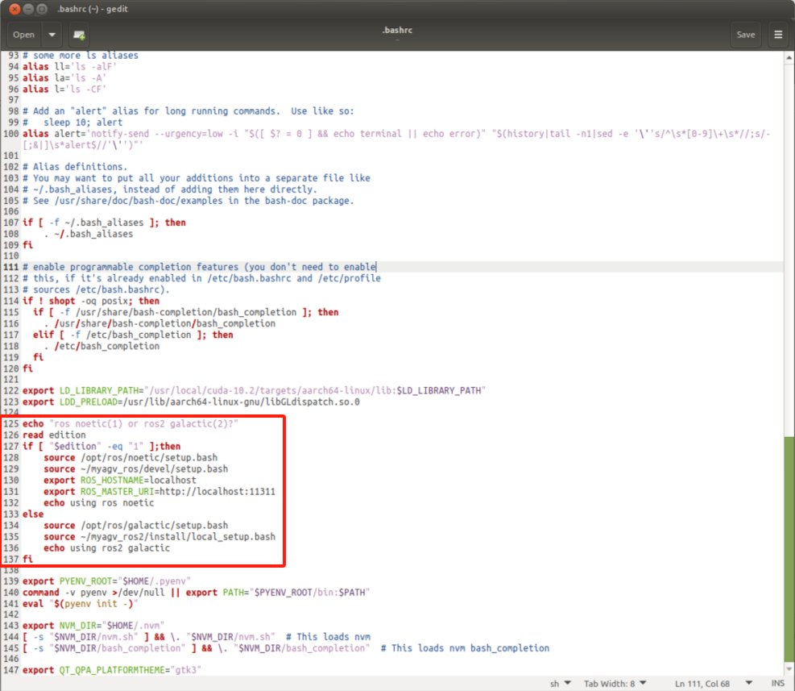
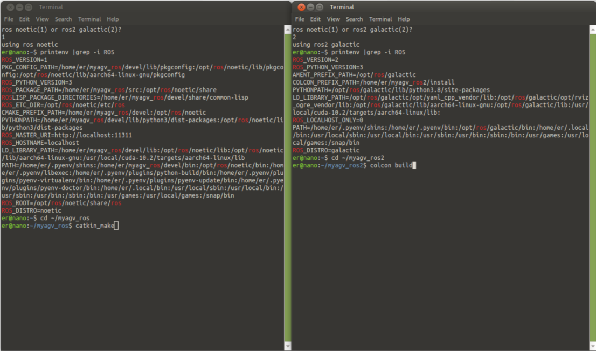
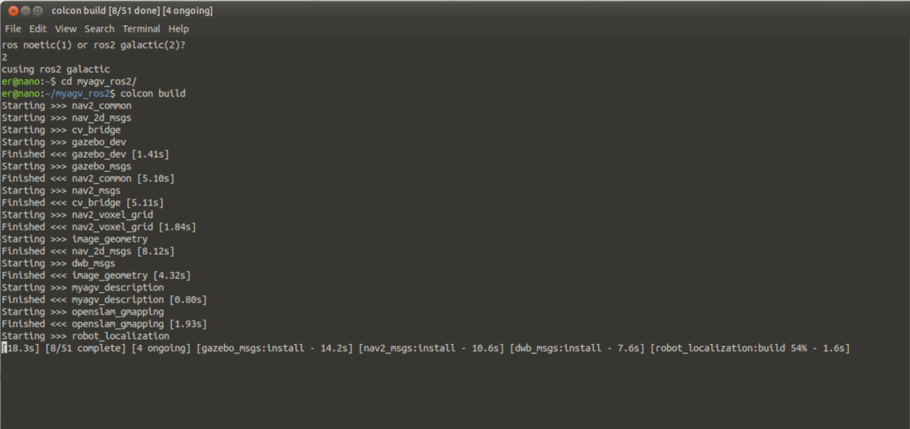
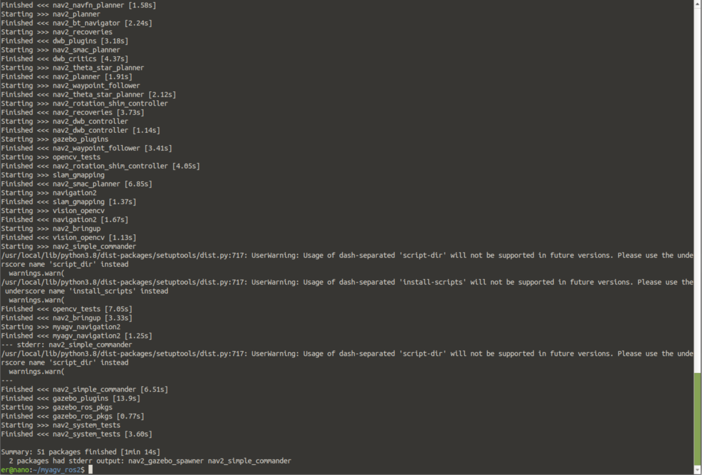
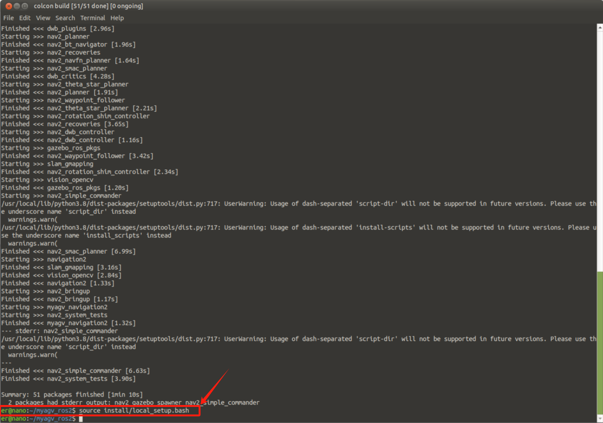

# ROS2 

## 查看当前镜像版本


```
cat /etc/version_log
```

```
v1.0.25.01.02
```

myAGV_ROS2 v1.0.25.03.11 镜像版本，已经完成ROS2的功能集成，可以在[跳转链接](https://docs.elephantrobotics.com/docs/myagv_jn23_cn/8-FilesDownload/8.4-SystemInformation/8.4.1-System_Image.html)下载最新镜像，并烧录镜像系统到tf卡中。

v1.0.25.03.11 镜像版本下面部分无需操作，只当作参考了解ros2知识。



如果myAGV_ROS2是v1.0.25.01.02镜像系统，可以根据下面操作进行适配ros2功能。




如果不是该版本，可以到[这里](https://www.elephantrobotics.com/download/)进行下载v2025102的系统镜像，根据这个[使用说明]((https://docs.elephantrobotics.com/docs/myagv_jn23_cn/8-FilesDownload/8.4-SystemInformation/8.4.2-Image_Burning.html))进行操作。



## 修改~/.bashrc切换ros1和ros2的环境变量

点开er's Home，然后按下键盘Ctrl + H 打开隐藏文件，并找到 .bashrc这个文件



将这四行ros1环境变量

```
source /opt/ros/noetic/setup.bash
source ~/myagv_ros/devel/setup.bash
export ROS_HOSTNAME=localhost
export ROS_MASTER_URI=http://localhost:11311
```



改写如下，增加ros2的环境变量

```
echo "ros noetic(1) or ros2 galactic(2)?"
read edition
if [ "$edition" -eq "1" ];then
    source /opt/ros/noetic/setup.bash
    source ~/myagv_ros/devel/setup.bash
    export ROS_HOSTNAME=localhost
    export ROS_MASTER_URI=http://localhost:11311
    echo using ros noetic
else 
    source /opt/ros/galactic/setup.bash
    source ~/myagv_ros2/install/local_setup.bash
    echo using ros2 galactic
fi
```



每次打开终端前都需要输入数字“1”或“2”，来激活ros1还是ros2的环境。



## 编译ros2代码

打开一个终端，拉取myagv_ros2的galactic-JN分支代码

```
git clone -b galactic-JN https://github.com/elephantrobotics/myagv_ros2.git myagv_ros2/src
```

然后，通过rosdep安装依赖包

```
cd ~/myagv_ros2
rosdep install --from-paths src --ignore-src -r -y
```
还需要手动安装下面的依赖包
```
sudo apt install ros-galactic-bondcpp \
    ros-galactic-test-msgs* \
    ros-galactic-behaviortree-cpp-v3* \
    ros-galactic-ompl \
    ros-galactic-joint-state-publisher \
    ros-galactic-rqt-tf-tree \
    ros-galactic-diagnostic-updater \
    ros-galactic-camera-info-manager -y
```

最后编译源码，第一次编译过程会比较慢，需要耐心等待。

> 注意：一定要在~/myagv_ros2 路径下进行编译

```
colcon build
```

编译成功会提示Summary: 51 packages finished






每次编译完后，记得source ros2的环境变量

```
source install/local_setup.bash
```



myagv_ros2放在[github](https://github.com/elephantrobotics/myagv_ros2)进行管理，可以通过git更新到新版本

```
cd ~/myagv_ros2/src

git pull

cd ..

colcon build
```

## ROS2基础知识

- ros1 组件用c++/python，ros2 组件用c/python；
- ros1 只支持Linux和MacOS，而 ros2 支持Linux/Windows/MacOS/RTOS；
- ros1 的通讯基于TCPROS/UDPROS，强依赖于master节点的处理，而 ros2 基于DDS(分布式架构)；
- ros2 支持实时控制；
- ros2 广泛使用C++11，和Python3.5以上；
- ros2 使用了新的编译系统 Ament；
- 在 ros2 上通过ros_bridge和 ros1 进行通信；
- ros2 使用托管启动：用户可以指定节点启动顺序；
- ros2 取消了 nodelet 的概念，支持多节点初始化；
- ros2 launch文件使用 python 编写，相比于 xml 拓展了功能性。

> ros2指令改动如下

```
rosrun --> ros2 run
rosnode --> ros2 node
roslaunch --> ros2 launch
rosparam --> ros2 param
rospkg --> ros2 pkg
rosservice --> ros2 service 
rossrv --> ros2 srv
rostopic --> ros2 topic
rosaction --> ros2 action
```

> clocon build

- `--packages-up-to` ：构建您想要的包，以及它的所有依赖项，但不是整个工作区（节省时间）
- `--symlink-install` ：让您不必在每次调整 Python 脚本时重建
- `--event-handlers console_direct+`： 在构建时显示控制台输出（否则可以在 `log` 目录中找到）
- `--executor sequential`：逐个处理包，而不是使用并行性

只编译你想要的功能包

```
colcon build --packages-select my_package
```

限制核心数

```
colcon build --jobs 2
```

---

[← 上一章](../6.2-ApplicationBaseROS1/6.2.8-Rtabmap.md) | [下一节 →](../6.3-ApplicationBaseROS2/6.3.2-Real-time_Mapping_with_Gmapping.md)
