# Nav2

接下来将介绍和使用[Nav2导航](https://docs.nav2.org/)。

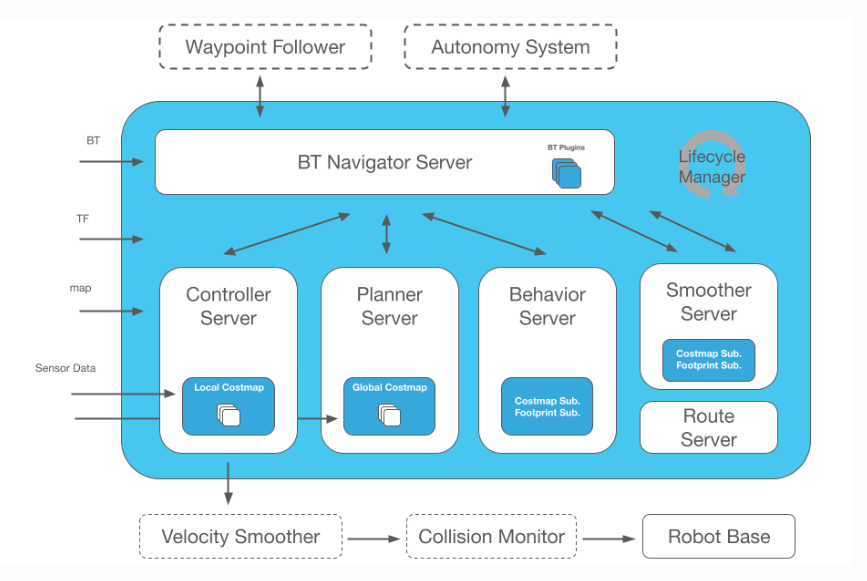

Nav2 是 ROS Navigation Stack 的继任者，部署了为移动和表面机器人技术提供动力的相同类型的技术。该项目允许移动机器人在复杂的环境中导航，以使用几乎任何类别的机器人运动学完成用户定义的应用任务。它不仅可以从 A 点移动到 B 点，还可以具有中间姿势，并表示其他类型的任务，例如对象跟踪、完整覆盖导航等。

## 启动myAGV底层通信

按下键盘Ctrl+Alt+T，打开第一个终端，输入指令

```
ros2 launch myagv_odometry myagv_active.launch.py
```

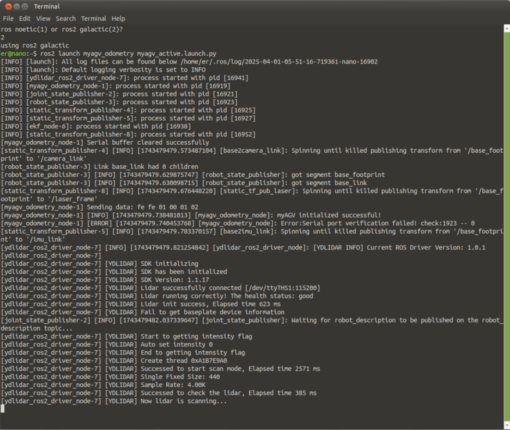

## 启动Nav2

按下键盘Ctrl+Alt+T，打开第二个终端，输入指令

```
ros2 launch myagv_navigation2 navigation2_active.launch.py
```

这将启动一个rviz

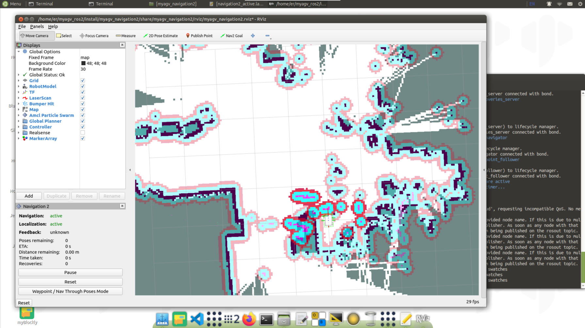

首先，在地图上找到机器人的位置。检查您的机器人在地图中的位置。

在 RViz 中设置机器人的姿势。单击 2D Pose Estimate 按钮，并在地图上指出机器人的位置。绿色箭头的方向是 myAGV 的方向。

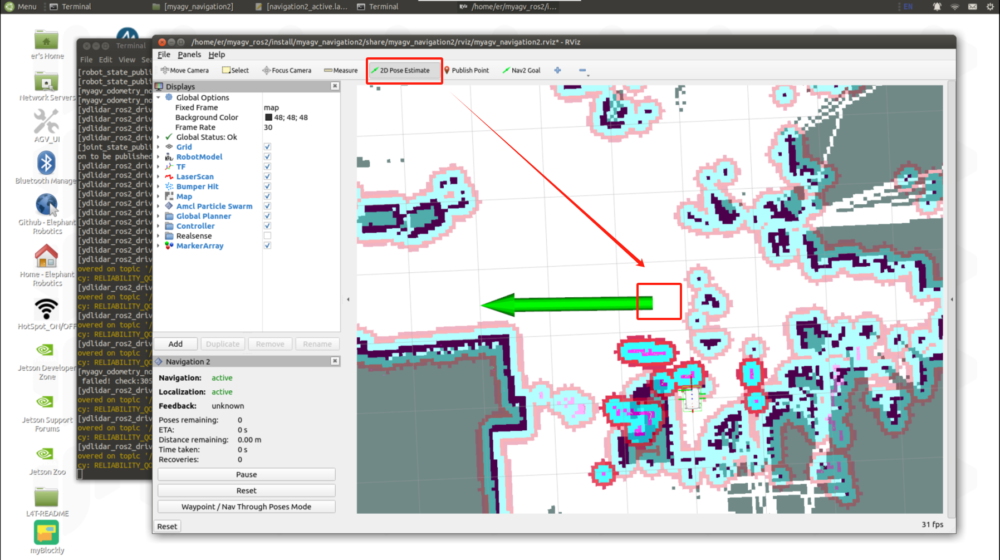

然后3D 模型会移动到该位置。观察激光雷达跟地图障碍物是否匹配，估计位置中的小误差是可以容忍的。

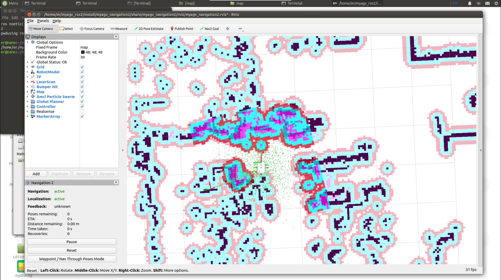

在地图上选择一个要导航的目标位置。使用Nav2 Goal按钮发送目标位置和目标方向。

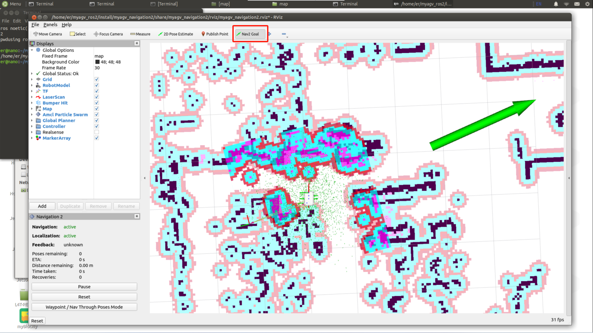

Nav2就会规划路径并发送运动指令，完成导航。

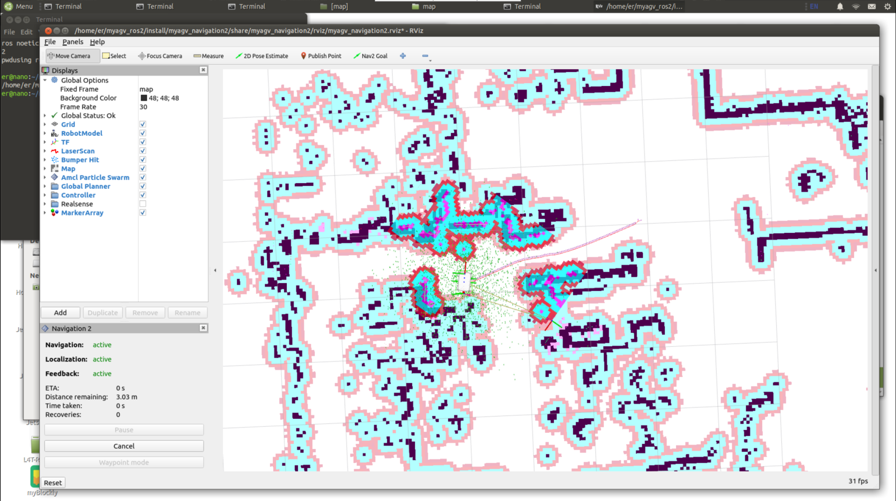

> 路径点跟随

点击rviz2左下框的Waypoint/Nav Through Poses Mode，切换成路径点跟随模式

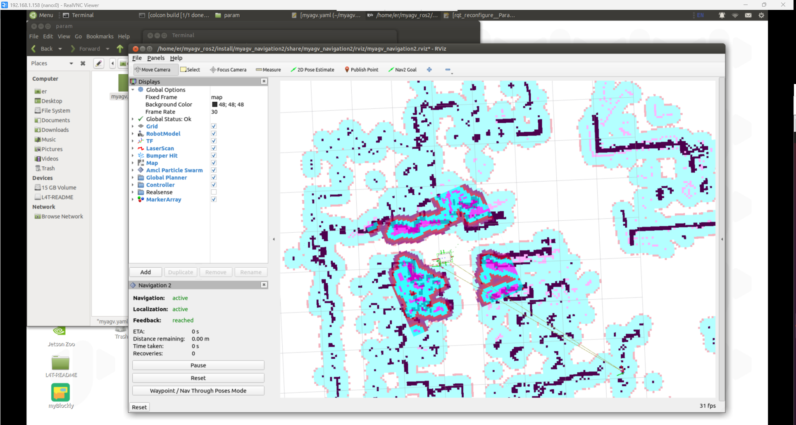

点击Nav2 Goal 发布两个导航点

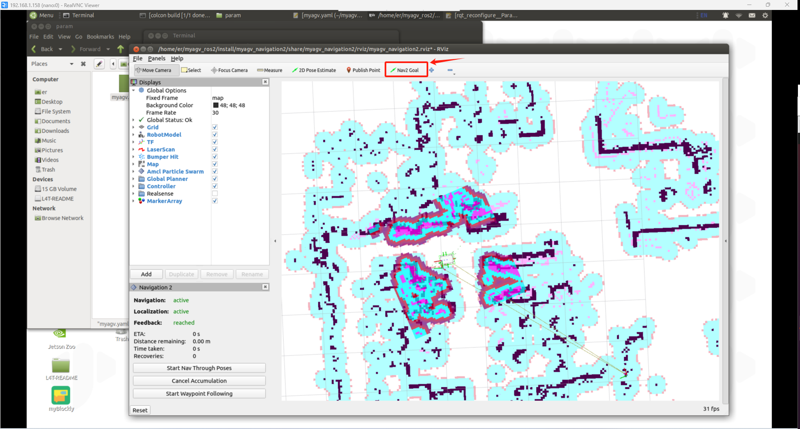

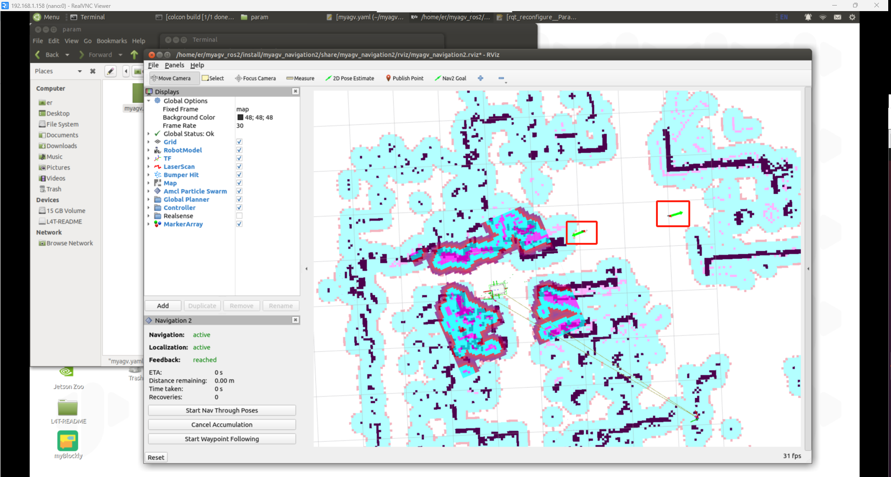

点击左下角的Start Waypoint Following，然后就会依次按顺序进行导航。

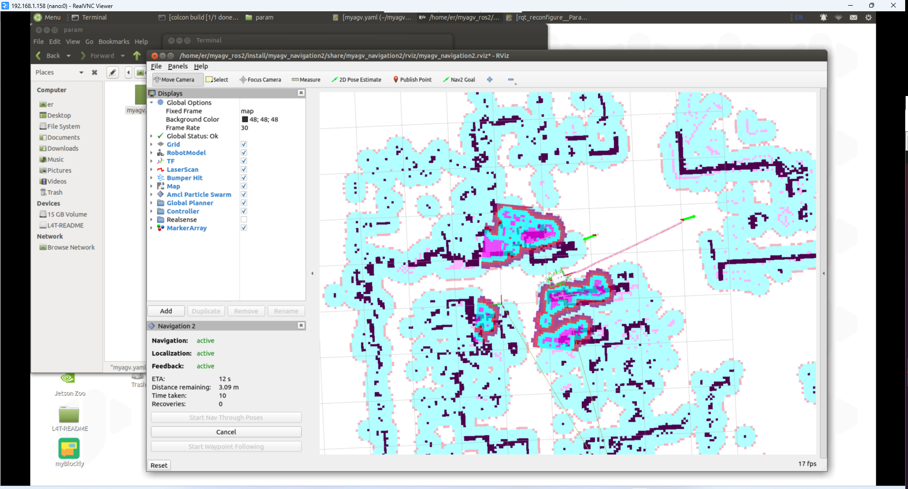

导航到第一个点位后，继续导航到第二点位

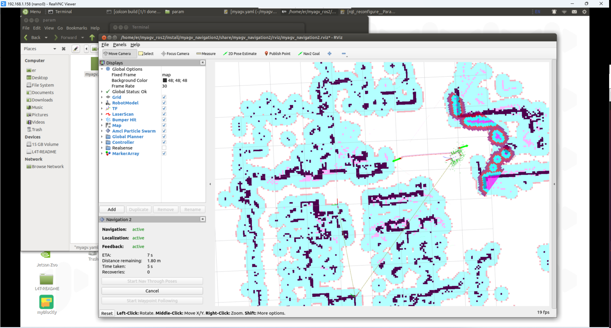

## 更改起始导航地图

在此之前，我们已经成功创建了空间地图，并获得了一组地图文件，即位于 ~/myagv_ros2/src/myagv_navigation2/map 目录下的 **map.pgm 和 map.yaml**，我们就是基于这两个地图文件的基础上进行导航的。下面将介绍如果基于其他地图导航。

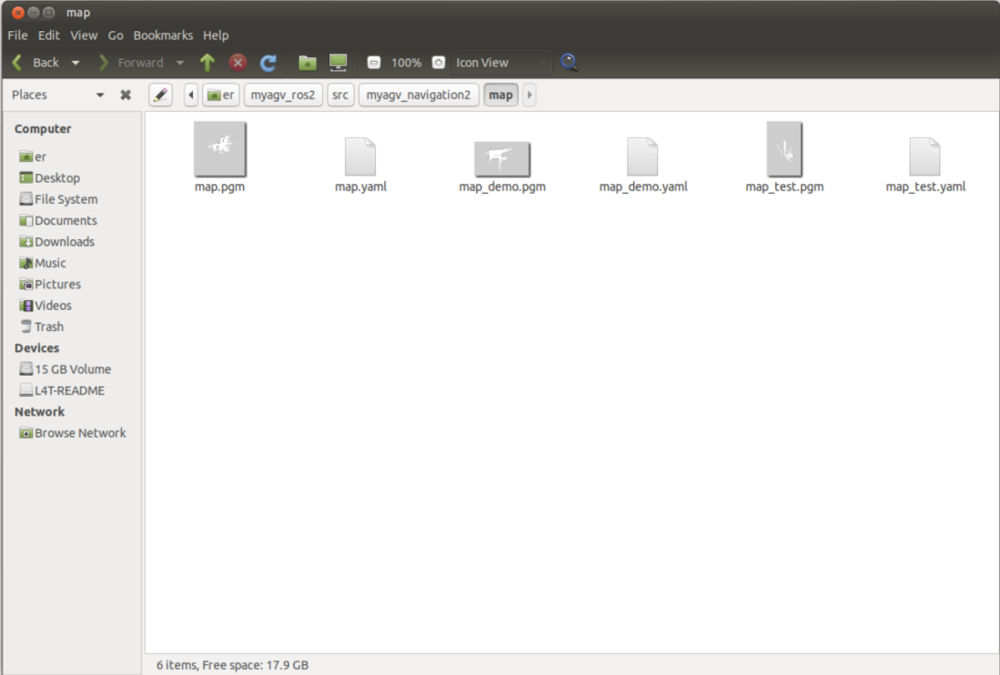

方法一：修改launch.py文件

找到`myagv_ros2/myagv_navigation2/launch/navigation2_active.launch.py`文件，将第二十行的`'map.yaml'`改成你需要的加载的地图文件，然后通过`colcon build`编译。

```python
import os

from ament_index_python.packages import get_package_share_directory

from launch import LaunchDescription
from launch.substitutions import LaunchConfiguration
from launch.actions import DeclareLaunchArgument,IncludeLaunchDescription
from launch.conditions import IfCondition
from launch.launch_description_sources import PythonLaunchDescriptionSource
from launch_ros.actions import Node

def generate_launch_description():
    use_sim_time = LaunchConfiguration('use_sim_time', default='false')
    use_rviz = LaunchConfiguration('use_rviz', default='true')
    map_dir = LaunchConfiguration(
        'map',
        default=os.path.join(
            get_package_share_directory('myagv_navigation2'),
            'map',
            'map.yaml'))

    param_file_name = 'myagv.yaml'
    param_dir = LaunchConfiguration(
        'params_file',
        default=os.path.join(
            get_package_share_directory('myagv_navigation2'),
            'param',
            param_file_name))

    nav2_launch_file_dir = os.path.join(get_package_share_directory('nav2_bringup'), 'launch')

    rviz_config_dir = os.path.join(
        get_package_share_directory('myagv_navigation2'),
        'rviz',
        'myagv_navigation2.rviz')

    return LaunchDescription([
        DeclareLaunchArgument(
            'map',
            default_value=map_dir,
            description='Full path to map file to load'),
    
        DeclareLaunchArgument(
            'params_file',
            default_value=param_dir,
            description='Full path to param file to load'),

        DeclareLaunchArgument(
            'use_sim_time',
            default_value='false',
            description='Use simulation (Gazebo) clock if true'),

        IncludeLaunchDescription(
            PythonLaunchDescriptionSource([nav2_launch_file_dir, '/bringup_launch.py']),
            launch_arguments={
                'map': map_dir,
                'use_sim_time': use_sim_time,
                'params_file': param_dir}.items(),
        ),

        Node(
            package='rviz2',
            executable='rviz2',
            name='rviz2',
            arguments=['-d', rviz_config_dir],
            parameters=[{'use_sim_time': use_sim_time}],
            condition=IfCondition(use_rviz),
            output='screen'),
    ])
```

方法二：启动launch时增加map的参数

在启动`ros2 launch myagv_navigation2 navigation2_active.launch.py`时，增加`map:=`参数。关于launch这部分写法，可以[参考该链接](https://docs.ros.org/en/galactic/Tutorials/Intermediate/Launch/Using-Substitutions.html)。

```
ros2 launch myagv_navigation2 navigation2_active.launch.py map:=/home/er/myagv_ros2/src/myagv_navigation2/map/map_demo.yaml
```

---

[← 上一页](6.2.6-Real-time_Mapping_with_Cartographer.md) | [下一页 →](6.2.8-Rtabmap.md)
