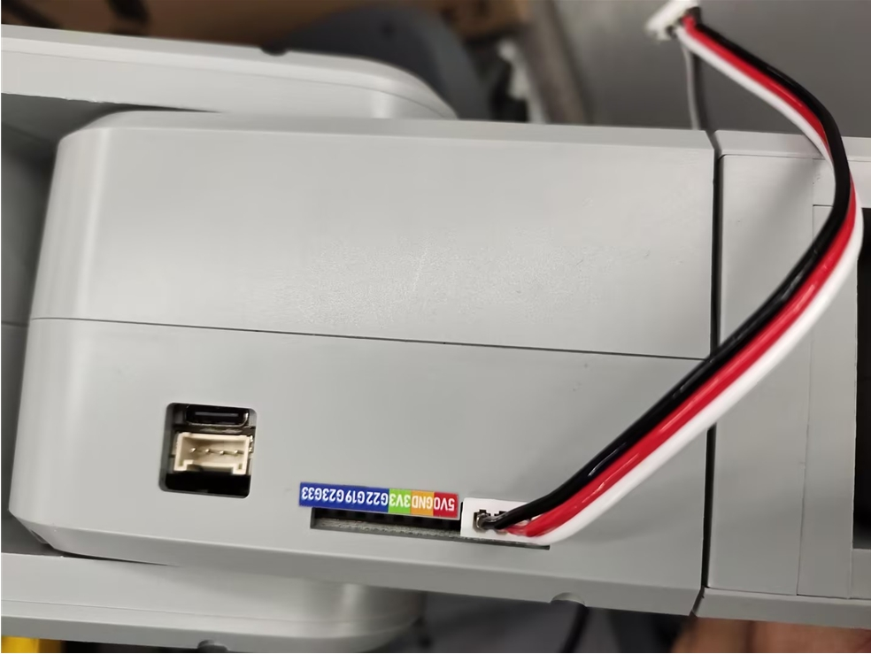

# MyAGV + 270M5 手柄遥控案例

**功能**：用手柄控制MyAGV + 270M5进行移动

## 1 硬件安装
### 机械臂安装
将270M5固定在AGV上


然后将12V电源线,Type-C线，手柄接收器参考下图进行接线后，按下AGV电源键即可


开机后，确保270M5底部屏幕显示ATOM：OK


末端工具可选择夹爪或吸泵

### 吸泵安装

将乐高连接件插入吸泵上预留的插孔中


将插好连接件的吸泵对准机械臂末端插孔插入


然后将公母杜邦线接到机械臂的底座IO


> 左侧为吸泵引脚，右侧为机械臂引脚
> GND -> GND
> 5V -> 5V
> G2 -> 2
> G5 -> 5


### 夹爪安装
将乐高连接件插入夹爪预留的插孔中


将插好连接件的夹爪对准机械臂末端插孔插入


将夹爪线插入机械臂控制接口




## 2 依赖库安装

```bash
pip install pygame pymycobot --upgrade
```

## 3 手柄功能说明


## 4 手柄激活
将手柄的开关打开


**注意**：第一次将手柄收发器插到AGV的USB接口上，或是重新拔插接收器以及AGV重启，都需要先执行下面的程序，对手柄进行激活
```python
import pygame
import sys
import time

pygame.init()
pygame.joystick.init()
if pygame.joystick.get_count() > 0:
    joystick = pygame.joystick.Joystick(0)  
    joystick.init()
    while 1:
        print("长按MODE键进入控制模式,MODE灯亮红灯,即可关闭此程序")
        time.sleep(1)
else:
    print("没有检测到手柄")
    pygame.quit()
    sys.exit()
```
执行程序后，长按手柄的MODE键，待手柄的MODE灯亮红灯后，即可松开MODE键


**注意**：只有MODE LED亮灯，才可以控制机械臂，如果手柄长时间不使用会进入待机状态，可以按一下手柄的START按键进行激活


## 5 案列复现
### 启动激光雷达
打开终端，运行下面指令
```bash
./myagv_ros/src/myagv_odometry/scripts/start_ydlidar.sh
```
### 启动里程计节点
```bash
roslaunch myagv_odometry myagv_active.launch
```

### 案列程序
运行下面程序后，终端打印init_ok，即可开始控制
```python

from pymycobot import MechArm270
import pygame
import time
import sys
import rospy
from geometry_msgs.msg import Twist
import threading

class CmdVelPublisher:
    def __init__(self):       
        rospy.init_node('cmd_vel_publisher', anonymous=True)
        self.pub = rospy.Publisher('/cmd_vel', Twist, queue_size=10)       
        self.move_cmd = Twist()     
        self.move_cmd.linear.x = 0
        self.move_cmd.linear.y= 0
        self.move_cmd.angular.z = 0        
        self.rate = rospy.Rate(10)         
        self.publish_thread = threading.Thread(target=self.publish_cmd_vel)
        self.publish_thread.daemon = True  
        self.publish_thread.start()
    def publish_cmd_vel(self):
        while not rospy.is_shutdown():
            self.pub.publish(self.move_cmd)
            self.rate.sleep()
    def set_speed(self, x=0,y=0,yaw=0):
        self.move_cmd.linear.x = x
        self.move_cmd.linear.y = y
        self.move_cmd.angular.z = yaw
       
pygame.init()
pygame.joystick.init()
button_pressed = False
hat_pressed=False
previous_state = [0,0,0,0,0,0] 
cmd_vel_publisher = CmdVelPublisher()
mc=MechArm270("/dev/ttyACM0")
init_angles=[0, 0, 0, 0, 90, 0]
mc.sync_send_angles(init_angles,50)
count=100
mc.set_gripper_state(0,100)
time.sleep(1)
mc.set_fresh_mode(1)
arm_speed=10
print("init_ok")

def pump_on():
    mc.set_basic_output(5, 0)
    # time.sleep(0.05)

def pump_off():
    mc.set_basic_output(5, 1)
    # time.sleep(0.05)
    mc.set_basic_output(2, 0)
    # time.sleep(1)
    mc.set_basic_output(2, 1)
    # time.sleep(0.05)
    
def joy_handler():
    global button_pressed
    global hat_pressed
    global previous_state
    global count
    if event.type == pygame.JOYAXISMOTION:
        axis = event.axis  
        value = round(event.value, 2)  
        if abs(value) ==1.0:  
            flag = True
            previous_state[axis] = value  
            if axis==0 and value==-1.00:
                mc.jog_coord(2,1,arm_speed)
            elif axis==0 and value==1.00:
                mc.jog_coord(2,0,arm_speed)
            if axis==1 and value==1.00:
                mc.jog_coord(1,0,arm_speed)
            elif axis==1 and value==-1.00:
                mc.jog_coord(1,1,arm_speed)
            if axis==2 and value==1.00:
                mc.power_on()
            if axis==4 and value==1.00:
                cmd_vel_publisher.set_speed(x=-0.2)  
            elif axis==4 and value==-1.00:
                cmd_vel_publisher.set_speed(x=0.2)              
            if axis==3 and value==1.00:
                cmd_vel_publisher.set_speed(y=-0.2)
            elif axis==3 and value==-1.00:
                cmd_vel_publisher.set_speed(y=0.2)
            if axis==5 and value==1.00:
                cmd_vel_publisher.set_speed(yaw=-0.2)
            elif axis==5 and value!=1.00:
                cmd_vel_publisher.set_speed()              
        else:
            if previous_state[axis] != 0:
                cmd_vel_publisher.set_speed()
                mc.stop()
                previous_state[axis] = 0  
    if event.type == pygame.JOYBUTTONDOWN:
        if joystick.get_button(0)==1:
            count-=10
            if count<0:
                count=0
            mc.set_gripper_value(count,100)
            pass
        if joystick.get_button(1)==1:
            pump_on()
            pass
        if joystick.get_button(2)==1:
            pump_off()
            pass
        if joystick.get_button(3)==1:
            count+=10
            if count>100:
                count=100
            mc.set_gripper_value(count,100)
            pass
        if  joystick.get_button(4)==1:
            mc.release_all_servos()
        if  joystick.get_button(5)==1:
            cmd_vel_publisher.set_speed(yaw=0.2)            
        if  joystick.get_button(7)==1:
            mc.send_angles(init_angles,100)
    if event.type == pygame.JOYBUTTONUP:      
        if  event.button==5:           
            cmd_vel_publisher.set_speed()            
    if event.type == pygame.JOYHATMOTION:
        hat_value = joystick.get_hat(0) 
        if hat_value ==(0,-1):
            mc.jog_coord(3,0,arm_speed)
        elif hat_value ==(0,1):
            mc.jog_coord(3,1,arm_speed)
        elif hat_value ==(-1,0):
            mc.jog_angle(6,0,arm_speed)
        elif hat_value ==(1,0):
            mc.jog_angle(6,1,arm_speed)
        if hat_value != (0, 0):
            hat_pressed = True
        else:
            if hat_pressed: 
                cmd_vel_publisher.set_speed() 
                mc.stop()
                hat_pressed = False  
if pygame.joystick.get_count() > 0:
    joystick = pygame.joystick.Joystick(0) 
    joystick.init()
else:
    print("no handler")
    pygame.quit()
    sys.exit()
running = True
try:
    while not rospy.is_shutdown():
        for event in pygame.event.get():                
            joy_handler()
except KeyboardInterrupt:
    #print("end")
    pygame.quit()
    sys.exit(0)
```

## 6 案例展示

