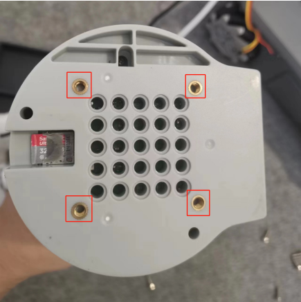

# 1 安装说明

## 1.1 安装机械臂

首先需要将机械臂安装到 myAGV，可使用乐高键或螺丝将机械臂安装在 myAGV 上部的位置，可以根据自己需求安装在前部或后部。

## 1.2 连接机械臂

使用 DC 电源线连接到机械臂供电接口，另一端连接机械臂电源接口，小车可以给机械臂供电（12V 5A）。

举例：myCobot280 Pi，其他 Pi 机械臂同理。

1.用六角扳手将这四颗 m4\*8 内六角螺丝拆卸下来

2.将 myCobot 280Pi 机械臂的 X 轴对应的正确方向进行安装，并拧上四颗 m4\*8 固定 280Pi。

---

[← 上一页](README.md) | [下一页 →](7.2-CommunicationsControl.md)
