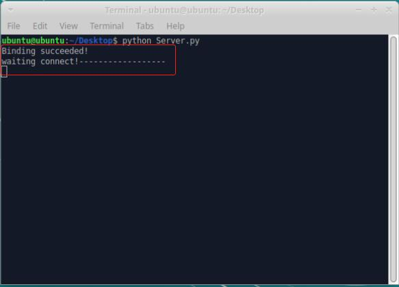

# myAGV 与机械臂通讯控制

## Pi 版本

### WIFI 通讯控制

**注：** 只支持 myCobot 280 Pi、myPalletizer 260 Pi、mechArm 270 Pi

1、配置机械臂

**Step 1** 首先机械臂连接显示屏开机，点击 WIFI 图标，连接 WIFI，并输入 WIFI 密码，点击 Connection，成功连接。

**Step 2** 点击桌面 pymycobot 文件，点击 demo 文件，把 Server.py 文件拷贝到桌面上。

**Step 3** 打开命令终端


**Step 4** 输入以下代码运行脚本：

```python
sudo python3 Server.py
```

**Step 5** 运行成功如图：



2、myAGV 通讯控制案例

小车正常开机连接显示屏与键鼠，以上步骤确保连接好，接下来就可以使用小车控制机械臂啦。

**注意：机械臂需要和小车在同一网段下，即同一 WIFI 下。**

- myCobot 280、mechArm 270：

```python
from pymycobot import MyCobotSocket
# 默认使用9000端口
#其中"192.168.10.22"为机械臂IP，请自行输入你的机械臂IP
mc = MyCobotSocket("192.168.10.22",9000)
mc.connect()

#连接正常就可以对机械臂进行控制操作
mc.send_angles([0,0,0,0,0,0],20)
res = mc.get_angles()
print(res)

...
```

- myPalletizer 260：

```python
from pymycobot import MyPalletizerSocket
# 默认使用9000端口
#其中"192.168.10.22"为机械臂IP，请自行输入你的机械臂IP
mc = MyPalletizerSocket("192.168.10.22"，9000)
mc.connect()

#连接正常就可以对机械臂进行控制操作
mc.send_angles([0,0,0,0],20)
res = mc.get_angles()
print(res)

...
```

---

## M5 版本

### USB串口通讯控制

**注：** 只支持myCobot 280 M5、myPalletizer 260 M5、mechArm 270 M5

此部分以myPalletizer 260 M5版本举例说明。

1、连接机械臂

使用usb串口通讯控制时，首先使用type-c转usb的线连接小车与机械臂。


2、USB通讯连接

点击 Transponder，再点击 USB UART,机械臂保持在Atom： ok界面。


3、myAGV通讯控制

小车正常开机连接显示屏与键鼠，以上步骤确保连接好，接下来就可以使用小车控制机械臂啦。


如果在运行后报错串口没有权限时

```
PermissionError:[Errno 13]Permission denied:"/dev/ttyACM0
```

可以增加串口规则解决：


填入一下内容


然后保存串口规则，然后在终端重载规则并重启

```
sudo  udevadm control --reload

sudo reboot
```

后续就能正常控制机械臂了

更加详细的 myBlockly教程，可查看
[**6.1章节 myBlockly**](../5-BasicApplication/5.2-ApplicationUse/5.2.1-myblockly/README.md)

### WIFI 通讯控制

**注：** 只支持myCobot 280 M5、myPalletizer 260 M5

1、 移动网络设定

**Step 1:** 需要把wifi或手机移动热点修改为与机械臂网络一致:

* 即“MyCobotWiFi2.4G”，机械臂移动网络密码为“mycobot123”;

* 即“MyPalWiFi2.4G”，机械臂移动网络密码为“mypal123”。


2、WIFI连接

**Step 1:** 点击 WlAN Server，出现“WIFI Connecting”提示，表示无线网络正在连接。


**Step 2:** 出现WIFI Connected以及IP和Port信息说明WIFI已经成功连接。


> **注意：**如果连接失败请返回到USB UART选项点击一次再试。若依旧无法连接WIFI，请查看第8章节 [**7 TCP/IP**](../../7-ApplicationBasePython/7.7_TCPIP.md/)：1.3 WIFI无法连接解决方案。

3、myAGV通讯控制案例

小车正常开机连接显示屏与键鼠，以上步骤确保连接好，接下来就可以使用小车控制机械臂啦。

* myCobot 280：

```python
from pymycobot import MyCobotSocket
# 默认使用9000端口
#其中"192.168.11.15"为机械臂IP，请自行输入你的机械臂IP
mc = MyCobotSocket("192.168.11.15",9000)

#连接正常就可以对机械臂进行控制操作
mc.send_angles([0,0,0,0,0,0],20)
res = mc.get_angles()
print(res)

...
```

* myPalletizer 260：

```python
from pymycobot import MyPalletizerSocket
# 默认使用9000端口
#其中"192.168.11.15"为机械臂IP，请自行输入你的机械臂IP
mc = MyPalletizerSocket("192.168.11.15",9000)

#连接正常就可以对机械臂进行控制操作
mc.send_angles([0,0,0,0],20)
res = mc.get_angles()
print(res)

...
```

---

[← 上一页](7.1-InstallationInstructions.md) | [下一章 →](../8-FilesDownload/README.md)
