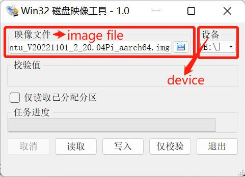

# 镜像烧录

## JN 版本机器人介绍

### 1.1 下载步骤

**Step 1:** 解压缩软件包后，会出现[一个镜像文件](8.4.1-System_Image.md)样式。

**Step 2:** 下载 Win32DiskImager。

请访问 [Win32DiskImager](https://sourceforge.net/projects/win32diskimager/) 下载。

**Step 3:** 根据图片卸下对应的螺丝，用镊子取出 Jetson nano 的 SD 卡。然后将 SD 卡连接到电脑。

**Step 4:** 打开 Win32DiskImager。

**Step 5:** 选择软件和设备（E 盘），然后将软件写入 PC。

**Step 6:** 已成功处理。

---

[← 上一页](8.4.1-System_Image.md) | [下一页 →](../8.5-PublicityMaterial.md)
