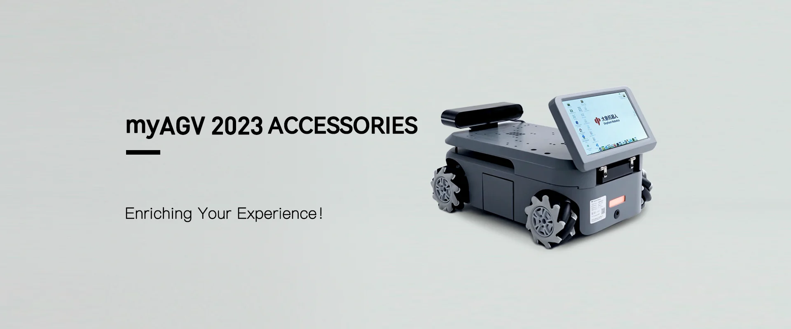

# Accessories & Tools

## Design Concept
Elephant Robotics is dedicated to enabling everyone to easily use robots alongside these accessories, liberating users from the complexity of selecting the right accessories and enabling a swift start to robot utilization.

## Types of Accessories

In order to meet the needs of customers in various scenarios, we provide the following accessories.

### Touch Screen

- [7-inch IPS High-Definition Touch Screen](../1.4-AccessoriesTools/1.4.1-IPS/1-IPSTouchScreen.md)
  The 7-inch IPS high-definition touchscreen is a small-sized LCD display with clear high-definition and wide-angle viewing characteristics. It also features touch functionality, allowing users to interact through simple touch gestures. 

### Backup Battery

- [Backup Battery](../1.4-AccessoriesTools/1.4.2-BackupBattery/1-BackupBattery.md)
  With the same specifications as the primary battery of myAGV 2023 and a quick installation method, it extends the runtime of the myAGV 2023 series.
  
---

 [← Previous Page](../README.md#chapter-summary)| [Next chapter →](../../2-ProductFeature/README.md)
