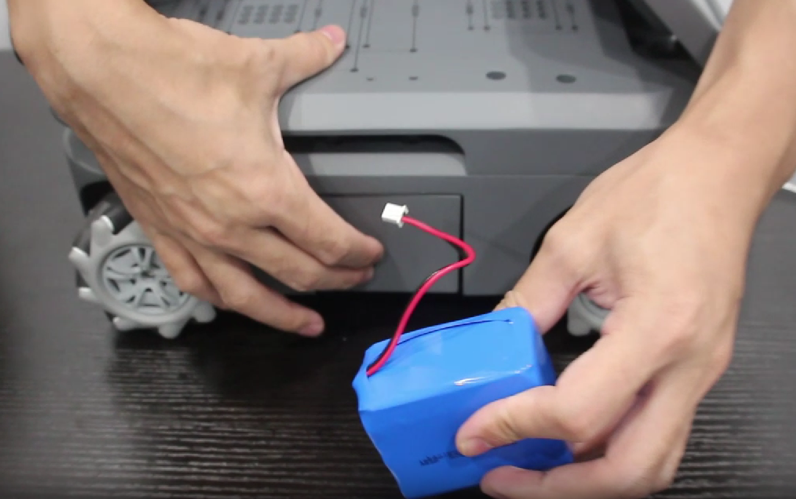
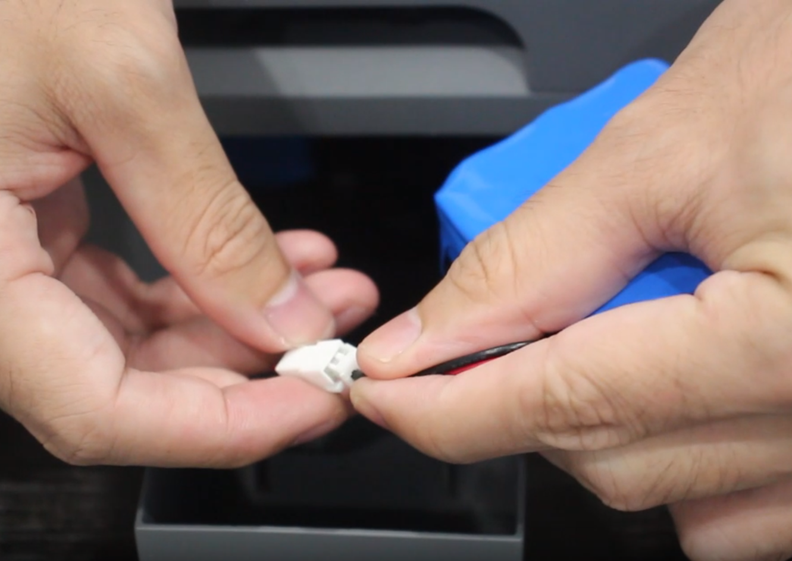
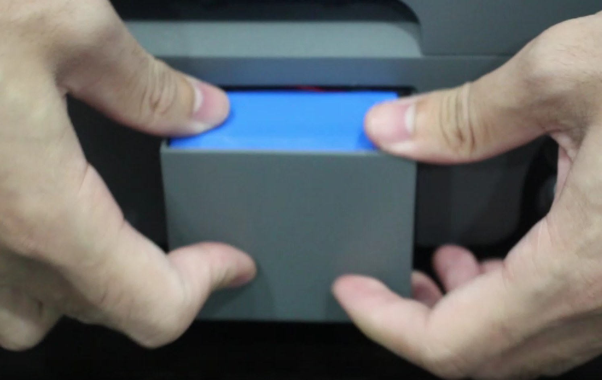

# 备用电池

> **兼容型号：** myAGV PI 2023、myAGV Jetson Nano 2023

它与 myAGV 2023 的主电池规格相同，并采用快速安装方法，可延长 myAGV 2023 系列的运行时间。

## 产品参数

| **参数** | **规格**                               |
| :------- | :------------------------------------- |
| 容量     | 6400mAh                                |
| 电压     | 11.1V                                  |
| 兼容性   | myAGV PI 2023 , myAGV Jetson Nano 2023 |

## 如何使用

1.从附件盒中取出备用电池，找到 myAGV 左侧的电池仓。

2.用手按压电池仓两侧，电池仓外壳会自动弹出，连接备用电池的正负极接口。

3.将电池直立放入电池仓，然后将白色插头插入空位，以防干扰外壳安装。

> 如何知道电池是否已正确安装和识别？

请打开 [myAGV_UI](../../../5-BasicApplication/5.2-ApplicationUse/5.2.3-myagv_UI/user_manual.md)  
备用电池的指示灯将亮起，电压值可以返回，表明安装成功。

## 购买链接：

- [淘宝](https://item.taobao.com/item.htm?id=745304010906&spm=a312a.7700824.w4002-23353347473.51.3a00b6e28MpDla)
- [shopify](https://shop.elephantrobotics.com/collections/myagv/products/spare-battery-for-myagv-2023)

---

[← 周边配件页](../1.4-AccessoriesTools.md#touch-screen)
