# Depth Camera

> **Compatible Model：** myAGV Jetson Nano 2023

The Astra Pro 2 depth camera is currently only used with the myAGV JN version. It is an optional product that must be [purchased separately](https://item.taobao.com/item.htm?id=745304010906&spm=a312a.7700824.w4002-23353347473.51.3a00b6e28MpDla&skuId=5309239682811).

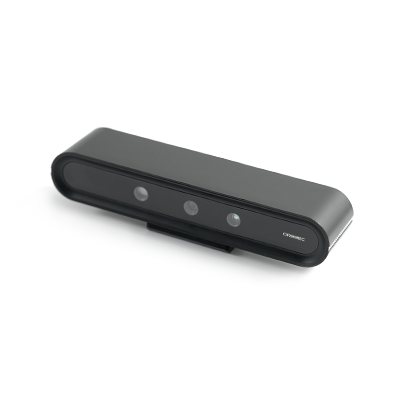

The Astra Pro 2 depth camera uses 3D structured light imaging technology to capture depth images of objects, while also utilizing a color camera to capture color images of objects. The Astra Pro 2 is suitable for 3D scanning of objects and spaces within a distance range of 0.6m to 6m, enabling depth data measurement of objects within this range.

## Astra Pro 2 Basic Specifications

| Parameter             | Specification               |
| --------------------- | --------------------------- |
| Name                  | Astra Pro 2                 |
| Model                 | A20113-000                  |
| Working Range         | 0.6m - 6m                   |
| Dimensions            | 164.85 × 36.00 × 40 mm      |
| Weight                | 145g ± 5g                   |
| Power Consumption     | Average < 2.0W, Peak < 2.5W |
| Baseline              | 55mm                        |
| Interface             | USB Type A Male             |
| Power Supply          | USB 2.0                     |
| Power Requirement     | 5V 0.5A                     |
| Operating Temperature | 10°C - 40°C                 |
| Measurement Accuracy  | 3mm @ 1m                    |

## Astra Pro 2 Depth Image Specifications

| Parameter                  | Specification                                                | Remarks                |
| -------------------------- | ------------------------------------------------------------ | ---------------------- |
| Resolution<br/>@Frame Rate | 1280x1024 @ 7fps<br/>1280x960 @ 7fps<br/>640x480 @ 10/15/30fps<br/>320x240 @ 10/15/30fps<br/>160x120 @ 10/15/30fps |                        |
| Depth FOV                  | H58.4° V45.5° D70° ± 5°                                      | Measured at 1m         |
| Depth Format               | Y16/Y12/Y11                                                  | Depth unit: 0.1mm, 1mm |

## Astra Pro 2 Color Image Specifications

| Parameter                  | Specification                                                |
| -------------------------- | ------------------------------------------------------------ |
| Resolution<br/>@Frame Rate | 1280x960 @ 7fps<br/>640x480 @ 10/15/30fps<br/>320x240 @ 10/15/30fps |
| Color FOV                  | H62.7° V49° D75.1° ± 5°                                      |
| Image Format               | UYVY                                                         |

## Astra Pro 2 Specifications

| Parameter               | Specification              |
| ----------------------- | -------------------------- |
| Operating System        | Windows / Linux            |
| Application Environment | Indoor                     |
| Safety                  | Class 1 Laser              |
| Camera Principle        | Monocular Structured Light |
| Certification           | RoHS 2.0 / REACH / Class 1 |


## Installation Guide

1.Take out the Astra Pro 2 depth camera and the installation components.

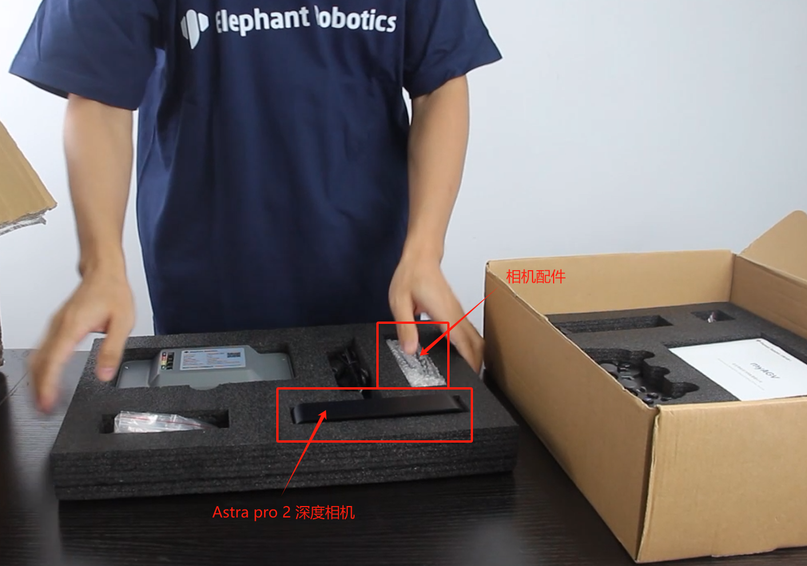

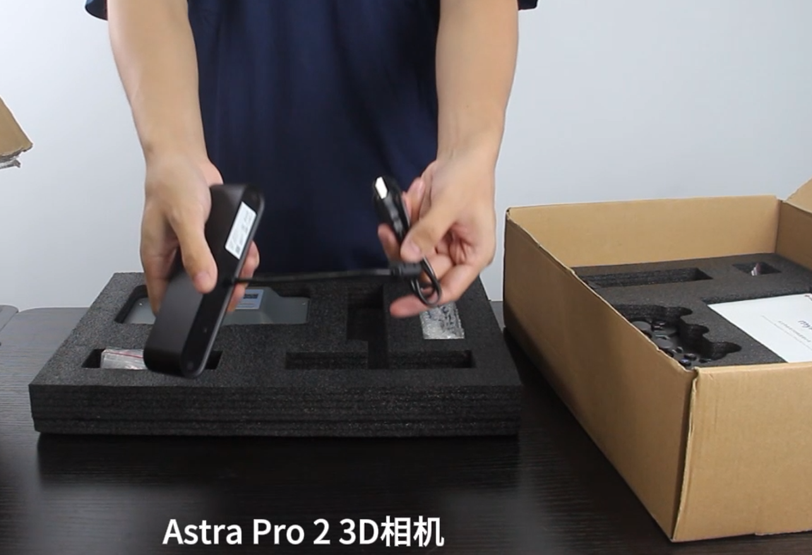

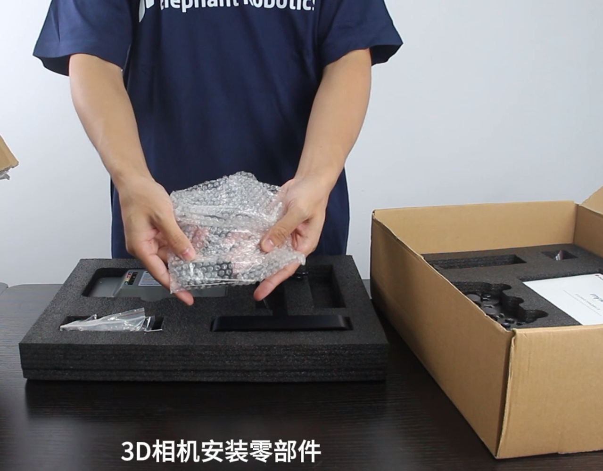

2.Use two M2*4 screws to secure the connector to the depth camera.

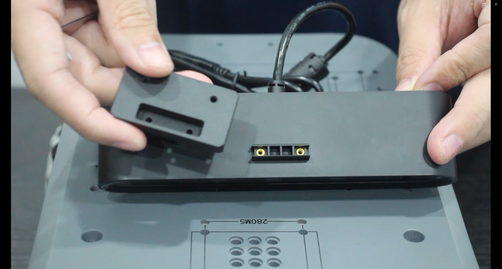

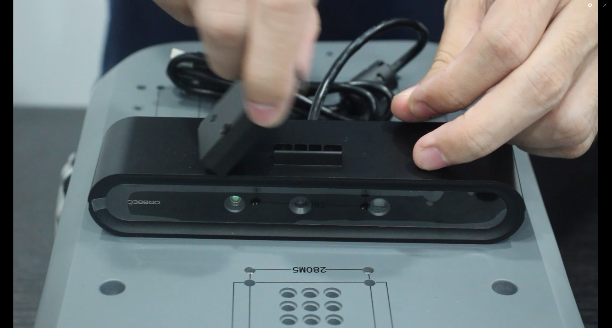

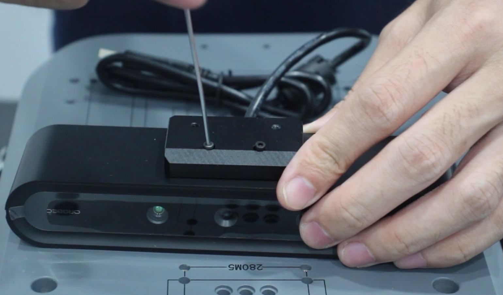

3.Use an Allen wrench to remove the four M4*8 screws.

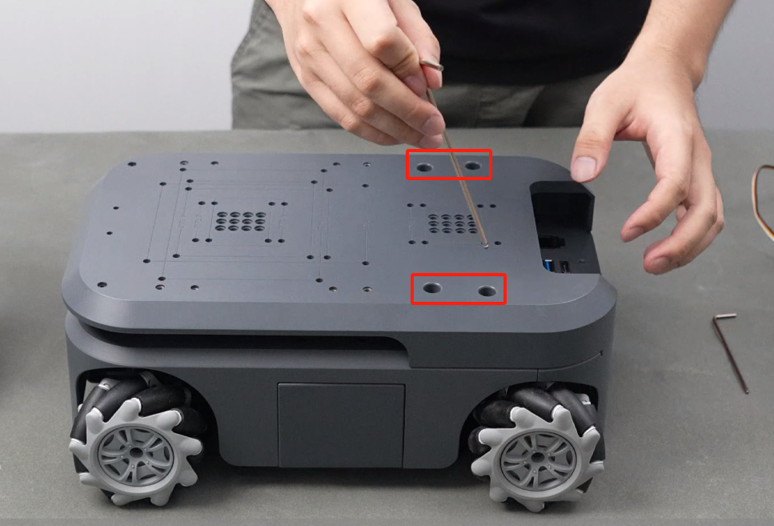

4.Use the Allen wrench to remove the two M2.5*2 screws.

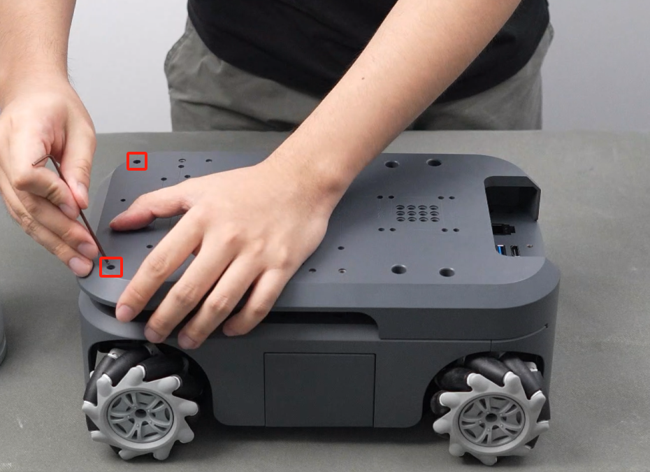

5.Flip the casing over and align the screw holes with the camera.

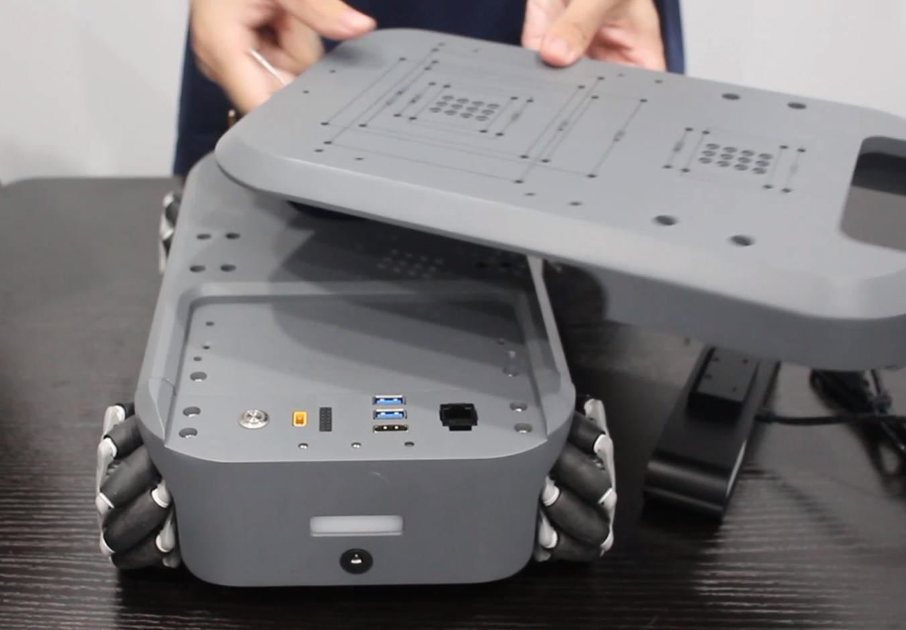

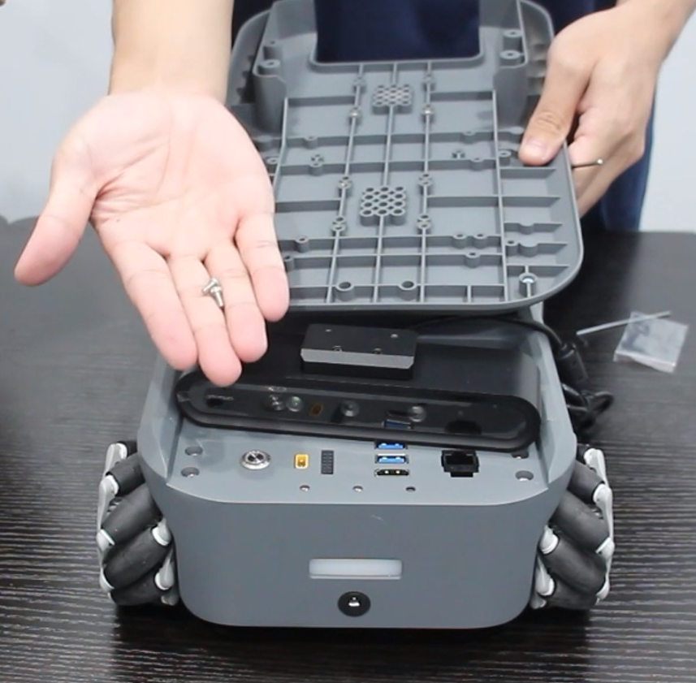

6.Install the camera by tightening the M4*4 screws.

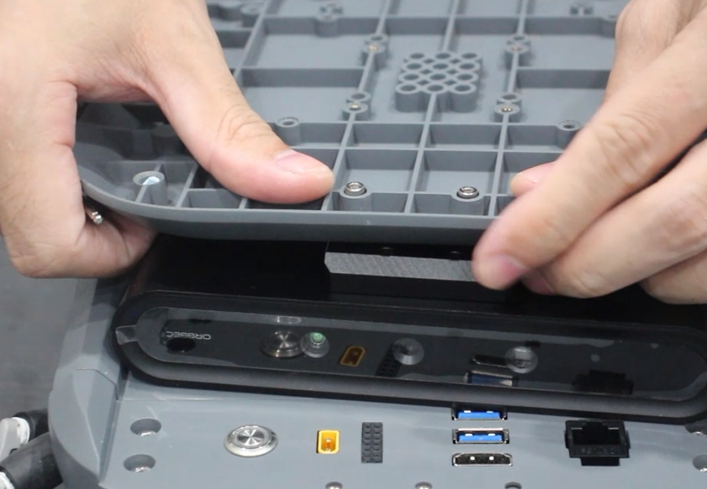

7.Connect the camera's USB cable to the USB port on the myAGV.

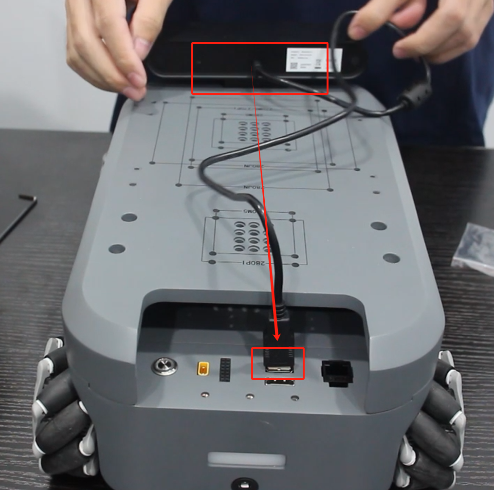

## User Guide

The Astra Pro 2 depth camera is primarily developed using ROS.

```
roslaunch orbbec_camera astra_pro2.launch
```

The available ROS topics that users can subscribe to are:

- `/camera/color/camera_info`: The color camera info.
- `/camera/color/image_raw`: The color stream image.
- `/camera/depth/camera_info`: The depth camera info.
- `/camera/depth/image_raw`: The depth stream image.
- `/camera/depth/points`: The point cloud, only available when `enable_point_cloud` is `true`.
- `/camera/depth_registered/points`: The colored point cloud, only available when `enable_colored_point_cloud` is `true`.
- `/camera/left_ir/camera_info`: The left IR camera info.
- `/camera/left_ir/image_raw`: The left IR stream image.
- `/camera/right_ir/camera_info`: The right IR camera info.
- `/camera/right_ir/image_raw`: The right IR stream image.
- `/diagnostics`: The diagnostic information of the camera, Currently, the diagnostic information only includes the temperature of the camera.

For more details, refer to [myAGV-rtabmap Mapping Guide](../../../6-SDKDevelopment/6.2-ApplicationBaseROS1/6.2.8-Rtabmap.md)

## Mall link: 

-   [Taobao](https://item.taobao.com/item.htm?id=745304010906&spm=a312a.7700824.w4002-23353347473.51.3a00b6e28MpDla&skuId=5309239682811)
-   [shopify](https://shop.elephantrobotics.com/collections/myagv-smart-navigation-robot/products/astra-pro-2-for-myagv-jetson-nano-2024)

----

[← Accessories Tools Page](../1.4-AccessoriesTools.md#touch-screen)
