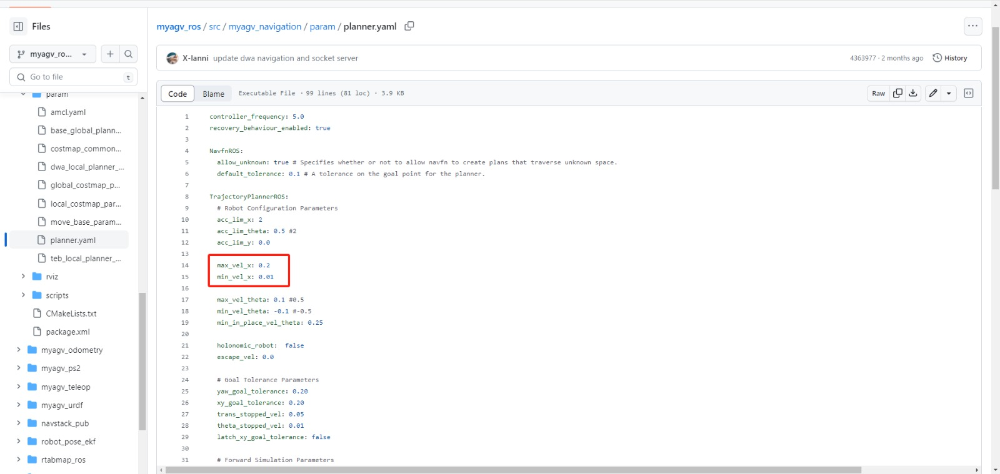

# Software issues

## mystudio related

**Q: Details about downloading firmware for mystudio**

1. Generally, the firmware is already built-in when leaving the factory. Unless the machine is abnormal, there is no need to re-flash the firmware

2. You need to connect to the network during the firmware download process

3. Select the firmware for the corresponding model, and do not choose the wrong model

## python related

**Q: The running prompt shows that the library file is missing Q: The error message: ModuleNotFoundError: No module named "pymycobot", how to deal with it?**

- A: The reason for the error may be that pymycobot is abnormal. The corresponding solution is to reinstall pymycobot. The command is `pip3 install pymycobot --upgrade --user`

**Q: Is there an API for AGV to control distance or angle?**

- A: The distance control in the current AGV API is determined by a combination of time and speed calculations. There is currently no API specifically for specifying the moving distance or wheel angle. If you need to travel a specific distance, you can calculate the time and speed required for distance conversion.

**Q: How to solve the problem of missing scripts folder when running the lidar file on AGV JN?**

- A: Since the AGV JN image version is relatively old, this problem cannot be solved by re-burning the image
You need to download the missing source files from the GitHub file and import them into AGV
The specific link is as follows:
https://github.com/elephantrobotics/myagv_ros/tree/myagv_ros_2023JN/myagv_odometry

## ROS related

**Q: How to deal with the failure to start the radar odometer or abnormal map building?**

- A: Enter the following two commands to enable the radar

```bash
//Jump to the laser radar startup directory
cd myagv_ros/src/myagv_odometry/scripts
//Power on to enable the radar. After powering on, the radar will send data through the serial port
./start_ydlidar.sh
```

If there is no start_ydlidar.sh file in the system's built-in myagv_ros package, please re-download the myagv_ros package. The command is: git clone https://github.com/elephantrobotics/myagv_ros/tree/myagv_ros_2023Pi
Or after selecting the corresponding branch, click "Code" and then click "Download ZIP" to download the ros package to the local computer and then use a USB flash drive to put the ros package in the AGV system.


If the model is AGV-JN, please switch to the AGV-JN branch


Notes:
1. After the replacement, you need to delete the myagv_ros folder in the original home/er directory, unzip the newly downloaded ROS source code package and put it in the home/er directory and change the name to myagv_ros, that is, completely replace the myagv_ros source code
2. After completing the replacement of myagv_ros, you need to compile it. The corresponding operation is to enter the command in the myagv_ros directory: catkin_make to compile. After the compilation shows 100% progress, the radar mapping function can be started normally.


**Q: Why does the AGV circle when navigating? Is this normal?**

AGV's circle behavior currently exists and is normal. There are two main reasons for the circle behavior:
1. The car's odometer is not accurate enough. If the error is sent midway, it needs to circle, calculate the error, and correct the positioning
2. The tolerance value of the car's navigation target point is too low. Although the target point has been reached on the map, the car thinks that it is a little bit away from the destination point, so it will circle around the target point. The factory has set a suitable tolerance value, but the user can try to modify the tolerance value. The method of modifying the file parameters refers to the figure below. The two parameters circled in the figure below can be increased in increments of 0.05


There is currently no better solution for this kind of circle behavior. When the AGV circles and cannot continue to the next positioning point, please try to manually push the AGV to change the position of the AGV so that the AGV can get closer to the navigation point.

**Q: The Raspberry Pi and Jetson Nano machines are not very smooth when using ROS. Sometimes they are stuck. Is there any optimization method?**

Although Raspberry Pi and Jetson Nano are powerful small computers, due to their limited hardware configuration, it is normal to have stuck when running some tasks that require a lot of computing resources. For example, when running ROS development, if it involves tasks that require a lot of computing resources such as image recognition, the performance may not meet the requirements, resulting in stuck phenomena.
This problem is largely caused by insufficient hardware performance and insufficient computing power. You need to optimize and improve it according to the specific situation. It is recommended to try to use the following methods to optimize:

① Optimize code: By optimizing the code, reduce unnecessary calculations, improve the execution efficiency of the code, and thus reduce the burden on Raspberry Pi and Jetson Nano.

② Upgrade hardware: You can consider using a higher-performance Raspberry Pi model, or other hardware platforms with better performance and higher computing power, such as NVIDIA NX series motherboards.

③ Distributed computing: Tasks can be distributed to multiple devices for processing, thereby reducing the burden on a single device and improving the performance of the entire system.

**Q: How to deal with the deviation problem of AGV using radar multi-point navigation?**


There are two reasons for the deviation of multi-point navigation:
① The AGV odometer is not accurate enough. After running multiple points, the offset has accumulated. Some of it can be corrected by AMCL, but not all of it. The problem exists and cannot be solved for the time being. It is necessary to wait for the optimization of the mileage calculation method or the upgrade of the hardware.
② Improper navigation operation. If the loop navigation mode is set, after setting multiple points and running the last point, the car will run to the first point and complete a cycle. However, due to the error of the wheel odometer, the path cannot be planned on the return trip. The car may run directly from the last point to the second point and fail to reach the first point. Therefore, it is recommended to add more points to complete the cycle when using the loop, as shown in the figure below, and try to form a closed loop.


**Q: What is the input source of the AGV mapping algorithm? Does cartographer support it?

A: The cartographer mapping algorithm is still under development and there is no exact launch time.

**Q: What is the input of the radar mapping algorithm?**

A: The gmapping mapping algorithm requires a lidar as input.

The rtabmap mapping algorithm requires a lidar and a 3d camera as input.

**Q: How to use the ordinary camera of the car as the input algorithm**

A: There is currently no case of using a 2d camera as input. It is recommended to check the usage of ORB-SLAM. Users need to study it themselves. The current development of myagv on visual SLAM is based on 3d cameras. Currently, the camera in front of myagv is only used to recognize aruco codes.

**Q: Can the speed of the car in the mapping algorithm be adjusted?**

A: The speed during navigation can be adjusted, but it is not recommended because the speed parameter is uncertain whether it will affect the overall navigation effect
The circle in the figure below is the maximum and minimum forward speed during navigation. If you want to go faster, just increase 0.2 a little bit



**Q: Why do some points set in the middle appear to be skipped during radar multi-point navigation?**

A: There are two reasons and optimization methods
① The matching degree of the established map is not high. It is recommended to let the AGV run a few more laps during mapping to allow the radar to fully scan and make the mapping accurate
② During multi-point navigation, the navigation distance between the front and rear points is too long, the positioning deviation is relatively large, and the path planning difficulty increases. If the navigation fails, the corresponding point will be skipped and navigate to the next point. Therefore, it is recommended to add a few more navigation points before the starting point and the target point.
