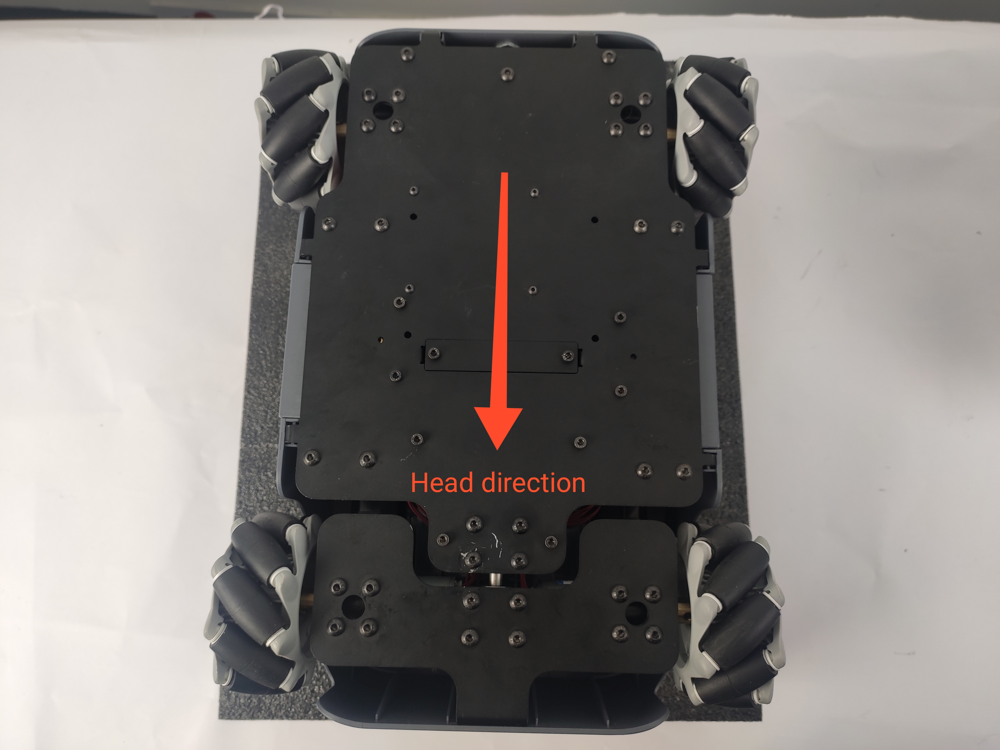

# Product unboxing guide

## 1 Product unboxing graphic guide

**Why you need to follow the steps to take out the product**

In this section we strongly recommend following the specified steps to take out the product. Not only does this help ensure that the product is not damaged during shipping, it also minimizes the risk of unexpected failure. Please read the following graphic guide carefully to ensure that your product is safe during the unboxing process.

- **1** Check whether the box is damaged. If there is any damage, please contact the logistics company and the supplier in your region in time.

- **2** The top box is the accessory box. Open the accessory box inside and check if there are any missing items against the standard list. The standard accessory box is shown in the figure below.

| Serial number | Product                                        |
| ------------- | ---------------------------------------------- |
| 1             | 12.6V, 2A power adapter and DC power interface |
| 2             | Building Blocks Plugin                         |
| 3             | Product Manual                                 |
| 4             | joystick                                       |
| 5             | jump wire                                      |
| 6             | HDMI Cable                                     |

- **3** Then remove the foam board and you can see the main body of myagv. Grasp the sides of the myagv and take it out.

- **4** After taking out the myagv, please check whether the mecanum wheel of the myagv is installed correctly. Due to the characteristics of the Mecanum wheel, the wheel in the upper left corner is installed in the same direction as the wheel in the lower right corner. Similarly, the wheel in the upper right corner is installed in the same direction as the wheel on the lower left corner.

- **5** Here you are, congratulations on completing the unboxing process.

---

[← Previous Page](README.md) | [Next Page →](4.3-PowerOnDetectionGuide.md)