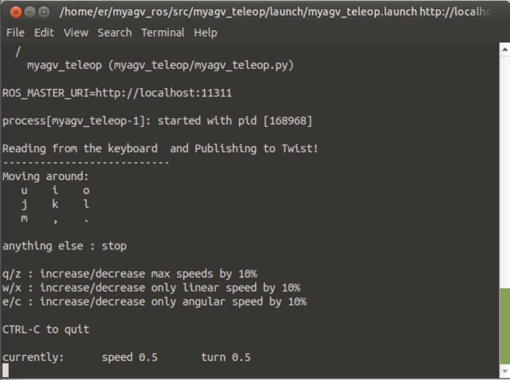

### Real-time Mapping with Gmapping

- 1 Start the communication of the car's lower layer.

First, check whether the LiDAR is powered and enabled. If it is not powered on, use the terminal to power on and start the LiDAR through the script file. If the LiDAR is already powered on and rotating, you can skip the step of powering on and enabling the LiDAR (./start_ydlidar.sh).

```bash
// Jump to Lidar startup directory
cd myagv_ros/src/myagv_odometry/scripts
// Power on the radar, after powering on the radar will send data through the serial port.
./start_ydlidar.sh
```

After powering on the LiDAR, open a terminal console (shortcut <kbd>Ctrl</kbd>+<kbd>Alt</kbd>+<kbd>T</kbd>), and enter the following command in the command line:

```bash
roslaunch myagv_odometry myagv_active.launch 
```

Open the launch file required for the SLAM laser scan and wheels of the car. If you see:

> myAGV initialized successful!
> ......
> Now YDLIDAR is scanning ......

It indicates successful communication between the car's LiDAR and wheels. The terminal will display the status as follows:


## 2. Open the GMapping mapping launch file

Open a new terminal console and enter the following command in the command line:

```
roslaunch myagv_navigation myagv_slam_laser.launch
```

## 3. Open the keyboard control file

Open a new terminal console and enter the following command in the terminal command line:

```
roslaunch myagv_teleop myagv_teleop.launch
```



| Key  | Direction                            |
| ---- | ------------------------------------ |
| i    | Forward                              |
| ,    | Backward                             |
| j    | Move Left                            |
| l    | Move Right                           |
| u    | Rotate Counterclockwise              |
| o    | Rotate Clockwise                     |
| k    | Stop                                 |
| m    | Rotate Clockwise in Reverse          |
| .    | Rotate Counterclockwise in Reverse   |
| q    | Increase Linear and Angular Velocity |
| z    | Decrease Linear and Angular Velocity |
| w    | Increase Linear Velocity             |
| x    | Decrease Linear Velocity             |
| e    | Increase Angular Velocity            |
| c    | Decrease Angular Velocity            |

## 4. Start Mapping

Now the car can start moving under keyboard control. Maneuver the car to rotate within the desired mapping space. Simultaneously, you can observe in the Rviz space that our map is gradually being constructed as the car moves.

Note: When operating the car with the keyboard, make sure that the terminal running the myagv_teleop.launch file is **the currently selected terminal**; otherwise, the keyboard control program won't recognize the key presses. Additionally, for better mapping results, it is recommended to **set the linear speed to 0.2 and angular speed to 0.4** during keyboard control, as **slower speeds** tend to produce better mapping outcomes."


## 5. Save the Constructed Map

Open another new terminal console and enter the following commands in the command line to save the map scanned by the agv:

```
cd ~/myagv_ros/src/myagv_navigation/map

rosrun map_server map_saver
```

Upon successful execution, two default map parameter files, namely **map.pgm** and **map.yaml**, will be generated in the current path **(~/myagv_ros/src/myagv_navigation/map)**.

Alternatively, when running **rosrun map_server map_saver** with the **-f** parameter, you can specify the path and filename. Here's an example for reference."

```
rosrun map_server map_saver -f /home/er/myagv_ros/src/myagv_navigation/map/map_505
```


---

[← Previous Page](6.2.4-Basic_Control_Based_on_ROS.md) | [Next Page →](6.2.6-Real-time_Mapping_with_Cartographer.md)
