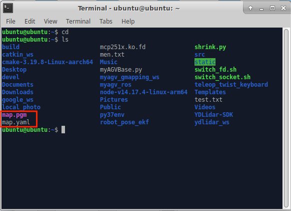

## Real-time mapping with Cartographer

## 1. Initiate communication on the underside of the cart.

First, check that the LiDAR is powered on and enabled. If it is not powered on, use the terminal to power on and enable the LiDAR via a script file. If the lidar is powered on and spinning, you can skip powering on and enabling the lidar (. /start_ydlidar.sh) steps.

```bash
// Jump to Lidar startup directory
cd myagv_ros/src/myagv_odometry/scripts
// Power on the radar, after powering on the radar will send data through the serial port.
./start_ydlidar.sh
```

After powering on the LiDAR, open a terminal console (shortcut <kbd>Ctrl</kbd>+<kbd>Alt</kbd>+<kbd>T</kbd>), and enter the following command in the command line:

```bash
roslaunch myagv_odometry myagv_active.launch
```

**Note: Before opening the launch file, please place the cart at a suitable starting point in the environment where you want to build the map, because opening the launch file will turn on the cart's IMU sensor and odom odometer, and artificially moving the cart will cause distortion in the cart's build.**

Open the launch file required for the SLAM laser scan and wheels of the car. If you see:

> myAGV initialized successful!
> ......
> Now YDLIDAR is scanning ......

It indicates successful communication between the car's LiDAR and wheels. The terminal will display the status as follows:


## 2. Open Cartographer build launch file

Open a new terminal console and enter the following command on the command line:

```
roslaunch cartographer_ros demo_myagv.launch
```

Open the launch file required for cartography. If the terminal keeps scrolling and outputting data, the cartography file is successfully opened, and the following status is displayed in the terminal:


If an error is reported in the terminal, use the shortcut Ctrl+C to close the terminal, move the trolley slightly, and then re-enter the build command. The error message in the terminal is as follows:


When the code runs successfully, rviz will be opened, and then the map and radar information will be displayed in rviz, with the red arrow indicating the direction of the car. The interface is shown in the figure.


**Note: If the Rviz emulation cannot be opened, you can check if the penultimate 2-4 lines of the demo_myagv.launch file are commented out, which is located in the /home/ubuntu/google_ws/src/cartographer_ros/cartographer_ros/launch/ directory. If it is uncommented just uncomment it to open it**

## 3. Opening the keyboard control file

Open a new terminal console and enter the following command on the terminal command line:

```
roslaunch myagv_teleop myagv_teleop.launch
```


| Key  | Direction                            |
| ---- | ------------------------------------ |
| i    | Forward                              |
| ,    | Backward                             |
| j    | Move Left                            |
| l    | Move Right                           |
| u    | Rotate Counterclockwise              |
| o    | Rotate Clockwise                     |
| k    | Stop                                 |
| m    | Rotate Clockwise in Reverse          |
| .    | Rotate Counterclockwise in Reverse   |
| q    | Increase Linear and Angular Velocity |
| z    | Decrease Linear and Angular Velocity |
| w    | Increase Linear Velocity             |
| x    | Decrease Linear Velocity             |
| e    | Increase Angular Velocity            |
| c    | Decrease Angular Velocity            |

## 4. Start Mapping

Now the car can start moving under keyboard control. Maneuver the car to rotate within the desired mapping space. Simultaneously, you can observe in the Rviz space that our map is gradually being constructed as the car moves.

Note: When operating the car with the keyboard, make sure that the terminal running the myagv_teleop.launch file is **the currently selected terminal**; otherwise, the keyboard control program won't recognize the key presses. Additionally, for better mapping results, it is recommended to **set the linear speed to 0.2 and angular speed to 0.4** during keyboard control, as **slower speeds** tend to produce better mapping outcomes."


## 5. Save the Constructed Map

Open another new terminal console and enter the following commands in the command line to save the map scanned by the agv:

```
cd ~/myagv_ros/src/myagv_navigation/map

rosrun map_server map_saver
```

Upon successful execution, two default map parameter files, namely **map.pgm** and **map.yaml**, will be generated in the current path **(~/myagv_ros/src/myagv_navigation/map)**.

Alternatively, when running **rosrun map_server map_saver** with the **-f** parameter, you can specify the path and filename. Here's an example for reference."

```
rosrun map_server map_saver -f /home/er/myagv_ros/src/myagv_navigation/map/map_505
```




---

[← Previous Page](6.2.5-Real-time_Mapping_with_Gmapping.md) | [Next Page →](6.2.7-Navigation-Map_Navigation.md)
