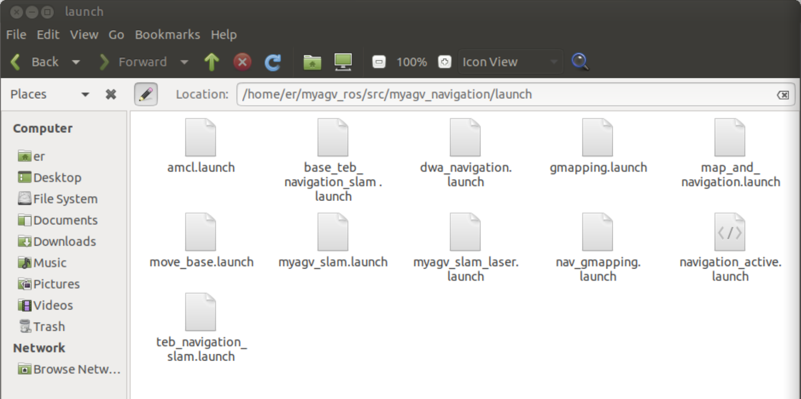
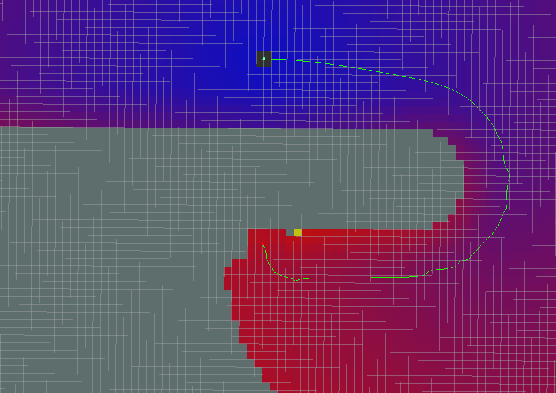
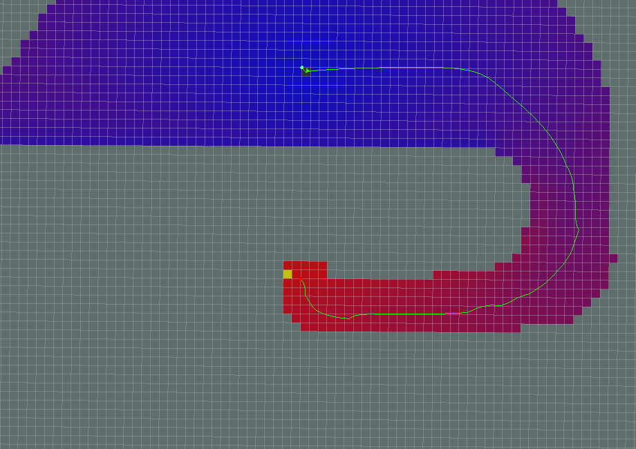
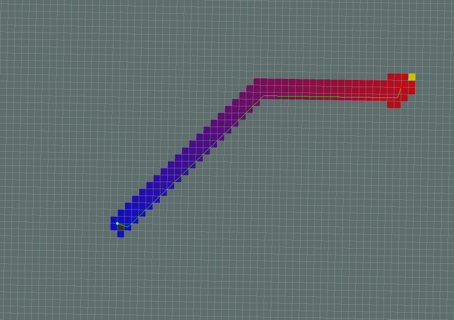
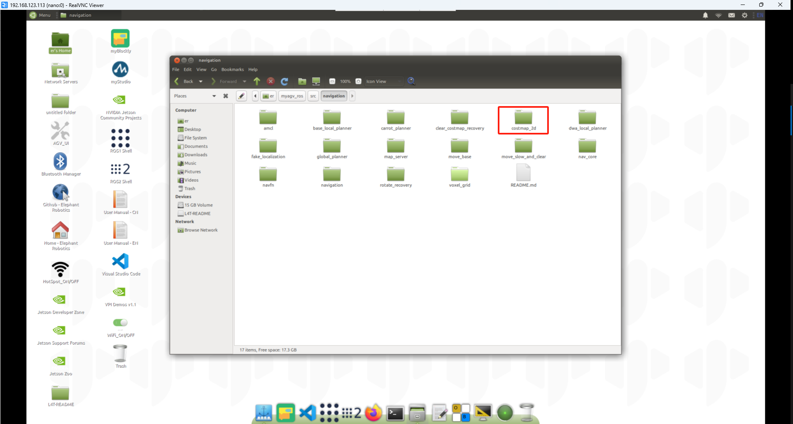

# Navigation-Map Navigation

Previously, we have successfully created a spatial map and obtained a set of map files, namely **map.pgm and map.yaml**, located in the directory ~/myagv_ros/src/myagv_navigation/map.


现在，让我们看看如何使用创建的地图为小车导航。

- 1 Modify the launch file

Open and edit the **navigation_active.launch** file located at ~/myagv_ros/src/myagv_navigation/launch/.

```
cd ~/myagv_ros/src/myagv_navigation/launch
sudo gedit navigation_active.launch
```



Find the parameter "map_file" and **replace default="$(find myagv_navigation)/map/map.yaml"** with the desired parameter file for navigation. For instance, if you want to load **map_505.yaml**, change **/map/map.yaml** to **/map/map_505.yaml**. Then, save the modified file and exit. If you don't make any changes, it will default to loading the **map.yaml** file.


- 2 Run the launch files

After powering on the myagv, open a terminal console (shortcut: Ctrl+Alt+T) and enter the following command:


```
roslaunch myagv_odometry myagv_active.launch
```

Open another terminal console (shortcut: Ctrl+Alt+T) and enter the following command:

```
roslaunch myagv_navigation navigation_active.launch
```


- 3 You will see that an Rviz simulation window has been opened.

Explanation of the Navigation Control Panel in the Bottom Left Corner

① Maximum Number of Target Points: You can set the maximum number of target points. The number of set target points cannot exceed this parameter (but can be fewer).

② Loop: If checked, after navigating to the last target point, the robot will navigate back to the first target point. For example: 1 -> 2 -> 3 -> 1 -> 2 -> 3 -> ... This option must be checked before starting navigation.

③ Task Target Point List: x/y/yaw, the pose (xy coordinates and yaw) of the given target points on the map.After setting the maximum number of target points and saving, this list will generate the corresponding number of entries.When providing a target point, the coordinates and orientation will be read here.

④ Start Navigation: Begin the task.

⑤ Cancel: Cancel the current target point navigation task, and the robot will stop moving. Clicking "Start Navigation" again will resume from the next target point.

Example: 1 -> 2 -> 3. If you click "Cancel" during the 1 -> 2 process, the robot will stop. Clicking "Start Navigation" again will make the robot go from the current position to 3.

⑥ Reset: Clears all current target points.


- 4 Start Navigation

Set the number of target points for the task, and click to confirm and save. Then, click on "2D Nav Goal" on the toolbar to define the target point on the map. (Each time you set a point, start by clicking "2D Nav Goal"). The target points differentiate orientation, with the arrowhead representing the vehicle's heading direction. Click "Start Navigation" to begin the navigation. In Rviz, you will see a planned path from the starting point to the target point, and the vehicle will move along this route to reach the destination.


- 5 Precautions

**Note: It is recommended to place the car's initial position at the starting point where the car was located during mapping. If you need to modify the starting position, follow the steps below.**

Click on the "2D Pose Estimate" in the top toolbar to adjust the position so that the car in the Rviz interface matches the physical car. The terminal will then return the coordinates and heading angle of the car relative to the map.


Open and edit the "navigation_active.launch" file located in "~/myagv_ros/src/myagv_navigation/launch/". Find the "amcl" node, and replace "initial_pose_x", "initial_pose_y", and "initial_pose_a" with the coordinates and heading angle returned by the terminal in that order. After launching "navigation_active.launch" again, the robot's starting position will be updated.


# 2.Navigation framework and navigation principles


- move_base ROS node, which is the main component of the navigation stack. move_base subscribes to the navigation target move_base_simple/goal and publishes the motion control signal cmd_vel in real time. The various navigation algorithm modules in move_base are called as plug-ins.
- global_planner: used for global path planning.
- local_planner: used for local path planning.
- global_costmap: The global cost map is used to describe global environmental information.
- local_costmap: The local cost map is used to describe local environmental information.
- recovery_behaviors: The recovery strategy is used for the robot to automatically escape and recover after encountering obstacles.
- amcl: The particle filter algorithm is used to realize the global positioning of the robot and provide global position information for robot navigation.
- odometry source: The input is odometer data.
- map_server: The map obtained by calling SLAM mapping provides environmental map information for navigation.
- sensor sources: sensor data, usually passed into sensor_msgs/LaserScan 2D laser radar data or sensor_msgs/PointCloud 3D point cloud data, acting on the cost map to achieve real-time obstacle avoidance.

## 2.1 move_base 

move_base is mainly composed of two planners: global_planner and local_planner.


- Global path planning (global_planner): Global path planning is to plan the overall path based on the given target location and global map. In navigation, the Dijkstra or A* algorithm is used to plan the global path, and the optimal route from the robot to the target location is calculated as the global route of the robot.
- Local path planning (local_planner): In actual situations, robots often cannot strictly follow the global route, so it is necessary to plan the route that the robot should travel in each cycle based on the map information and obstacles that may appear at any time near the robot, so as to make it conform to the global optimal path as much as possible. Local path planning is implemented by the local_planner module, which uses the Dynamic Window Approaches (DWA) algorithm or the Trajectory Rollout algorithm to search for multiple paths to avoid and travel, select the optimal path based on various evaluation criteria (whether it will hit obstacles, the time required, etc.), and calculate the linear speed and angular velocity in the driving cycle to avoid collisions with dynamic obstacles.


Let's analyze the `navigation_active.launch` file


You can see that when the `move_base` node is started, many `.yaml` files are loaded. The meaning of these parameters is introduced below. The navigation parameters of `move_base` are placed under `myagv_navigation/param`. The main difference lies in the parameters of the local path planner. The base_local_planner local path planner is used as an example below.


### 2.1.1 base_global_planner_params.yaml

```xml
# Planner selection
base_global_planner: "global_planner/GlobalPlanner"  

GlobalPlanner:                                  # Also see: http://wiki.ros.org/global_planner
  old_navfn_behavior: false                     # Exactly mirror behavior of navfn, use defaults for other boolean parameters, default false
  use_quadratic: true                           # Use the quadratic approximation of the potential. Otherwise, use a simpler calculation, default true
  use_dijkstra: true                            # Use dijkstra's algorithm. Otherwise, A*, default true
  use_grid_path: false                          # Create a path that follows the grid boundaries. Otherwise, use a gradient descent method, default false
  
  allow_unknown:  true                          # Allow planner to plan through unknown space, default true
                                                #Needs to have track_unknown_space: true in the obstacle / voxel layer (in costmap_commons_param) to work
  planner_window_x: 0.0                         # default 0.0
  planner_window_y: 0.0                         # default 0.0
  default_tolerance: 0.0                        # If goal in obstacle, plan to the closest point in radius default_tolerance, default 0.0
  lethal_cost: 253                              
  neutral_cost: 66                              
  cost_factor: 0.55    
```

```xml
base_global_planner: "global_planner/GlobalPlanner"  
```

Global Path Planning Plugins

- [navfn](http://wiki.ros.org/navfn): A global planner based on a grid map that calculates the robot's path when using navigation functions. Implements the dijkstra and A* global planning algorithms. (Plugin name: "navfn/NavfnROS")
- [global_planner](http://wiki.ros.org/global_planner): Reimplements the Dijkstra and A* global path planning algorithms, which can be seen as an improved version of navfn. (Plugin name: "global_planner/GlobalPlanner")
- [carrot_planner](http://wiki.ros.org/carrot_planner): A simple global path planner that takes a user-specified target point and tries to move the robot as close to it as possible, even if the target point is in an obstacle. (Plugin name: "carrot_planner/CarrotPlanner")

```xml
GlobalPlanner:                                  # Also see: http://wiki.ros.org/global_planner
  old_navfn_behavior: false                     # Exactly mirror behavior of navfn, use defaults for other boolean parameters, default false
  use_quadratic: true                           # Use the quadratic approximation of the potential. Otherwise, use a simpler calculation, default true
  use_dijkstra: true                            # Use dijkstra's algorithm. Otherwise, A*, default true
  use_grid_path: false                          # Create a path that follows the grid boundaries. Otherwise, use a gradient descent method, default false
  
  allow_unknown:  true                          # Allow planner to plan through unknown space, default true
                                                #Needs to have track_unknown_space: true in the obstacle / voxel layer (in costmap_commons_param) to work
  planner_window_x: 0.0                         # default 0.0
  planner_window_y: 0.0                         # default 0.0
  default_tolerance: 0.0                        # If goal in obstacle, plan to the closest point in radius default_tolerance, default 0.0
  lethal_cost: 253                              
  neutral_cost: 66                              
  cost_factor: 0.55    
```

Parameter analysis

- old_navfn_behavior: If you want global_planner to have the same effect as the previous navfn version, set it to true, so it is not recommended to set it to true.
- use_quadratic: If set to true, the quadratic function will be used to approximate the function, otherwise a simpler calculation method will be used to save hardware computing resources.
- use_dijkstra: If true, the dijkstra algorithm is used. Otherwise, A*.
- use_grid_path: If true, a path along the grid boundary is created. Otherwise, the gradient descent method is used, and the path is smoother.
- allow_unknown: Whether to choose to explore unknown areas. It is not enough to just set this parameter to true. `track_unknown_space` must also be set to `true` in costmap_commons_params.yaml.
- default_tolerance: When the set destination is occupied by an obstacle, it is necessary to find the nearest point with this parameter as the radius as the new destination point.
- lethal_cost: The cost value of the fatal area of ​​the obstacle.
- neutral_cost: The neutral cost of the obstacle.
- cost_factor: The factor by which the costmap is multiplied by each cost value.

All parameters are default values.



use_grid_path=True


use_quadratic=False


use_dijkstra=False



Dijkstra


A*



old_navfn_behavior=True


In addition to these parameters, there are three parameters not listed that actually determine the quality of the planned global path. They are cost factor, neutral cost, and fatal cost. In fact, these parameters also exist in navfn. There is a paragraph in the source code 2 that explains how navfn calculates the cost value.

The cost value of navfn is set to
Cost = cost neutral (COST NEUTRAL) + cost factor (COST FACTOR) * cost map cost value.

The cost map cost value passed in ranges from 0 to 252. The comment also states:
When cost neutral (COST NEUTRAL) is 50, cost factor (COST FACTOR) needs to be about 0.8 to ensure that the input values ​​are evenly distributed over the output range of 50 to
253. If the cost factor (COST FACTOR) is higher, the cost value tends to stabilize near obstacles, so the planner will treat (for example) the entire width of a narrow corridor as equally undesirable and will not plan a path along the center.

Experimental Observation: Experiments confirm this explanation. Setting the cost factor too low or too high degrades the quality of the paths. These paths do not pass through the middle of obstacles on both sides and have relatively flat curvature.

Extreme neutral cost values ​​also have the same effect. For the fatal cost, setting it to a low value may result in no path being generated, even if a feasible path is obvious. The figure below shows the effect of the cost factor and the neutral cost on global path planning.


### 2.1.2 base_local_planner_params.yaml

```xml
TrajectoryPlannerROS:
  # Robot Configuration Parameters
  acc_lim_x: 2
  acc_lim_theta: 0.5 #2
  acc_lim_y: 0.0

  max_vel_x: 0.2
  min_vel_x: 0.01

  max_vel_theta: 0.1 #0.5
  min_vel_theta: -0.1 #-0.5
  min_in_place_vel_theta: 0.25

  holonomic_robot:  false
  escape_vel: -0.0

  # Goal Tolerance Parameters
  yaw_goal_tolerance: 0.25
  xy_goal_tolerance: 0.25
  trans_stopped_vel: 0.05
  theta_stopped_vel: 0.01
  latch_xy_goal_tolerance: false

  # Forward Simulation Parameters
  sim_time: 0.6
  sim_granularity: 0.02
  angular_sim_granularity: 0.02
  vx_samples: 3
  vtheta_samples: 20
  controller_frequency: 5.0

  # Trajectory scoring parameters
  meter_scoring: true # Whether the gdist_scale and pdist_scale parameters should assume that goal_distance and path_distance are expressed in units of meters or cells. Cells are assumed by default (false).
  occdist_scale:  0.1 #The weighting for how much the controller should attempt to avoid obstacles. default 0.01
  path_distance_bias: 2.5  #     The weighting for how much the controller should stay close to the path it was given . default 0.6
  goal_distance_bias: 1.0 #     The weighting for how much the controller should attempt to reach its local goal, also controls speed  default 0.8

  heading_lookahead: 0.325  #How far to look ahead in meters when scoring different in-place-rotation trajectories
  heading_scoring: false  #Whether to score based on the robot's heading to the path or its distance from the path. default false
  heading_scoring_timestep: 0.8   #How far to look ahead in time in seconds along the simulated trajectory when using heading scoring (double, default: 0.8)
  dwa: false #Whether to use the Dynamic Window Approach (DWA)_ or whether to use Trajectory Rollout
  simple_attractor: false
  publish_cost_grid_pc: true  

  # Oscillation Prevention Parameters
  oscillation_reset_dist: 0.02 #How far the robot must travel in meters before oscillation flags are reset (double, default: 0.05)
  escape_reset_dist: 0.05
  escape_reset_theta: 0.05
```
Robot configuration parameters

- acc_lim_x: The robot's x acceleration limit (unit: m/s^2).
- acc_lim_y: The absolute value of the acceleration in the y direction (unit: m/s^2). Note: This value only needs to be configured for omnidirectional robots.
- acc_lim_th: The absolute value of the rotational acceleration (unit: rad/s^2).
- max_vel_trans: The absolute value of the maximum translation speed (unit: m/s).
- min_vel_trans: The absolute value of the minimum translation speed (unit: m/s).
- max_vel_x: The absolute value of the maximum speed in the x direction (unit: m/s).
- min_vel_x: The absolute value of the minimum speed in the x direction (unit: m/s). If it is a negative value, it means that you can move backward.
- max_vel_y: The absolute value of the maximum speed in the y direction (unit: m/s).
- min_vel_y: The absolute value of the minimum speed in the y direction (unit: m/s).
- max_rot_vel: the absolute value of the maximum rotation speed (unit: rad/s).
- min_rot_vel: the absolute value of the minimum rotation speed (unit: rad/s).

Target tolerance parameters

- yaw_goal_tolerance: the allowable error of the yaw angle when reaching the target point (unit: rad).
- xy_goal_tolerance: the tolerance allowed within the x&y distance when reaching the target point (unit: m).
- latch_xy_goal_tolerance: set to true, if the robot reaches the tolerance distance, it will rotate in place, even if it runs out of the tolerance distance.

Forward simulation parameters

- sim_time: the time to simulate the trajectory forward (unit: s).
- sim_granularity: the step size between each point on a given trajectory (unit: m).
- vx_samples: the number of sampling points in the x-direction velocity space.
- vy_samples: the number of sampling points in the y-direction velocity space.
- vth_samples: number of velocity space samples in the direction of rotation.
- controller_frequency: frequency (in Hz) at which this controller is called.

Trajectory scoring parameters

- path_distance_bias: weight for how close the controller is to a given path.
- goal_distance_bias: weight for how close the controller is to a local goal point.
- occdist_scale: weight for how much the controller avoids obstacles.
- forward_point_distance: distance from the robot center to where the extra scoring points are placed (in meters).
- stop_time_buffer: how long the robot must stop before a collision (in seconds).
- scaling_speed: speed at which scaling of the robot chassis is started (in meters/second).
- max_scaling_factor: maximum scaling factor for the robot chassis.
- publish_cost_grid: whether to publish the cost grid of the planner when planning a path. If set to true, messages of type sensor_msgs/PointCloud2 are published on the topic ~/cost_cloud.

Anti-vibration parameters

- oscillation_reset_dist: How far does the robot have to move before the oscillation mark is reset (unit: m).

Global planning parameters

- prune_plan: Whether to clear the track 1m behind the robot when it moves forward.


## 2.1.3 costmap_2D

The costmap_2d package provides a 2D costmap implementation that uses input sensor data to construct a 2D or 3D costmap (depending on whether a voxel-based implementation is used) and calculates the cost of the 2D costmap based on the occupancy grid and the user-defined inflation radius. The two costmaps require the use of some common or separate configuration files: the common configuration file (costmap_common_params.yaml), the global costmap configuration file (global_costmap_params.yaml), and the local costmap configuration file (local_costmap_params.yaml).





> costmap_common_params.yaml

```
footprint: [[0.17, 0.12], [0.17,-0.12], [-0.17, -0.12], [-0.17, 0.12]]
footprint_padding: 0.01

transform_tolerance: 0.2


always_send_full_costmap: true

obstacle_layer:
  enabled: true

  obstacle_range: 2.0 #2
  raytrace_range: 2.0 #2
  inflation_radius: 0.04
  combination_method: 1
  observation_sources: laser_scan_sensor 
  track_unknown_space: true

  laser_scan_sensor:
    data_type: LaserScan
    topic: /scan
    marking: true
    clearing: true


inflation_layer:
  enabled: true
  cost_scaling_factor: 5.0 #10
  inflation_radius: 0.25

static_layer:
  enabled: true
  map_topic:  "/map"
```

Let's analyze this yaml parameter

```
footprint: [[0.17, 0.12], [0.17,-0.12], [-0.17, -0.12], [-0.17, 0.12]]
footprint_padding: 0.01
transform_tolerance: 0.2
always_send_full_costmap: true
```

- `footprint`: defines the shape of the robot chassis (polygon), here it is a rectangle of roughly **0.34m long and 0.24m wide**, this chassis size definition should be larger than the actual robot.
- `footprint_padding`: additional safety space (0.01m) added to the robot's "body" in the costmap.
- `transform_tolerance: 0.2`: tolerance time (seconds) to wait for TF transformation, used to synchronize coordinate transformation to prevent navigation failure due to delay.
- `always_send_full_costmap: true`: send the full costmap for each update, not just the changed part (used for debugging or to ensure the full map is displayed).

```
obstacle_layer:
  enabled: true
  obstacle_range: 2.0
  raytrace_range: 2.0
  inflation_radius: 0.04
  combination_method: 1
  observation_sources: laser_scan_sensor 
  track_unknown_space: true
  laser_scan_sensor:
    data_type: LaserScan
    topic: /scan
    marking: true
    clearing: true
```
`enabled`: Enables the obstacle_layer.

`obstacle_range`: Maximum detectable obstacle distance.

`raytrace_range`: Raytrace clearing range (for clearing invisible obstacles).

`inflation_radius`: The inflation radius of the layer itself (usually small, only used for pass-through).

`combination_method`: Method for fusing different layers (1 means maximum).

`track_unknown_space`: Whether to treat unknown areas as obstacles.

`laser_scan_sensor`: Use laser scan `/scan` topic data to build obstacle information.

`marking`: Mark obstacles.

`clearing`: Clear obstacles using laser rays.

```
inflation_layer:
  enabled: true
  cost_scaling_factor: 5.0
  inflation_radius: 0.25
```
`enabled`: Enable inflation_layer.

`cost_scaling_factor`: The decay factor of the inflation cost (the larger the inflation cost, the faster it decreases).

`inflation_radius`: The maximum radius of inflation from the edge of the obstacle.

```
static_layer:
  enabled: true
  map_topic: "/map"
```
`enabled`: Enable static_layer (static map layer).

`map_topic:` Use the static map provided by /map.

> global_costmap_params.yaml
```
global_costmap:
  global_frame: map
  robot_base_frame: base_footprint
  static_map: true
  update_frequency: 0.3
  publish_frequency:  0.3
  rolling_window: false
  transform_tolerance: 1

  plugins:
     - {name: static_layer, type: 'costmap_2d::StaticLayer'}
     - {name: obstacle_layer, type: 'costmap_2d::VoxelLayer'}
     - {name: inflation_layer, type: 'costmap_2d::InflationLayer'}
```

`marking`: Mark obstacles.

`clearing`: Clear obstacles with laser beams.

`global_frame`: Global reference frame to use, usually set to `/map`.

`robot_base_frame`: Robot base frame, usually `base_footprint`.

`static_map`: Enable static map (usually provided by SLAM).

`update_frequency`: Map update frequency (Hz), global map does not need to be updated frequently.

`publish_frequency`: Publish frequency (Hz), used for visualization.

`rolling_window`: Enable rolling window, set to `false` to indicate fixed map.

`transform_tolerance`: TF time tolerance (in seconds).

Plugin layer

`static_layer`: Load static map (permanent obstacles in the map).
`obstacle_layer`: Use the above laser scanning `/scan` topic data to build obstacle information and record obstacles. It is applicable to point cloud data.
`inflation_layer`: Inflate obstacles to generate navigation safety zones.

> local_costmap_params.yaml
```
local_costmap:
   global_frame: map
   robot_base_frame: base_footprint
   update_frequency: 0.3
   publish_frequency: 2.0
   rolling_window: true
   width: 3.0
   height: 3.0
   resolution: 0.02
   transform_tolerance: 1.2
   inflation_radius: 0.25

   plugins:
   - {name: static_layer,        type: "costmap_2d::StaticLayer"}
   - {name: obstacle_layer,      type: "costmap_2d::ObstacleLayer"}
   - {name: inflation_layer,     type: "costmap_2d::InflationLayer"}
```

`global_frame`: Map reference coordinates, usually `map` or `odom`.

`robot_base_frame`: Robot chassis coordinate system.

`update_frequency`: Map update frequency, slightly higher is recommended when real-time is important.

`publish_frequency`: Publishing frequency, higher helps RViz visualization.

`rolling_window`: Enable rolling window, local map is always centered on the robot.

`width`: Local map width (meters).

`height`: Local map height (meters).

`resolution`: Map resolution (2 cm per grid).

`transform_tolerance`: TF delay tolerance time (in seconds).

`inflation_radius`: Inflation radius, used for local obstacle avoidance safety boundary.

Plugin layer

`static_layer`: Load static map (permanent obstacles in the map).
`obstacle_layer`: Use the above laser scanning `/scan` topic data to build obstacle information and record obstacles. It is applicable to point cloud data.
`inflation_layer`: Inflate obstacles to generate navigation safety zones.

## 2.1.5 More Parameter Tuning Guides

The parameters in `myagv_navigation/param` will affect the navigation effect.

Use ros dynamic parameter adjustment tool

```
rosrun rqt_reconfigure rqt_reconfigure
```

You can adjust according to your needs and observe the robot's motion status until the effect is optimal, record the current parameters, and modify them in the `myagv_navigation/param` file.

You can get more information about navigation tuning from the [Basic Navigation Tuning Guide](https://wiki.ros.org/navigation/Tutorials/Navigation%20Tuning%20Guide) and [ROS Navigation Tuning Guide written by Kaiyu Zheng](http://kaiyuzheng.me/documents/navguide.pdf).

---

[← Previous Page](6.2.6-Real-time_Mapping_with_Cartographer.md) | [Next Page →](6.2.8-Rtabmap.md)
