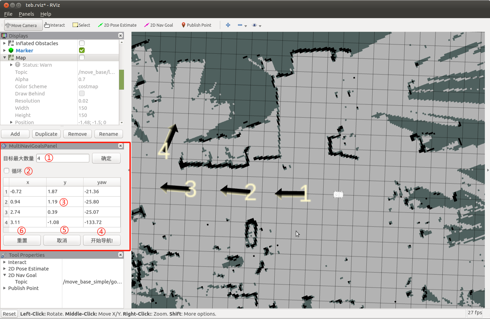

# myAGV-rtabmap build map

## 1. Open slam laser scanning launch file

Detect whether the laser radar is powered on and enabled first, if it is not turned on, then the terminal needs to be powered on to start the laser radar through the script file, if the radar is powered on and enabled, then you can skip the step of powering on and enabling the radar.

```bash
// Jump to Lidar startup directory
cd myagv_ros/src/myagv_odometry/scripts
// Power on the radar, after powering on the radar will send data through the serial port.
./start_ydlidar.sh
```

After powering up the radar and enabling it, open the 3 console terminals (shortcut <kbd>Ctrl</kbd>+<kbd>Alt</kbd>+<kbd>T</kbd>), and enter the following commands in the command line respectively.

```bash
// Activate odometer and LiDAR
roslaunch myagv_odometry myagv_active.launch
// Start the launch file for the depth camera
roslaunch orbbec_camera astra_pro2.launch
// Launching the rtabamp graph building algorithm
roslaunch myagv_navigation rtabmap_mapping.launch
```

## 2.Open the keyboard control file

Open a new terminal console and enter the following command in the terminal command line:

```bash
cd myagv_ros
roslaunch myagv_teleop myagv_teleop.launch
```


| Key  | Direction                            |
| ---- | ------------------------------------ |
| i    | Forward                              |
| ,    | Backward                             |
| j    | Move Left                            |
| l    | Move Right                           |
| u    | Rotate Counterclockwise              |
| o    | Rotate Clockwise                     |
| k    | Stop                                 |
| m    | Rotate Clockwise in Reverse          |
| .    | Rotate Counterclockwise in Reverse   |
| q    | Increase Linear and Angular Velocity |
| z    | Decrease Linear and Angular Velocity |
| w    | Increase Linear Velocity             |
| x    | Decrease Linear Velocity             |
| e    | Increase Angular Velocity            |
| c    | Decrease Angular Velocity            |


Now the car can start moving under keyboard control. Maneuver the car to rotate within the desired mapping space. Simultaneously, you can observe in the Rviz space that our map is gradually being constructed as the car moves.
***Note: When operating the trolley with keyboard, make sure the terminal running the myagv_teleop.launch file is the currently selected window, otherwise the keyboard control program can't recognise the keyboard keys. And the slower the speed, the better the building effect, it is recommended to set the line speed 0.2, the angular speed 0.4 for keyboard control!***
After the keyboard control cart moves to build the map, use ctrl+c to stop the build node, it will ~/.ros/rtabmap.db to generate the map data.

## 3.Navigation

In addition to keyboard control, simultaneous map building and navigation is also possible. Again, after powering up the radar to enable it, myagv opens 3 console terminals (shortcut <kbd>Ctrl</kbd>+<kbd>Alt</kbd>+<kbd>T</kbd>), and enters the following commands on the command line, respectively.

```bash
// Activate odometer and LiDAR
roslaunch myagv_odometry myagv_active.launch
/ /Start the launch file for the depth camera
roslaunch orbbec_camera astra_pro2.launch
// Launching the rtabamp graph building algorithm
roslaunch myagv_navigation 3d_navigation_active.launch
```

1. Description of the navigation operation area in the lower left corner

① Maximum number of target points that can be set: the number of target points set cannot be greater than this parameter (it can be less than).

② Whether to cycle: if ticked, after navigating to the last target point, it will re-navigate to the first target point. Example: 1->2->3->1->2->3->---, this option must be ticked before starting navigation

③ List of mission target points: x/y/yaw, the position of the given target point on the map (xy coordinate with heading angle yaw).

* After setting the maximum number of targets and saving, this list will generate the corresponding number of entries * For each given target point, the coordinates and heading of the target point will be read here

④ Start navigation: start the task

⑤ Cancel: cancels the navigation task at the current target point and the robot stops moving. After clicking Start Navigation again, it will start from the next task point.

Example: 1->2->3, click cancellation during 1->2, the robot stops moving, and after clicking start navigation, the robot will go to 3 from the current coordinate point.

⑥ Reset: will clear all current target points



2. Set the number of target points for the mission and click Confirm to save. Then click 2D Nav Goal on the ToolBar to set the target points on the map. (You need to click 2D Nav Goal first for each setting), the target point has direction differentiation, the top of arrow is the direction of the front of the car. Click Start Navigation, the navigation starts, you see a planned path of the cart between the start point and the target point in rviz, the cart will move along the route to the target point.


3.Actual use effect

The effect is as follows: through the rviz release navigation point, navigation and map building at the same time, to reach the navigation point


---

[← Previous Page](6.2.7-Navigation-Map_Navigation.md) | [Next Chapter →](../../7-ExamplesRobotsUsing/280pi.md)
