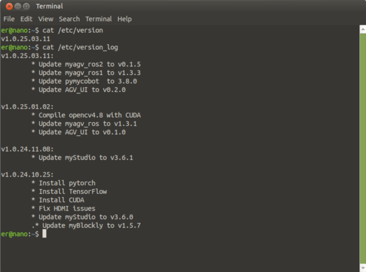
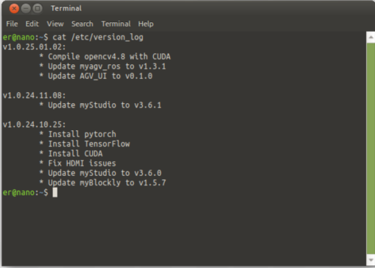
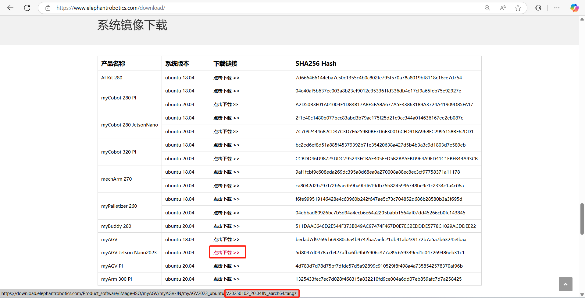
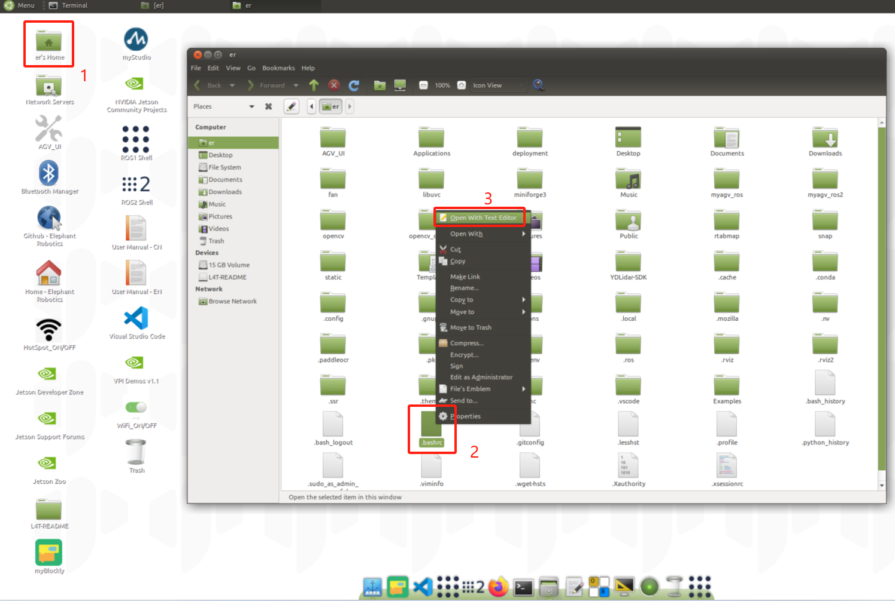
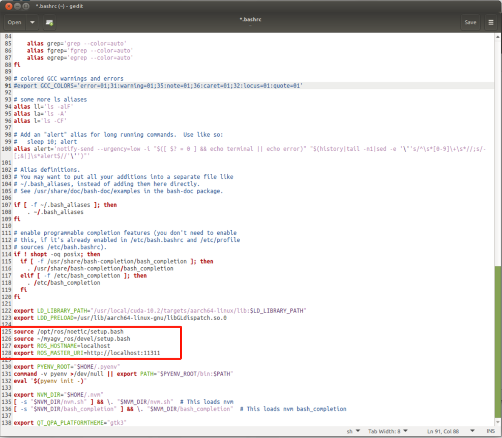
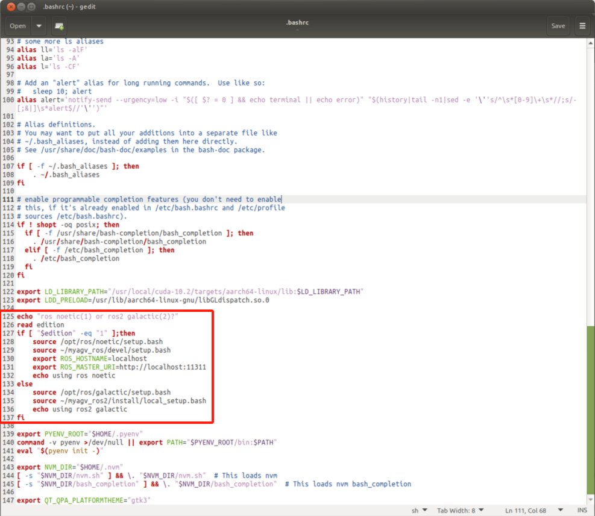
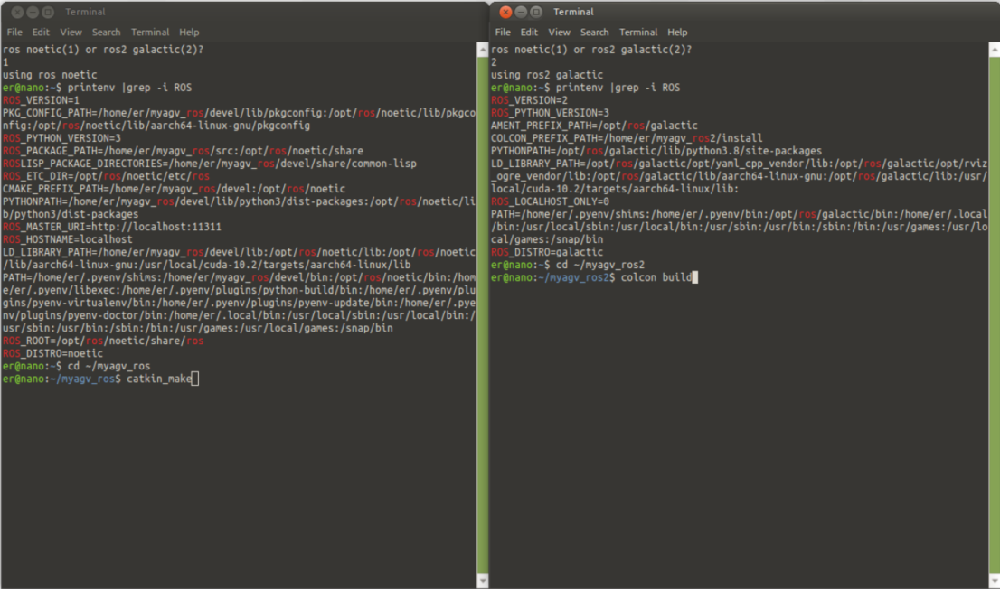
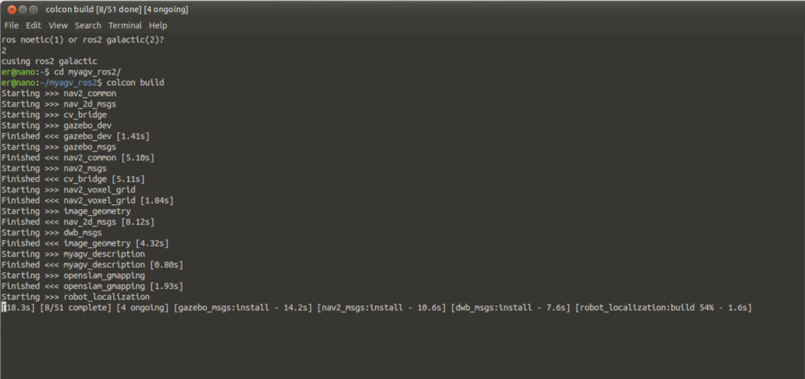
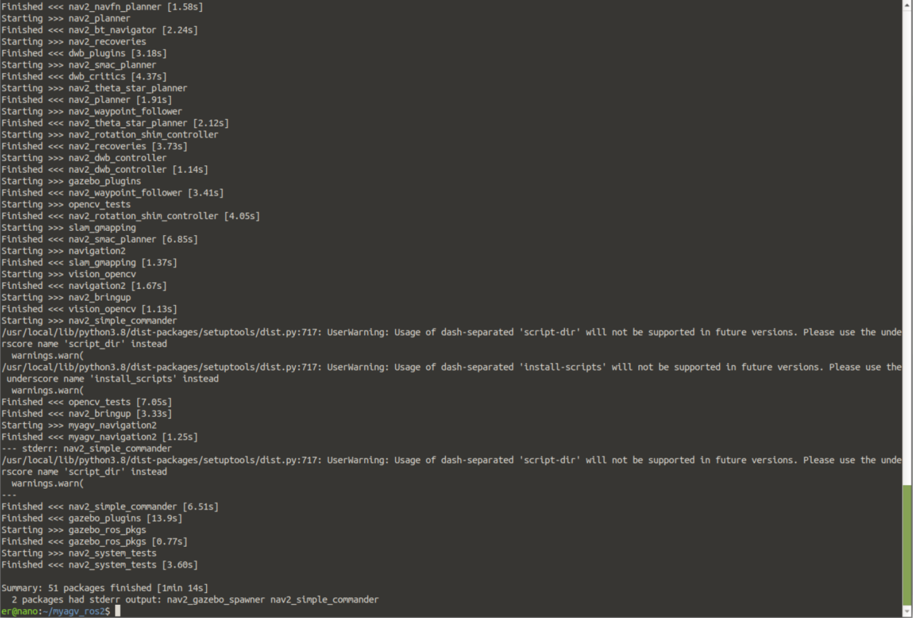
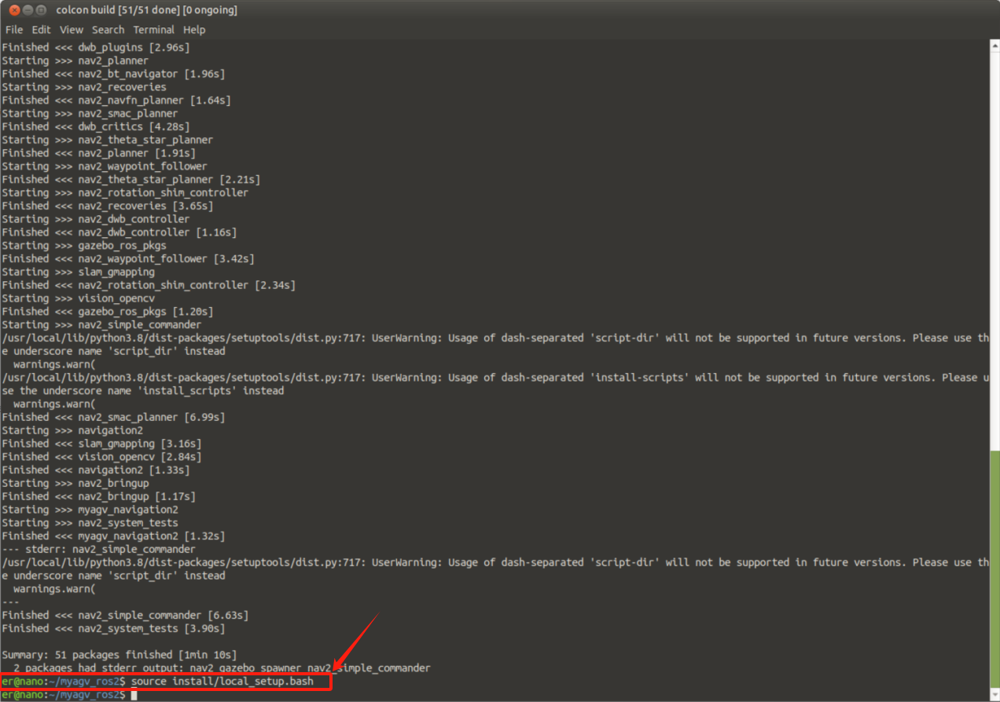

# ROS2 

## View the current image version


```
cat /etc/version_log
```

```
v1.0.25.01.02
```

myAGV_ROS2 v1.0.25.03.11 image version has completed the function integration of ROS2. You can download the latest image at [jump link](https://docs.elephantrobotics.com/docs/myagv_jn23_cn/8-FilesDownload/8.4-SystemInformation/8.4.1-System_Image.html) and burn the image system to the TF card.

v1.0.25.03.11 image version The following parts do not need to be operated, just use it as a reference to understand ros2 knowledge.



If myAGV_ROS2 is the v1.0.25.01.02 image system, you can adapt the ros2 function according to the following operations.



If it is not this version, you can go [here](https://www.elephantrobotics.com/download/) to download the system image of v2025102 and follow this [instructions]((https://docs.elephantrobotics.com/docs/myagv_jn23_cn/8-FilesDownload/8.4-SystemInformation/8.4.2-Image_Burning.html)) to operate.



## Modify ~/.bashrc to switch the environment variables of ros1 and ros2

Click on er's Home, then press Ctrl + H on the keyboard to open the hidden file and find the .bashrc file.



These four lines of ros1 environment variables.

```
source /opt/ros/noetic/setup.bash
source ~/myagv_ros/devel/setup.bash
export ROS_HOSTNAME=localhost
export ROS_MASTER_URI=http://localhost:11311
```



Rewrite as follows, add ros2 environment variables.

```
echo "ros noetic(1) or ros2 galactic(2)?"
read edition
if [ "$edition" -eq "1" ];then
    source /opt/ros/noetic/setup.bash
    source ~/myagv_ros/devel/setup.bash
    export ROS_HOSTNAME=localhost
    export ROS_MASTER_URI=http://localhost:11311
    echo using ros noetic
else 
    source /opt/ros/galactic/setup.bash
    source ~/myagv_ros2/install/local_setup.bash
    echo using ros2 galactic
fi
```



Each time you open the terminal, you need to enter the number "1" or "2" to activate the ros1 or ros2 environment.



## Compile ros2 code

Open a terminal and pull the galactic-JN branch code of myagv_ros2.

```
git clone -b galactic-JN https://github.com/elephantrobotics/myagv_ros2.git myagv_ros2/src
```

Then, install the dependency package through rosdep.

```
cd ~/myagv_ros2
rosdep install --from-paths src --ignore-src -r -y
```
You also need to manually install the following dependency packages.
```
sudo apt install ros-galactic-bondcpp \
    ros-galactic-test-msgs* \
    ros-galactic-behaviortree-cpp-v3* \
    ros-galactic-ompl \
    ros-galactic-joint-state-publisher \
    ros-galactic-rqt-tf-tree \
    ros-galactic-diagnostic-updater \
    ros-galactic-camera-info-manager -y
```

Finally, compile the source code. The first compilation process will be slow and you need to wait patiently.

> Note: Be sure to compile in the ~/myagv_ros2 path

```
colcon build
```

If the compilation is successful, the message Summary: xxx packages finished will be displayed.






After each compilation, remember to source the ros2 environment variables.

```
source install/local_setup.bash
```



myagv_ros2 is managed on [github](https://github.com/elephantrobotics/myagv_ros2) and can be updated to the latest version via git.

```
cd ~/myagv_ros2/src

git pull

cd ..

colcon build
```

## ROS2 Basics

- ros1 components use c++/python, ros2 components use c/python;
- ros1 only supports Linux and MacOS, while ros2 supports Linux/Windows/MacOS/RTOS;
- ros1 communication is based on TCPROS/UDPROS, which strongly depends on the processing of the master node, while ros2 is based on DDS (distributed architecture);
- ros2 supports real-time control;
- ros2 widely uses C++11 and Python3.5 and above;
- ros2 uses a new compilation system Ament;
- ros2 communicates with ros1 through ros_bridge;
- ros2 uses managed startup: users can specify the node startup order;
- ros2 cancels the concept of nodelet and supports multi-node initialization;
- ros2 launch files are written in python, which expands functionality compared to xml.

> The ros2 command changes are as follows

```
rosrun --> ros2 run
rosnode --> ros2 node
roslaunch --> ros2 launch
rosparam --> ros2 param
rospkg --> ros2 pkg
rosservice --> ros2 service 
rossrv --> ros2 srv
rostopic --> ros2 topic
rosaction --> ros2 action
```

> clocon build

- `--packages-up-to`: Build the package you want, and all its dependencies, but not the entire workspace (saves time)
- `--symlink-install`: Saves you from having to rebuild every time you tweak your Python scripts
- `--event-handlers console_direct+`: Show console output while building (otherwise available in the `log` directory)
- `--executor sequential`: Process packages one by one, instead of using parallelism

Compile only the packages you want

```
colcon build --packages-select my_package
```

Limit the number of cores

```
colcon build --jobs 2
```

---

[← Previous Chapter](../6.2-ApplicationBaseROS1/6.2.8-Rtabmap.md) | [Next Page →](../6.3-ApplicationBaseROS2/6.3.2-Real-time_Mapping_with_Gmapping.md)
