# Nav2

Next, we will introduce and use [Nav2 navigation](https://docs.nav2.org/).

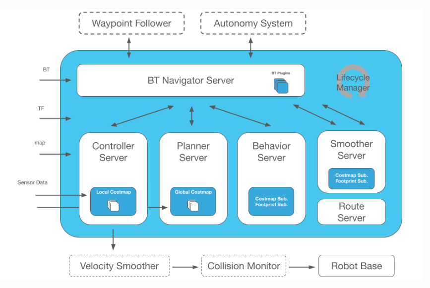

Nav2 is the successor to the ROS Navigation Stack, deploying the same type of technology that powers mobile and surface robotics. This project allows mobile robots to navigate in complex environments to complete user-defined application tasks using nearly any class of robot kinematics. Not only can it move from point A to point B, it can also have intermediate poses and represent other types of tasks such as object tracking, full coverage navigation, and more.

## Start myAGV underlying communication

Press Ctrl+Alt+T on the keyboard to open the first terminal and enter the command:

```
ros2 launch myagv_odometry myagv_active.launch.py
```


## Start Nav2

Press Ctrl+Alt+T on the keyboard to open a second terminal and enter the command:

```
ros2 launch myagv_navigation2 navigation2_active.launch.py
```

This will start an rviz.

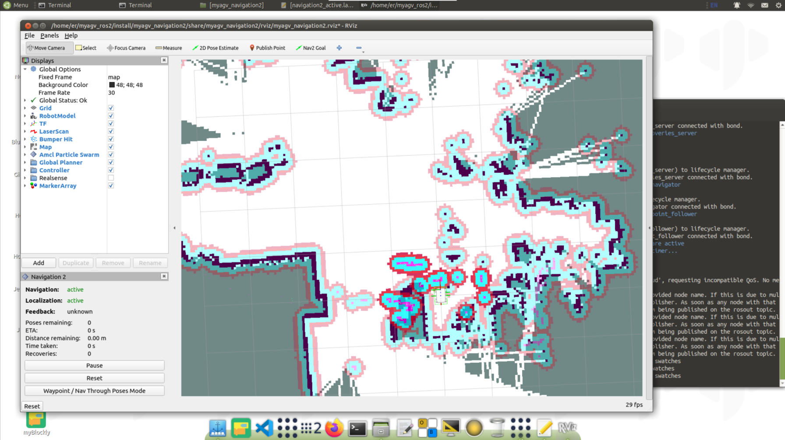

First, find the robot's position on the map. Check the position of your robot in the map.

Set the robot's pose in RViz. Click the 2D Pose Estimate button and indicate the robot's position on the map. The direction of the green arrow is the direction of myAGV.

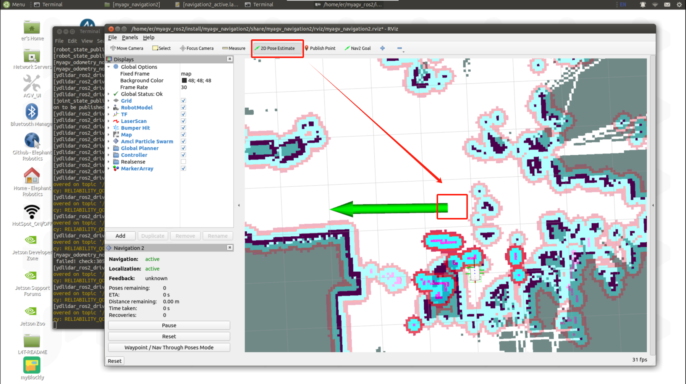

The 3D model is then moved to that location, and the lidar and map obstacles are observed to see if they match, and that small errors in the estimated position are tolerable.

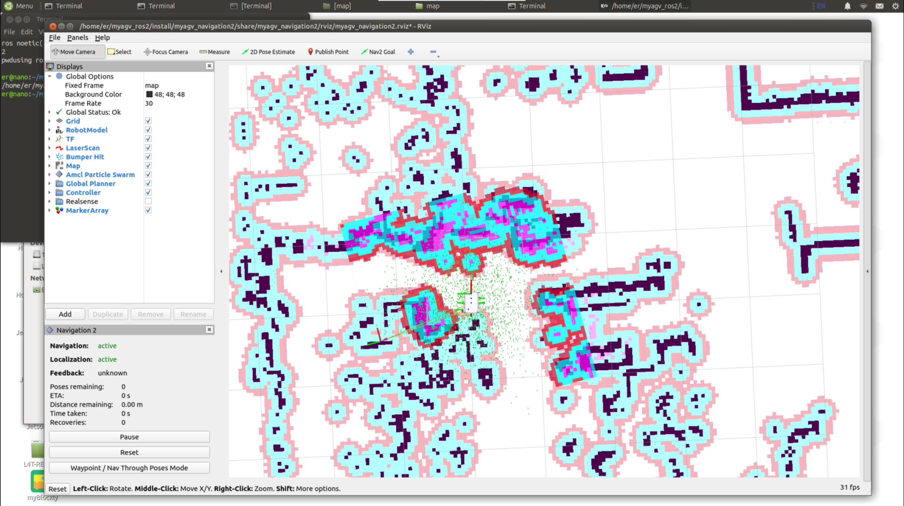

Select a target location on the map to navigate to. Use the Nav2 Goal button to send the target location and target direction.

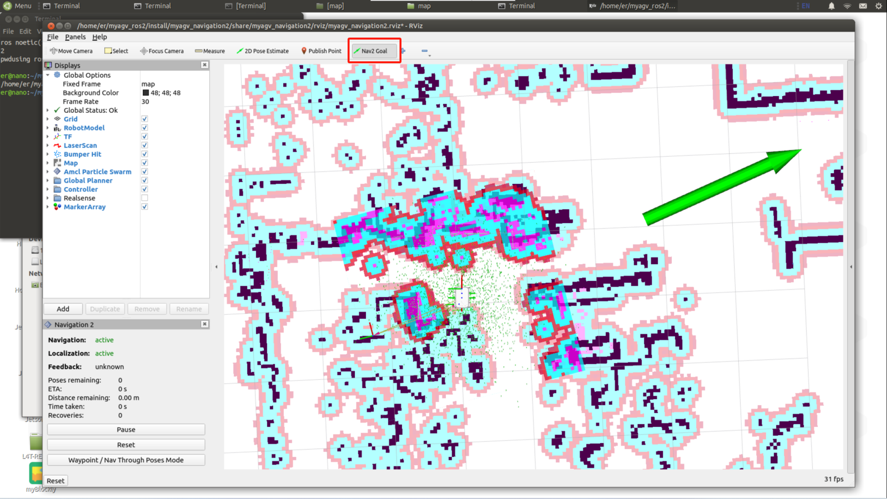

Nav2 will plan the path and send motion instructions to complete the navigation.

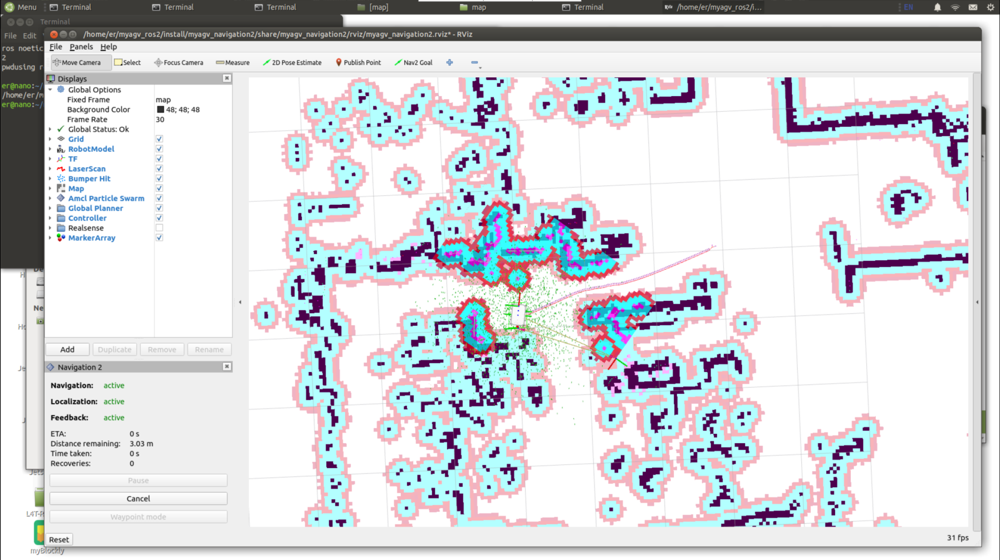

> Waypoint Following

Click Waypoint/Nav Through Poses Mode in the lower left box of rviz2 to switch to path point following mode.

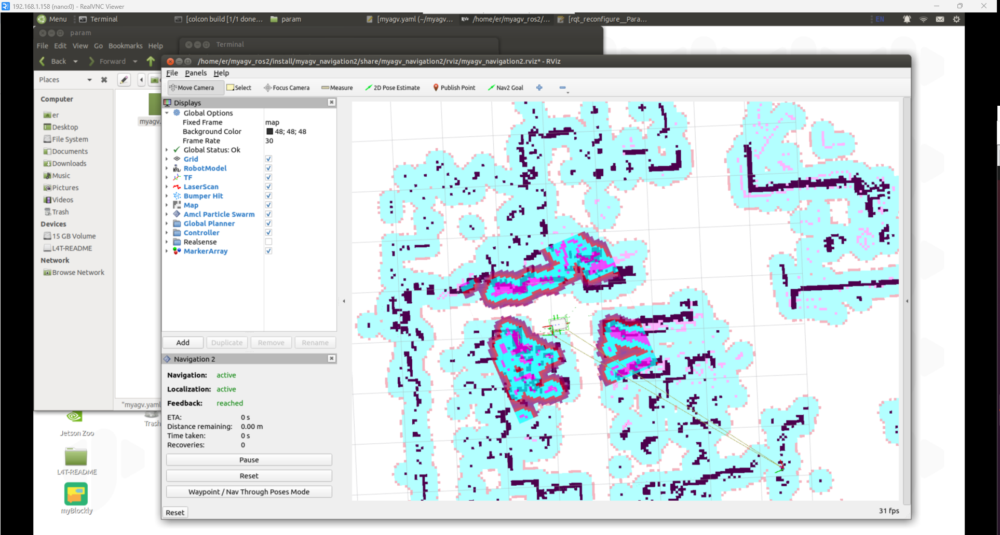

Click Nav2 Goal to publish two navigation points.

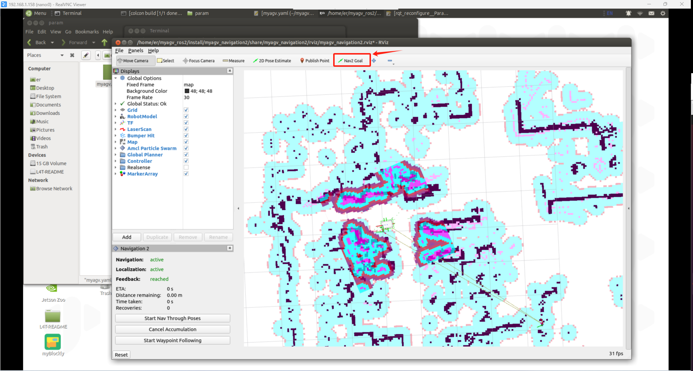

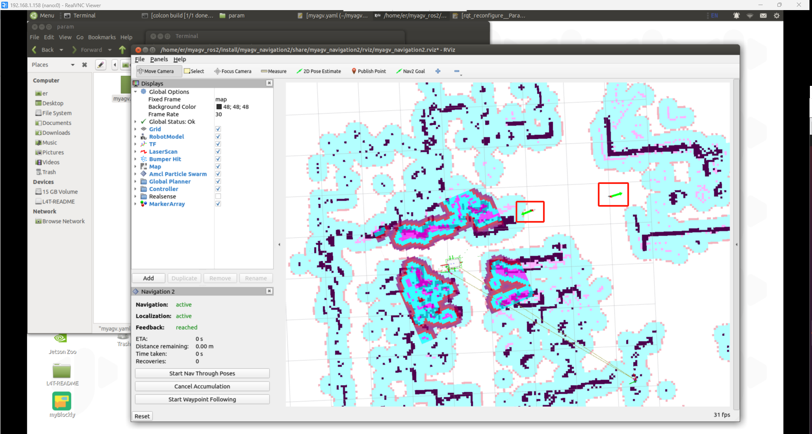

Click Start Waypoint Following in the lower left corner, and then navigation will proceed in sequence.

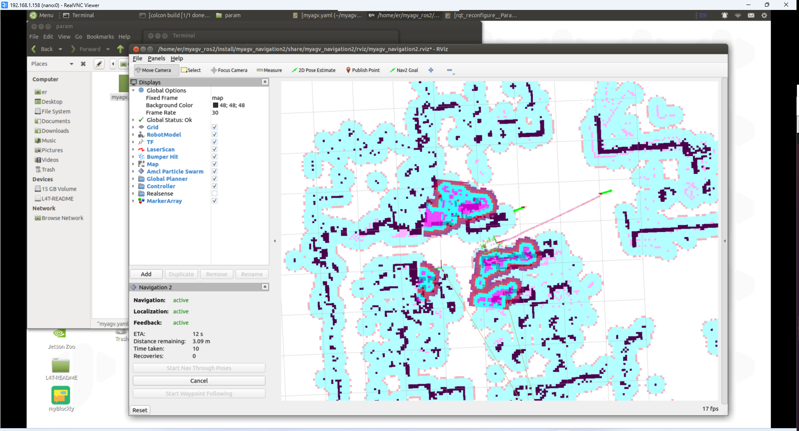

After navigating to the first point, continue navigating to the second point.

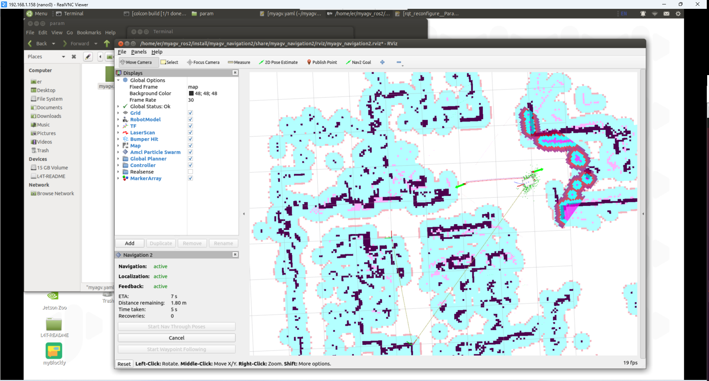

## Change the starting navigation map

Before this, we have successfully created a spatial map and obtained a set of map files, namely **map.pgm** and map.yaml** in the ~/myagv_ros2/src/myagv_navigation2/map directory. We navigate based on these two map files. The following will introduce how to navigate based on other maps.


Method 1: Modify the launch.py ​​file

Find the file `myagv_ros2/myagv_navigation2/launch/navigation2_active.launch.py`, change the `'map.yaml'` on line 20 to the map file you need to load, and then compile it through `colcon build`.

```python
import os

from ament_index_python.packages import get_package_share_directory

from launch import LaunchDescription
from launch.substitutions import LaunchConfiguration
from launch.actions import DeclareLaunchArgument,IncludeLaunchDescription
from launch.conditions import IfCondition
from launch.launch_description_sources import PythonLaunchDescriptionSource
from launch_ros.actions import Node

def generate_launch_description():
    use_sim_time = LaunchConfiguration('use_sim_time', default='false')
    use_rviz = LaunchConfiguration('use_rviz', default='true')
    map_dir = LaunchConfiguration(
        'map',
        default=os.path.join(
            get_package_share_directory('myagv_navigation2'),
            'map',
            'map.yaml'))

    param_file_name = 'myagv.yaml'
    param_dir = LaunchConfiguration(
        'params_file',
        default=os.path.join(
            get_package_share_directory('myagv_navigation2'),
            'param',
            param_file_name))

    nav2_launch_file_dir = os.path.join(get_package_share_directory('nav2_bringup'), 'launch')

    rviz_config_dir = os.path.join(
        get_package_share_directory('myagv_navigation2'),
        'rviz',
        'myagv_navigation2.rviz')

    return LaunchDescription([
        DeclareLaunchArgument(
            'map',
            default_value=map_dir,
            description='Full path to map file to load'),
    
        DeclareLaunchArgument(
            'params_file',
            default_value=param_dir,
            description='Full path to param file to load'),

        DeclareLaunchArgument(
            'use_sim_time',
            default_value='false',
            description='Use simulation (Gazebo) clock if true'),

        IncludeLaunchDescription(
            PythonLaunchDescriptionSource([nav2_launch_file_dir, '/bringup_launch.py']),
            launch_arguments={
                'map': map_dir,
                'use_sim_time': use_sim_time,
                'params_file': param_dir}.items(),
        ),

        Node(
            package='rviz2',
            executable='rviz2',
            name='rviz2',
            arguments=['-d', rviz_config_dir],
            parameters=[{'use_sim_time': use_sim_time}],
            condition=IfCondition(use_rviz),
            output='screen'),
    ])
```

Method 2: Add the map parameter when launching launch

When launching `ros2 launch myagv_navigation2 navigation2_active.launch.py`, add the `map:=` parameter. For the writing of launch, you can [refer to this link](https://docs.ros.org/en/galactic/Tutorials/Intermediate/Launch/Using-Substitutions.html).

```
ros2 launch myagv_navigation2 navigation2_active.launch.py map:=/home/er/myagv_ros2/src/myagv_navigation2/map/map_demo.yaml
```

---

[← Previous page](6.2.6-Real-time_Mapping_with_Cartographer.md) | [Next Page →](6.2.8-Rtabmap.md)
