# MyAGV + 270M5 handle remote control case

**Function**: Use the handle to control MyAGV + 270M5 to move

## 1 Hardware installation
### Robot arm installation
Fix 270M5 on AGV

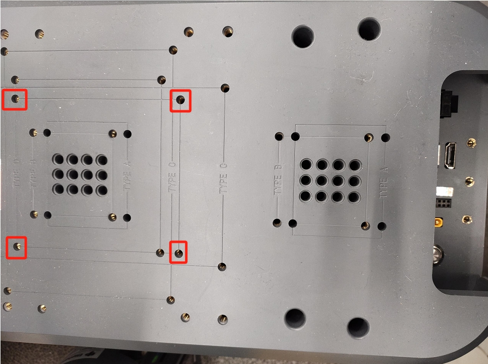

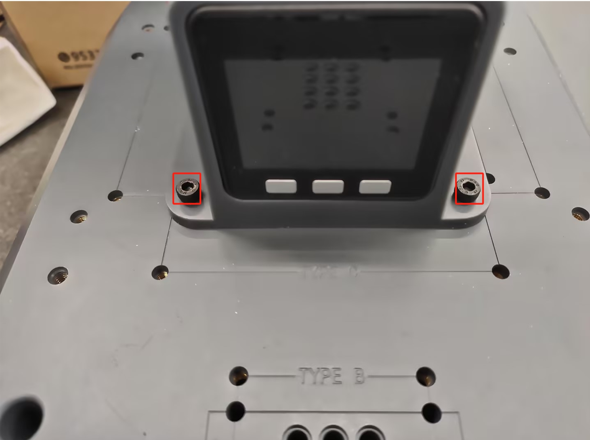

Then connect the 12V power cord, Type-C cable, and handle receiver as shown below, and press the AGV power button

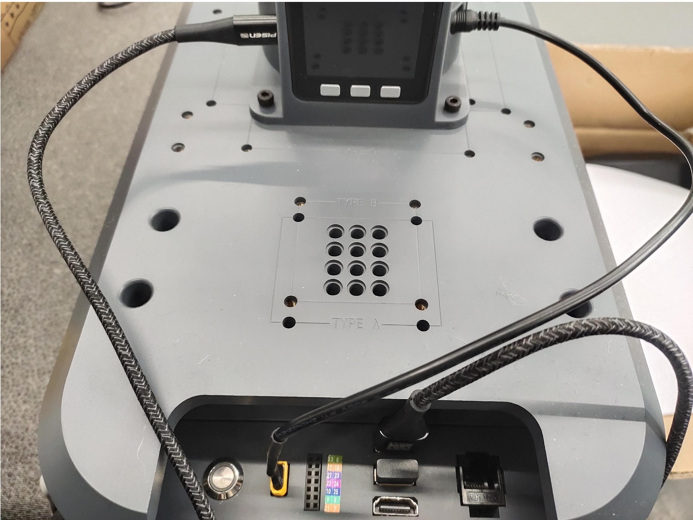

After powering on, make sure the bottom screen of 270M5 displays ATOM: OK


The end tool can choose a gripper or a suction pump

### Suction pump installation

Insert the Lego connector into the reserved socket on the suction pump

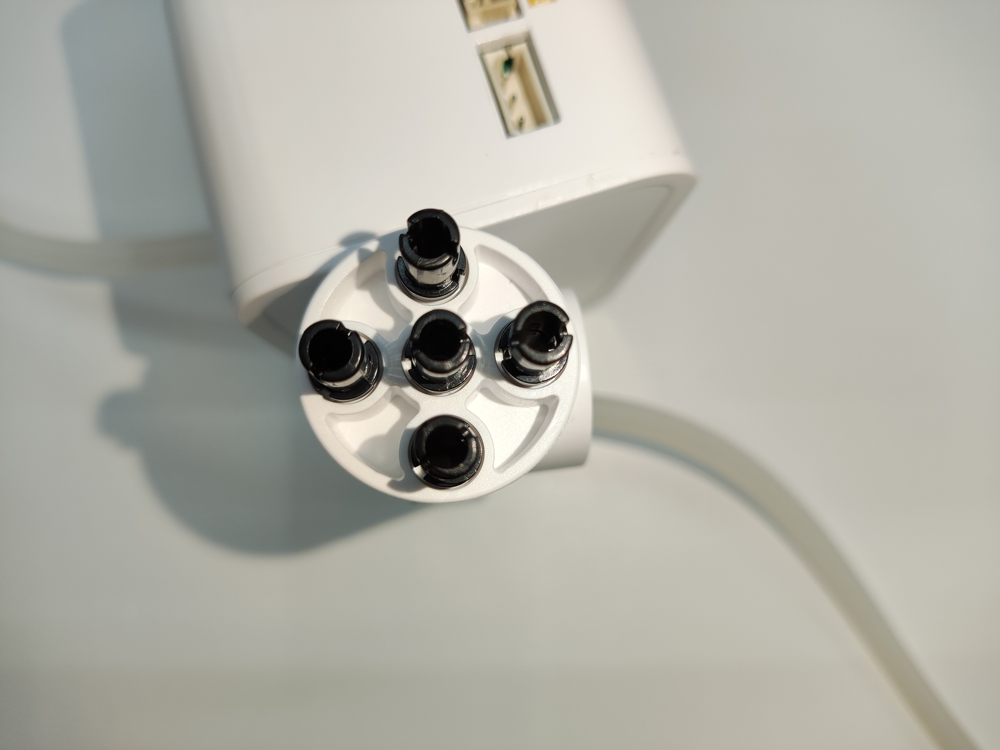

Align the suction pump with the connector inserted into the end socket of the robot arm

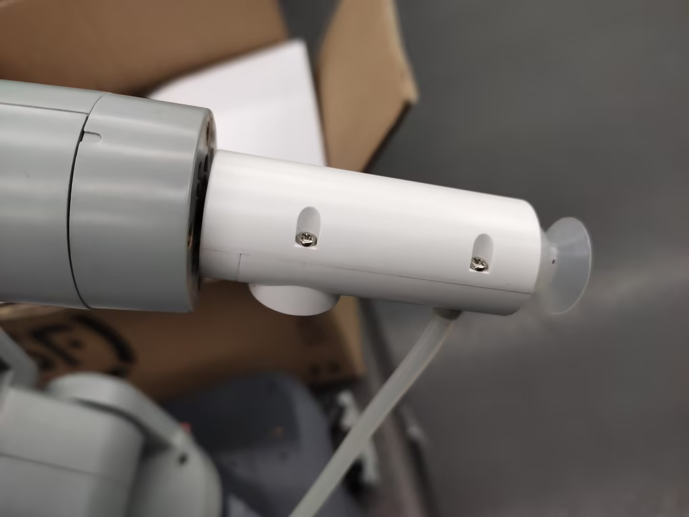

Then connect the male and female DuPont wires to the base IO of the robot arm
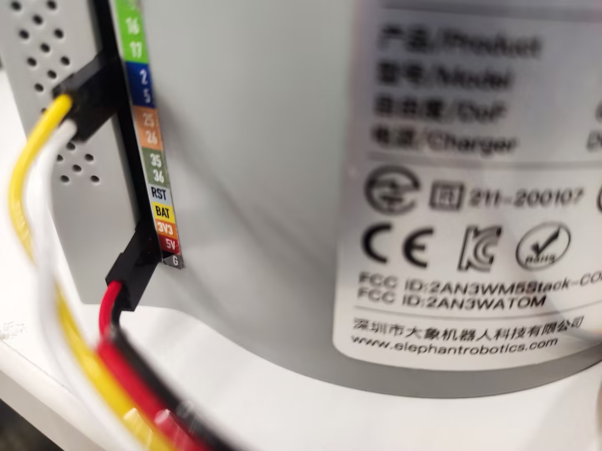

> The left side is the suction pump pin, and the right side is the robot arm pin
> GND -> GND
> 5V -> 5V
> G2 -> 2
> G5 -> 5

### Gripper installation
Insert the Lego connector into the reserved socket of the gripper

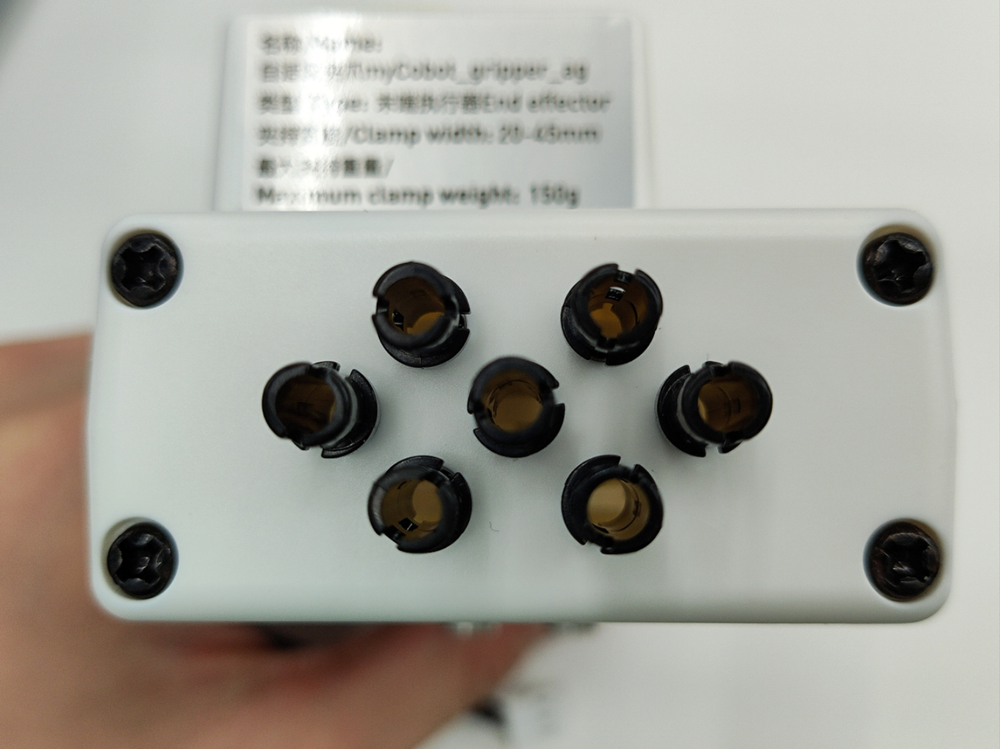

Align the gripper with the connector inserted into the socket at the end of the robot arm and insert it

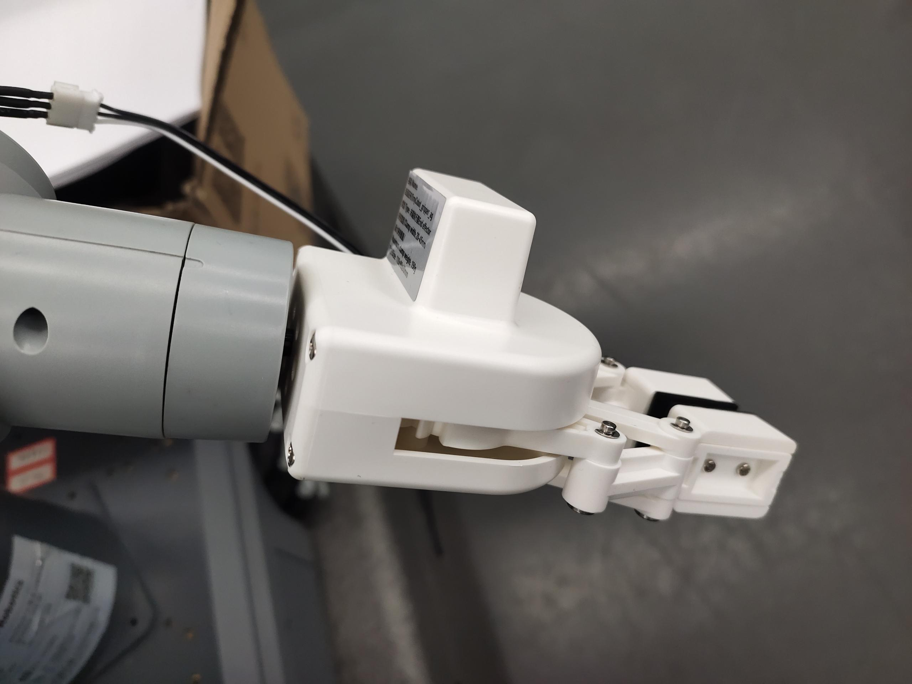

Insert the gripper line into the robot arm control interface

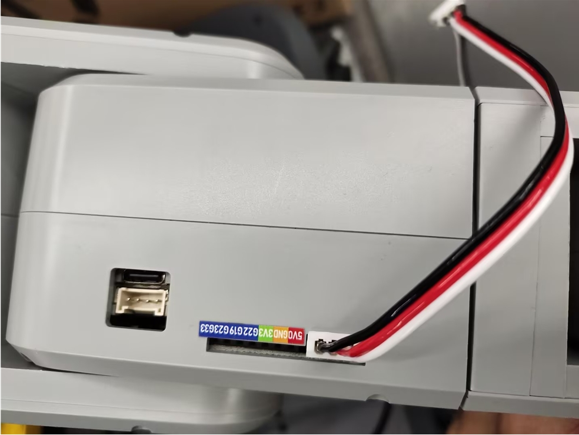

## 2 Dependent library installation

```bash
pip install pygame pymycobot --upgrade
```

## 3 Controller function description
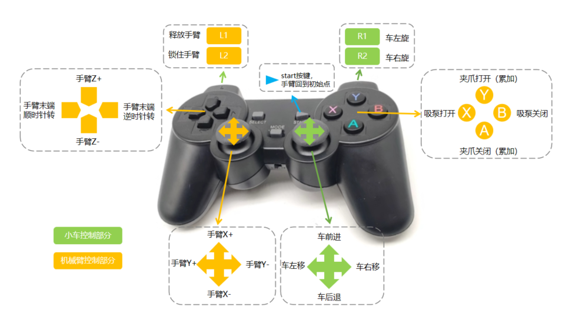

## 4 Controller activation
Turn on the controller switch

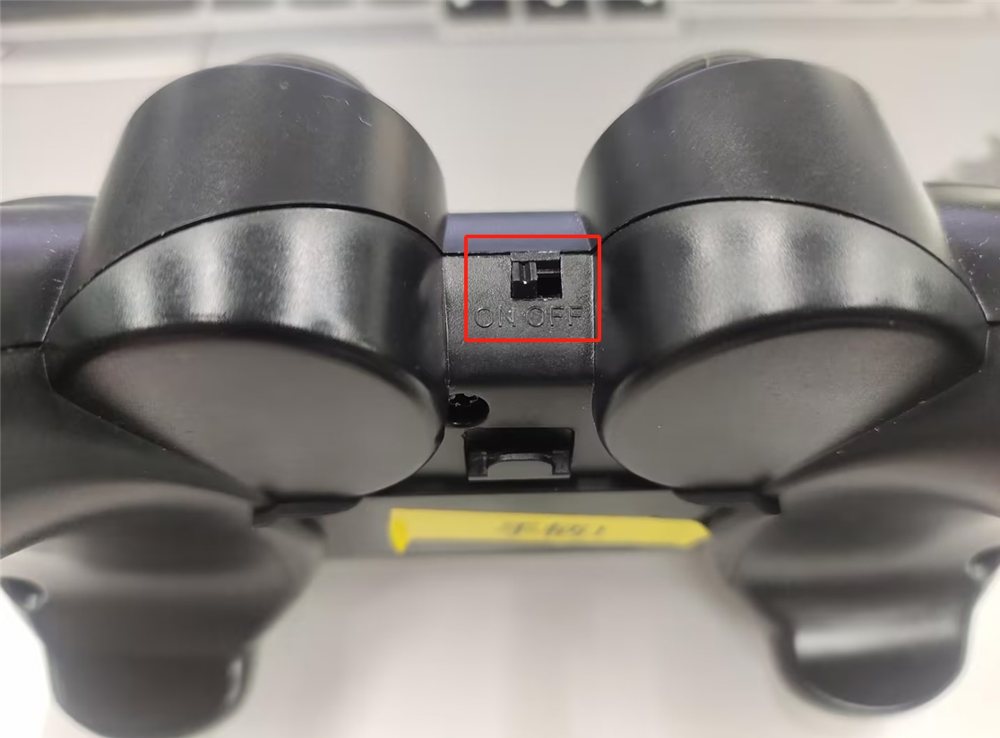

**Note**: When you plug the handle transceiver into the USB port of the AGV for the first time, or when you unplug and plug the receiver or restart the AGV, you need to execute the following program to activate the handle
```python
import pygame
import sys
import time

pygame.init()
pygame.joystick.init()
if pygame.joystick.get_count() > 0:
    joystick = pygame.joystick.Joystick(0)  
    joystick.init()
    while 1:
        print("Press and hold the MODE button to enter the control mode. The MODE light turns red and you can close this program.")
        time.sleep(1)
else:
    print("No controller detected")
    pygame.quit()
    sys.exit()
```
After executing the program, long press the MODE button of the handle. When the MODE light of the handle turns red, release the MODE button

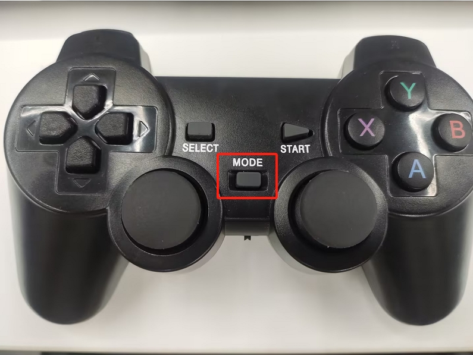

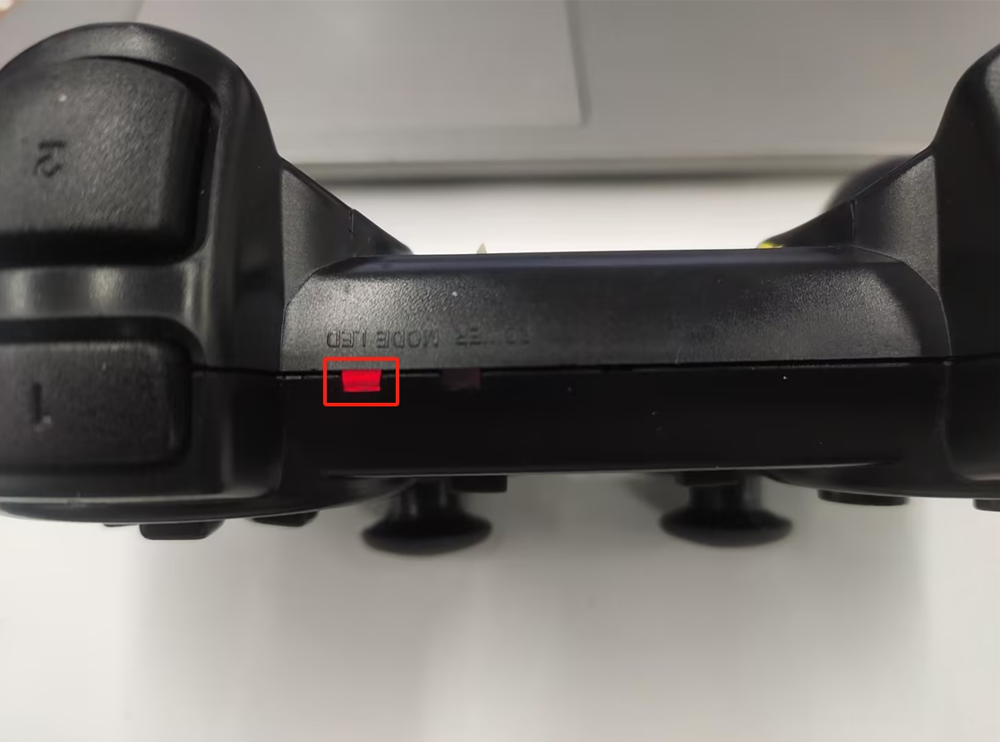

**Note**: Only when the MODE LED turns on can the robot arm be controlled. If the handle is not used for a long time, it will enter the standby state. You can press the START button of the handle to activate it


## 5 Case Reproduction
### Start the laser radar
Open the terminal and run the following command
```bash
./myagv_ros/src/myagv_odometry/scripts/start_ydlidar.sh
```
### Start the odometer node
```bash
roslaunch myagv_odometry myagv_active.launch
```

### Example program
After running the following program, the terminal prints init_ok, and you can start control
```python

from pymycobot import MechArm270
import pygame
import time
import sys
import rospy
from geometry_msgs.msg import Twist
import threading

class CmdVelPublisher:
    def __init__(self):       
        rospy.init_node('cmd_vel_publisher', anonymous=True)
        self.pub = rospy.Publisher('/cmd_vel', Twist, queue_size=10)       
        self.move_cmd = Twist()     
        self.move_cmd.linear.x = 0
        self.move_cmd.linear.y= 0
        self.move_cmd.angular.z = 0        
        self.rate = rospy.Rate(10)         
        self.publish_thread = threading.Thread(target=self.publish_cmd_vel)
        self.publish_thread.daemon = True  
        self.publish_thread.start()
    def publish_cmd_vel(self):
        while not rospy.is_shutdown():
            self.pub.publish(self.move_cmd)
            self.rate.sleep()
    def set_speed(self, x=0,y=0,yaw=0):
        self.move_cmd.linear.x = x
        self.move_cmd.linear.y = y
        self.move_cmd.angular.z = yaw
       
pygame.init()
pygame.joystick.init()
button_pressed = False
hat_pressed=False
previous_state = [0,0,0,0,0,0] 
cmd_vel_publisher = CmdVelPublisher()
mc=MechArm270("/dev/ttyACM0")
init_angles=[0, 0, 0, 0, 90, 0]
mc.sync_send_angles(init_angles,50)
count=100
mc.set_gripper_state(0,100)
time.sleep(1)
mc.set_fresh_mode(1)
arm_speed=10
print("init_ok")

def pump_on():
    mc.set_basic_output(5, 0)
    # time.sleep(0.05)

def pump_off():
    mc.set_basic_output(5, 1)
    # time.sleep(0.05)
    mc.set_basic_output(2, 0)
    # time.sleep(1)
    mc.set_basic_output(2, 1)
    # time.sleep(0.05)
    
def joy_handler():
    global button_pressed
    global hat_pressed
    global previous_state
    global count
    if event.type == pygame.JOYAXISMOTION:
        axis = event.axis  
        value = round(event.value, 2)  
        if abs(value) ==1.0:  
            flag = True
            previous_state[axis] = value  
            if axis==0 and value==-1.00:
                mc.jog_coord(2,1,arm_speed)
            elif axis==0 and value==1.00:
                mc.jog_coord(2,0,arm_speed)
            if axis==1 and value==1.00:
                mc.jog_coord(1,0,arm_speed)
            elif axis==1 and value==-1.00:
                mc.jog_coord(1,1,arm_speed)
            if axis==2 and value==1.00:
                mc.power_on()
            if axis==4 and value==1.00:
                cmd_vel_publisher.set_speed(x=-0.2)  
            elif axis==4 and value==-1.00:
                cmd_vel_publisher.set_speed(x=0.2)              
            if axis==3 and value==1.00:
                cmd_vel_publisher.set_speed(y=-0.2)
            elif axis==3 and value==-1.00:
                cmd_vel_publisher.set_speed(y=0.2)
            if axis==5 and value==1.00:
                cmd_vel_publisher.set_speed(yaw=-0.2)
            elif axis==5 and value!=1.00:
                cmd_vel_publisher.set_speed()              
        else:
            if previous_state[axis] != 0:
                cmd_vel_publisher.set_speed()
                mc.stop()
                previous_state[axis] = 0  
    if event.type == pygame.JOYBUTTONDOWN:
        if joystick.get_button(0)==1:
            count-=10
            if count<0:
                count=0
            mc.set_gripper_value(count,100)
            pass
        if joystick.get_button(1)==1:
            pump_on()
            pass
        if joystick.get_button(2)==1:
            pump_off()
            pass
        if joystick.get_button(3)==1:
            count+=10
            if count>100:
                count=100
            mc.set_gripper_value(count,100)
            pass
        if  joystick.get_button(4)==1:
            mc.release_all_servos()
        if  joystick.get_button(5)==1:
            cmd_vel_publisher.set_speed(yaw=0.2)            
        if  joystick.get_button(7)==1:
            mc.send_angles(init_angles,100)
    if event.type == pygame.JOYBUTTONUP:      
        if  event.button==5:           
            cmd_vel_publisher.set_speed()            
    if event.type == pygame.JOYHATMOTION:
        hat_value = joystick.get_hat(0) 
        if hat_value ==(0,-1):
            mc.jog_coord(3,0,arm_speed)
        elif hat_value ==(0,1):
            mc.jog_coord(3,1,arm_speed)
        elif hat_value ==(-1,0):
            mc.jog_angle(6,0,arm_speed)
        elif hat_value ==(1,0):
            mc.jog_angle(6,1,arm_speed)
        if hat_value != (0, 0):
            hat_pressed = True
        else:
            if hat_pressed: 
                cmd_vel_publisher.set_speed() 
                mc.stop()
                hat_pressed = False  
if pygame.joystick.get_count() > 0:
    joystick = pygame.joystick.Joystick(0) 
    joystick.init()
else:
    print("no handler")
    pygame.quit()
    sys.exit()
running = True
try:
    while not rospy.is_shutdown():
        for event in pygame.event.get():                
            joy_handler()
except KeyboardInterrupt:
    #print("end")
    pygame.quit()
    sys.exit(0)
```

## 6 Example display

