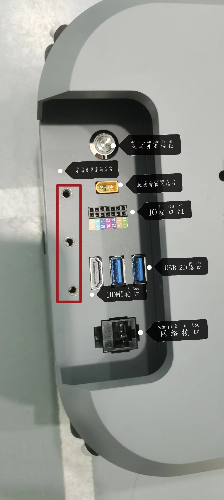
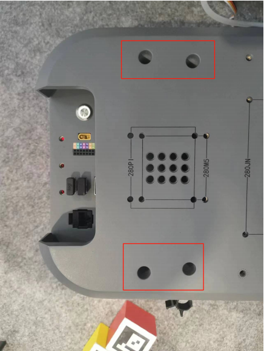

# 1 Installation Instructions

## 1.1 Installation of robotic arm

Firstly the arm needs to be mounted to the myAGV. The arm can be mounted in the upper part of the myAGV using LEGO keys or screws, either at the front or at the back depending on your needs.

## 1.2 Connecting the robot arm

Using the DC power cable to connect to the arm power supply connector and the other end to connect to the arm power connector, the trolley can supply power to the arm (12V 5A).

Example: myCobot280 Pi, other Pi robotic arms are the same.  

1. Remove the four m4\*8 socket head cap screws with a hexagonal spanner.

2. Mount the myCobot 280Pi arm in the correct direction corresponding to the X-axis and screw on four m4\*8 to fix the 280Pi.

![[Enabling trolley launch terminal]](../resources/7-ExamplesRobotsUsing/复合机器人/A2.png)

![[Enabling trolley launch terminal]](../resources/7-ExamplesRobotsUsing/复合机器人/A3.png)

![[Enabling trolley launch terminal]](../resources/7-ExamplesRobotsUsing/复合机器人/A4.png)

---

[← Previous Page](README.md) | [Next Page →](7.2-CommunicationsControl.md)
