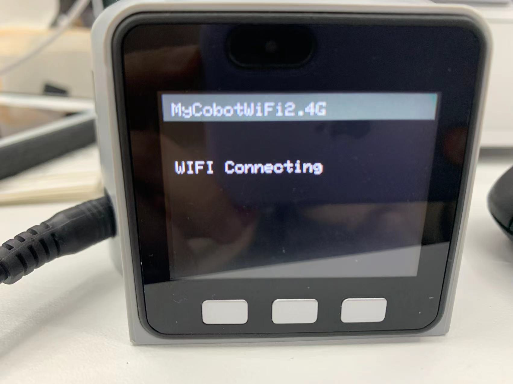

## myAGV with robot arm communication control

## Pi version

### WIFI communication control

**Note:** Only myCobot 280 Pi, myPalletizer 260 Pi, mechArm 270 Pi are supported.

1. Configure the robotic arm

**Step 1** Firstly, connect the robot arm to the display and switch on the machine, click the WIFI icon to connect to WIFI and enter the WIFI password, click Connection to connect successfully.

**Step 2** Click the desktop pymycobot file, click the demo file, copy the Server.py file to the desktop.

**Step 3** Open command terminal


**Step 4** Enter the following code to run the script:

```python
sudo python3 Server.py
```

**Step 5** Run successfully as shown:


2. myAGV communication control case

The trolley is normally switched on and connected to the display and the keyboard and mouse, the above steps ensure that the connection is good, then you can use the trolley to control the robotic arm.

**Note: The robot arm needs to be on the same network segment as the cart, i.e. under the same WIFI.**

- myCobot 280、mechArm 270：

```python
from pymycobot import MyCobotSocket
# Port 9000 is used by default 
# where "192.168.10.22" is the robot arm IP, please enter your robot arm IP yourself
mc = MyCobotSocket("192.168.10.22",9000)
mc.connect()

# The arm can be controlled when it is properly connected.
mc.send_angles([0,0,0,0,0,0],20)
res = mc.get_angles()
print(res)

...
```

- myPalletizer 260：

```python
from pymycobot import MyPalletizerSocket
# Port 9000 is used by default 
# Where "192.168.10.22" is the IP of the robot arm, please input your robot arm IP by yourself.
mc = MyPalletizerSocket("192.168.10.22"，9000)
mc.connect()

# The arm can be controlled when it is properly connected.
mc.send_angles([0,0,0,0],20)
res = mc.get_angles()
print(res)

...
```


---

## M5 version

### USB serial communication control

**Note:** Only myCobot 280 M5, myPalletizer 260 M5, mechArm 270 M5 are supported.

This part takes myPalletizer 260 M5 version as an example.

1、Connect the robot arm

When using usb serial communication control, first use type-c to usb cable to connect the trolley and robotic arm.


2、USB communication connection

Click Transponder, then click USB UART, the robot arm stays in Atom: ok interface.


3, myAGV communication control

The trolley is normally switched on to connect the display and keypad, the above steps to ensure that the connection is good, then you can use the trolley to control the robotic arm.


If you get an error that the serial port does not have privileges after running a

```
PermissionError:[Errno 13]Permission denied:"/dev/ttyACM0
```

This can be solved by adding a serial port rule: fill in the fields and save the serial port rule, then reload the rule in the terminal and reboot.


fill in the fields and save the serial port rule


then reload the rule in the terminal and reboot.

```
sudo  udevadm control --reload

sudo reboot
```

Afterwards you will be able to control the robotic arm properly

For a more detailed myBlockly tutorial, check out the
[**6.1 myBlockly**](../5-BasicApplication/5.2-ApplicationUse/5.2.1-myblockly/README.md)

### WIFI communication control

**注：** 只支持myCobot 280 M5、myPalletizer 260 M5

1. Mobile network settings

**Step 1:** Need to change wifi or mobile hotspot of mobile phone to match the network of robotic arm.

* i.e. "MyCobotWiFi2.4G", and the password for the robotic arm mobile network is "mycobot123".

* i.e. "MyPalWiFi2.4G", and the password for the robotic arm mobile network is "mypal123".


2. WIFI Connecting

**Step 1:** Click WlAN Server, "WIFI Connecting" will appear, indicating that the wireless network is connecting.




**Step 2:** WIFI Connected and IP and Port information appear indicating that WIFI has been successfully connected.


3. myAGV communication control case

The cart is normally switched on and connected to the display and keypad, the above steps to ensure that the connection is good, then you can use the cart to control the robot arm.

* myCobot 280：

```python
from pymycobot import MyCobotSocket
# Default port 9000 
# The "192.168.11.15" is the IP of the robot arm, please input your robot arm IP by yourself.
mc = MyCobotSocket("192.168.11.15",9000)

# The arm can be controlled when it is properly connected.
mc.send_angles([0,0,0,0,0,0],20)
res = mc.get_angles()
print(res)

...
```

* myPalletizer 260：

```python
from pymycobot import MyPalletizerSocket
# Port 9000 is used by default
# The "192.168.11.15" is the IP of the robot arm, please input your robot arm IP by yourself.
mc = MyPalletizerSocket("192.168.11.15",9000)

# The arm can be controlled when it is properly connected.The arm can be controlled when it is properly connected.
mc.send_angles([0,0,0,0],20)
res = mc.get_angles()
print(res)

...
```

---

[← Previous Page](7.1-InstallationInstructions.md) | [Next Chapter →](../8-FilesDownload/README.md)
