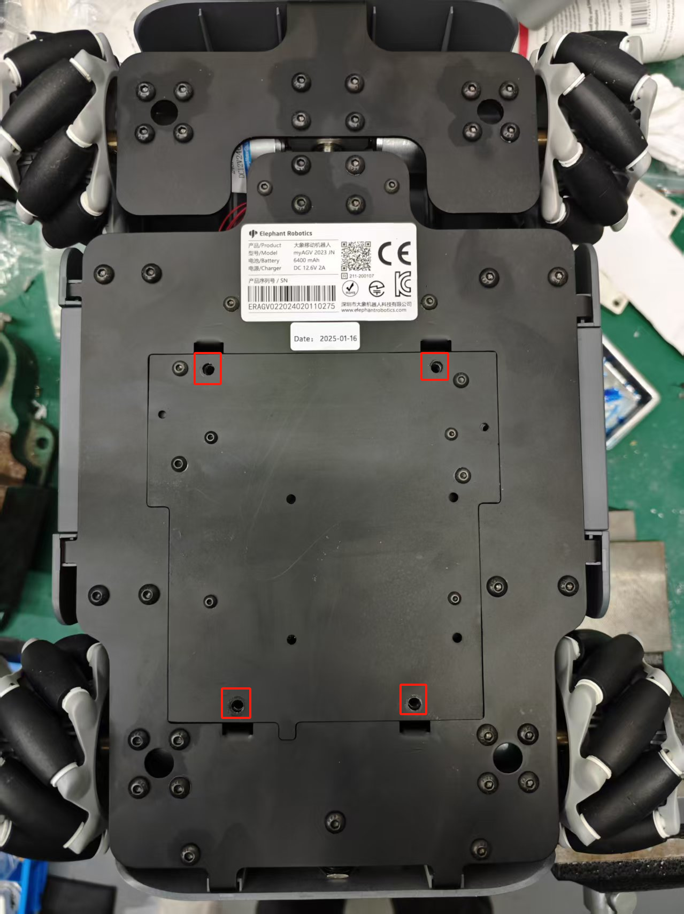

# Image Burning

### Introduction to PI version robots

## 1.1 Steps to Download

**Step 1:** Unzip the package and [a file of image](8.4.1-System_Image.md) style appears.

**Step 2:** Download Win32DiskImager.

Go to [Win32DiskImager](https://sourceforge.net/projects/win32diskimager/) to download.

**Step 3:** Find the corresponding wheel on the left according to the picture, unscrew the wheel, and take out the Raspberry Pi's SD card. Then connect the sd card to the pc.

**Step 4:** Open Win32DiskImager.

**Step 5:** Select the software and device (E disc) and then write the software into PC.

**Step 6:** Successfully processed.

---

---
[← Previous Page](8.4.1-System_Image.md) | [Next Section →](../8.5-PublicityMaterial.md)