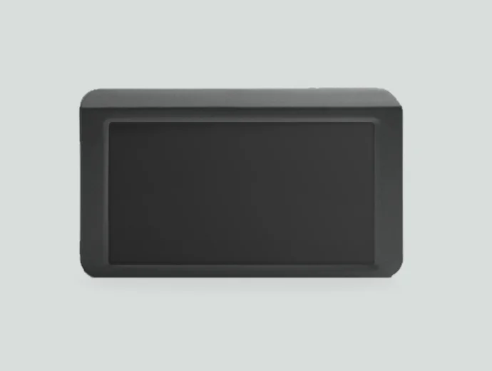
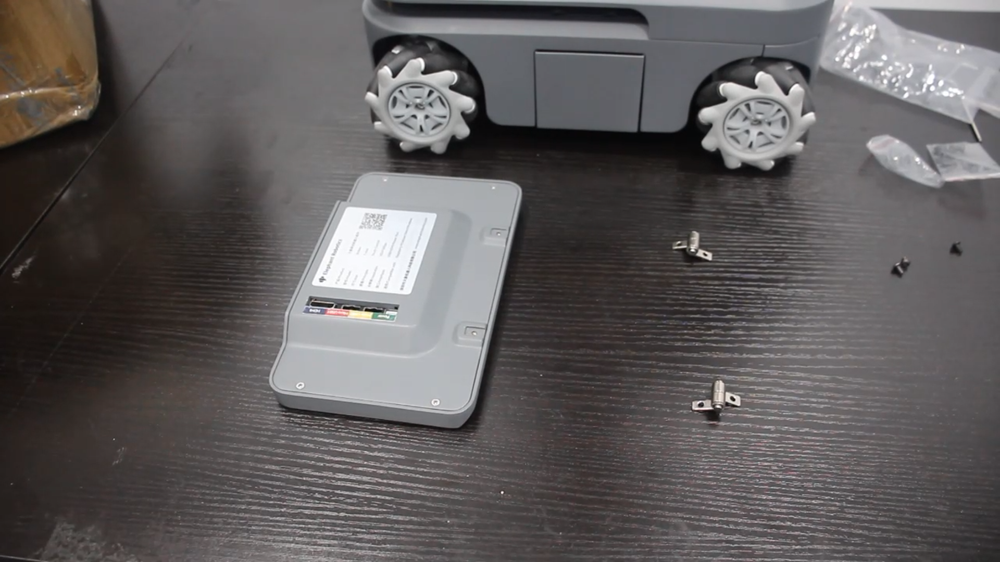
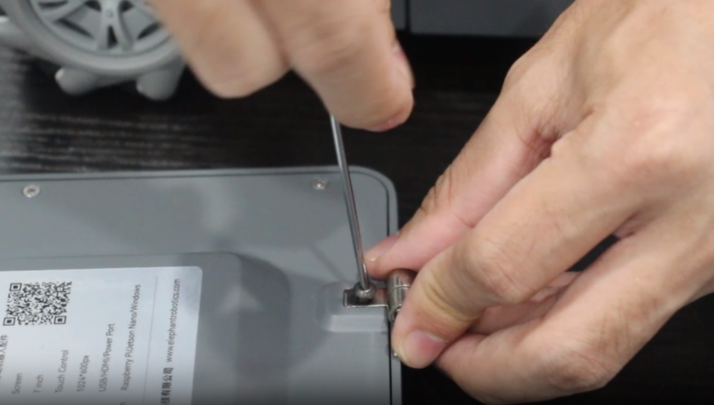
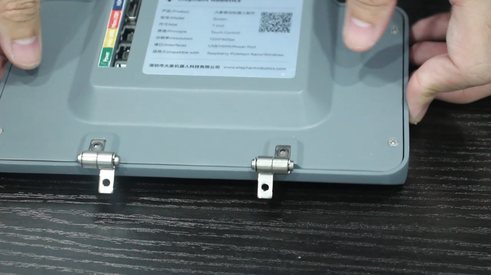
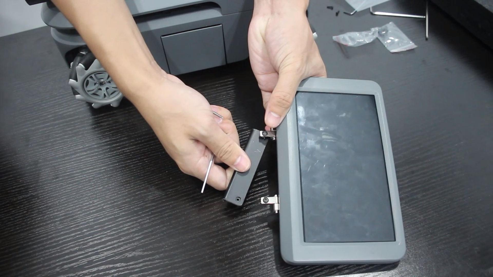
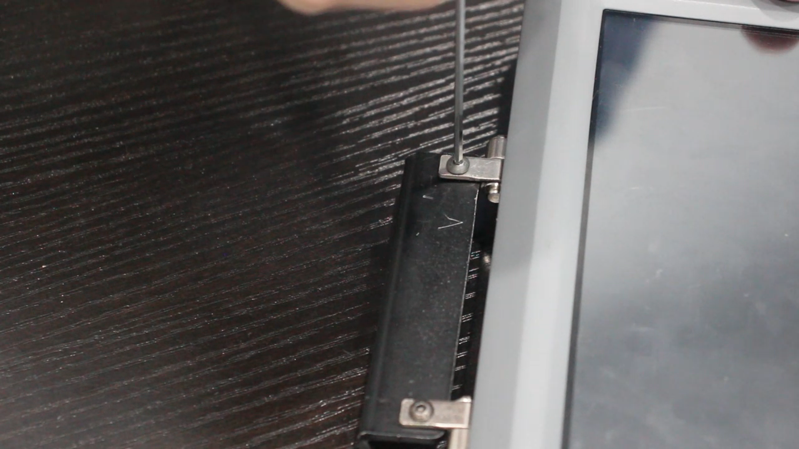
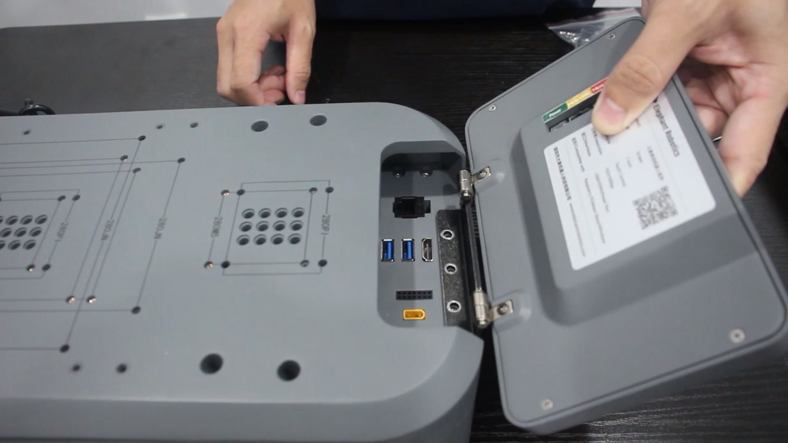
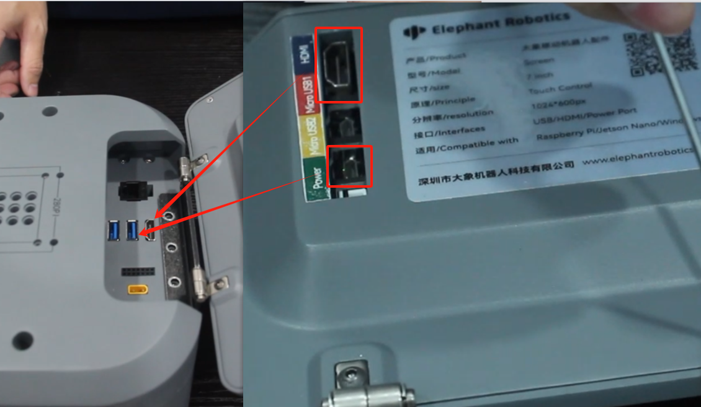

# **7 英寸 IPS 高清触摸屏**

> **兼容型号：** myAGV PI 2023、myAGV Jetson Nano 2023

7 英寸 IPS 高清触摸屏是一款小尺寸液晶显示屏，具有清晰的高清晰度和广角观看特性。它还具有触摸功能，允许用户通过简单的触摸手势进行交互。它可与 myAGV 2023 系列集成使用。

## 产品参数

| **参数**   | **规格**                              |
| :--------- | :------------------------------------ |
| 显示屏尺寸 | 7 inches                              |
| 原理       | 触摸控制                              |
| 分辨率     | 1024 \* 600px                         |
| 接口       | USB/HDMI/Power                        |
| 兼容性     | Raspberry Pi/NVIDIA/Windows           |
| 重量       | 约 350g                               |
| 兼容性     | myAGV PI 2023, myAGV Jetson Nano 2023 |

## 如何使用

1.从配件盒中取出 IPS 触摸屏、铰链和配套螺丝。

2.用螺丝固定。

3.取出连接器，按图中所示位置拧紧螺丝。

4.将螺钉拧紧到与连接器相对应的三个螺孔中。

5.将 HDMI 电缆和 Micro USB2 连接到 myAGV

## 购买链接：

- [淘宝](https://item.taobao.com/item.htm?id=745304010906&spm=a312a.7700824.w4002-23353347473.51.3a00b6e28MpDla)
- [shopify](https://shop.elephantrobotics.com/collections/myagv/products/7-inch-ips-high-definition-touchscreen)

---

[← 周边配件页](../1.4-AccessoriesTools.md#touch-screen) | [下一页 →](../1.4.2-BackupBattery/1-BackupBattery.md)
