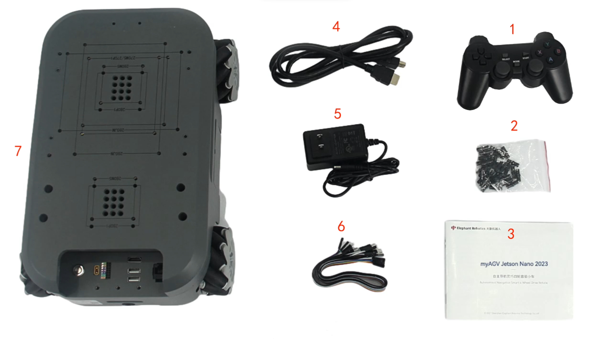

# 产品标准清单

## 1 产品列表图片

每件产品都有编号和详细说明，以确保您能准确参考您的清单。

## 2 产品标准清单对照表

| 序号 | 产品                              |
| ---- | --------------------------------- |
| 1    | 手柄                              |
| 2    | 积木插件                          |
| 3    | 产品手册                          |
| 4    | HDMI 电缆                         |
| 5    | 12.6V 2A 电源适配器和直流电源接口 |
| 6    | 跳线                              |
| 7    | myAGV Pi 2023                     |

**注：** 包装箱到手后，请确认机器人包装完好无损。如有损坏，请及时联系物流公司和您所在地区的供应商。开箱后，请根据物品清单检查箱内的实际物品。

## 3 可选产品清单

myAGV Pi 2023 现在提供两种可选产品配件，即 7 英寸高清 IPS 触摸显示屏和 6400mAh 原装备用电池。

| 序号 | 产品                                 |
| ---- | ------------------------------------ |
| 1    | 6400mAh 原装备用电池                 |
| 2    | 7 英寸高清 IPS 触摸显示屏            |
| 3    | 用于 7 英寸高清 IPS 触摸显示屏的螺钉 |

---

[← 首次安装使用页](README.md) | [下一页 →](4.2-ProductUnboxingGuide.md)
