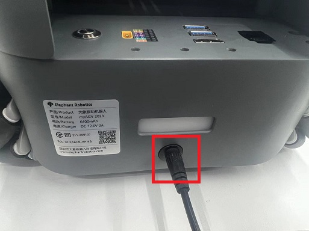
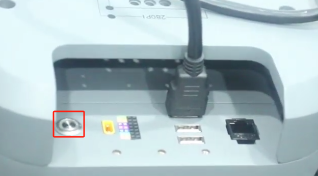
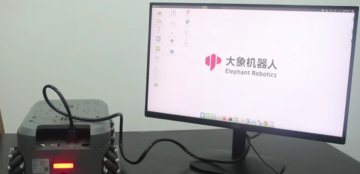
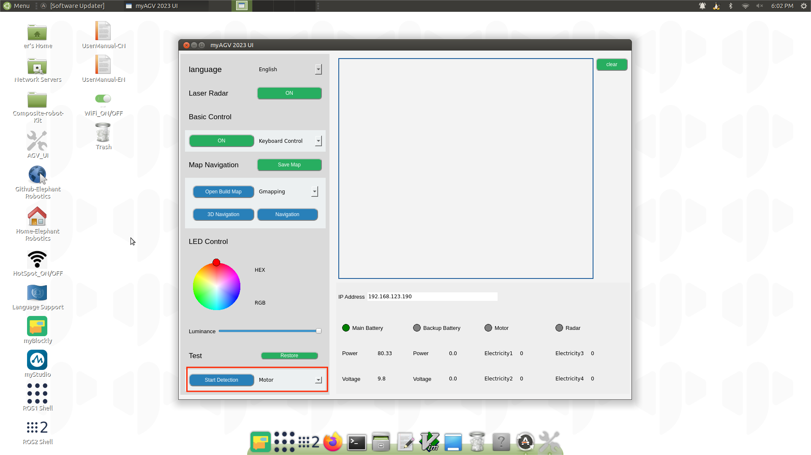

# 开机检测指南

本章内容介绍启动测试指南，目的是在使用 myagv 开发功能之前确保硬件功能正常。这对后续 myagv 软件功能的顺利运行至关重要。如果在启动测试指导过程中出现任何问题，请参考 [常见问题和解决方案](../3-UserNotes/3.4-FAQs.md) 或联系技术支持寻求帮助。

## 1 外部电缆连接

操作前，请确认您已阅读本章的安全说明，以确保 [安全运行](../3-UserNotes/3.1-SafetyInstruction.md).

由于 myagv 快递安全的限制，用户刚拿到 myagv 时，电池电量一般都很低。此时，电量不足以启动 myagv，因此需要为 myagv 充电。从配件盒中取出 12.6V 电源适配器，连接直流电源为 myagv 充电。

产品配件包括 HDMI 电缆和蓝牙控制器。我们将它们全部连接到 myagv，然后还需要再准备一个带 HDMI 接口的显示器和一个 USB 键盘和鼠标。

将 HDMI 电缆连接到显示器。

## 2 开机状态显示

连接必要的外部设备后，按下电源按钮启动 myAGV PI 2023。

此时此刻，你会观察到以下现象：

- 1 按下电源按钮后，按钮将亮起白光。
- 2 myagv 后部的 LED 灯会闪烁，然后保持稳定。
- 3 显示器将显示系统信息，并成功进入操作系统桌面。

如果系统无法成功启动，可能是以下常见问题造成的。如果 myagv 仍然无法进入系统，请联系技术支持人员协助排除故障：

1. 按下电源按钮，但按钮指示灯不亮.

   - 锂电池已进入电池保护模式。电压过低，无法为 myagv 供电。请使用 12.6V 电源适配器为 myagv [充电](#1-外部电缆连接)。 

2. 电源按钮的指示灯保持稳定的白色，后部 LED 灯也点亮，但显示器上没有显示。

   - 请检查 HDMI 电缆是否损坏，显示器电源是否打开。您可以尝试更换 HDMI 电缆或显示器。如果尝试这些步骤后问题仍然存在，则表明 myagv 的内部接口已损坏。请联系客户支持部门寻求进一步帮助。

3. 系统启动失败，无法成功进入系统桌面。

   - 系统文件已损坏。您可以尝试 [用最新的镜像系统替换它们。](../9-FilesDownload/9.4-SystemInformation/9.4.2-Image_Burning.md)

## 3 AGV_UI 检测硬件功能

成功进入系统后，找到 [AGV_UI 软件](../5-BasicApplication/5.2-ApplicationUse/5.2.3-myagv_UI/user_manual.md) 并双击打开。

找到左下角的 "Test" 窗口，选择要测试的硬件。可在 myAGV PI 2023 上测试的硬件包括：电机、LED、2D 摄像头。

**需要注意的是，在测试电机时，它们将高速旋转。建议在 myagv 下方放置一个物体将其抬高，使四个轮子悬空后再进行测试。**

---

[← 上一页](4.2-ProductUnboxingGuide.md) | [下一章 →](../../5-BasicApplication/README.md)
