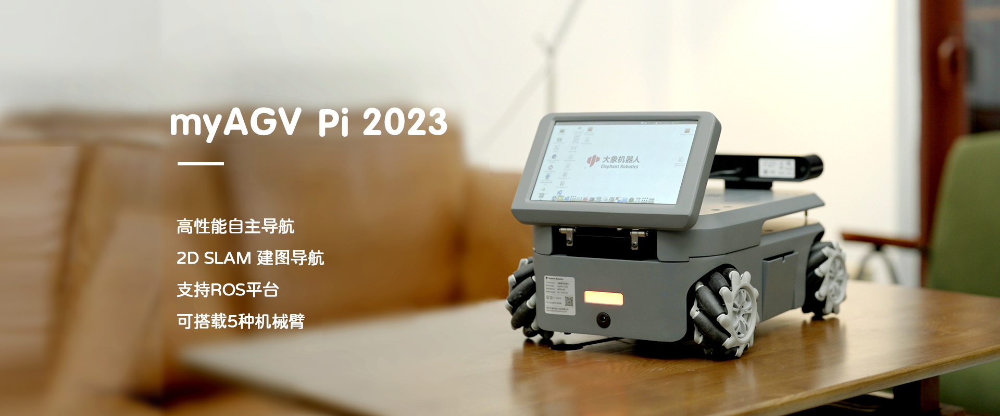

# 首次安装和使用

- **感谢您选择我们的产品**

在开始之前，我们衷心感谢您选择我们的产品。我们致力于为您提供卓越的用户体验。

- **首次使用和问题处理**

本章将详细介绍产品收到后的初步使用方法，并提供解决问题的相关信息，确保您在使用过程中无后顾之忧。

- **跳转到各部分**
  - [4.1 产品标准清单](4.1-ProductStandardList.md)
  - [4.2 产品开箱指南](4.2-ProductUnboxingGuide.md)
  - [4.3 开机检测指南](4.3-PowerOnDetectionGuide.md)

---

[← 上一章](../3-UserNotes/README.md) | [下一章 →](../5-BasicApplication/README.md)
