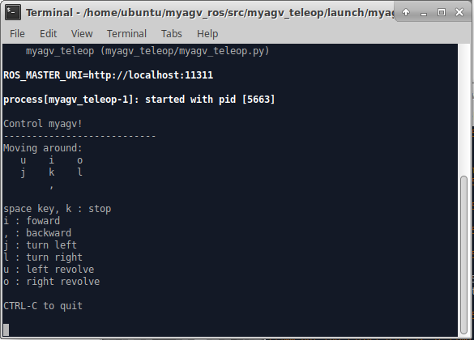
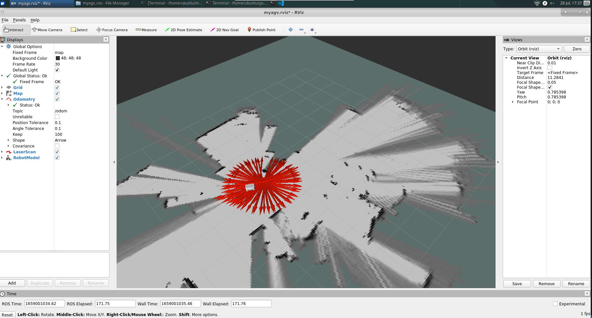
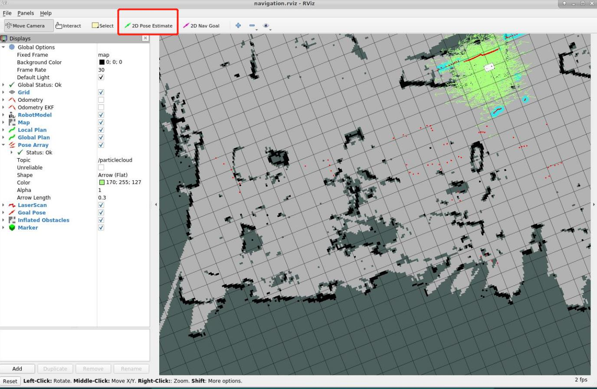
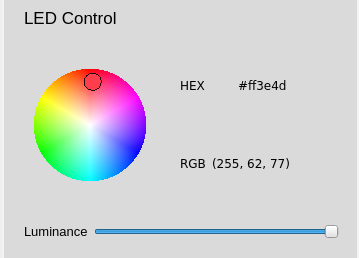
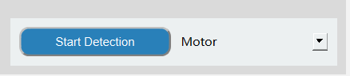

# myAgv 软件用户手册

## 运行程序

## 1. 切换语言

选择中文和英文，切换相应语言。

## 2. 激光雷达

- 点击按钮打开雷达。按钮变为红色，文字显示 "off"。
- myAgv 的雷达开始旋转。
- 桌面上会出现一个新终端，表明雷达已成功打开。  
   

**限制：**

- 雷达开启：可使用基本控制、制图、导航和地图保存功能。
- 雷达关闭：
  - 可使用 LED 灯光控制和测试功能
  - 在关闭雷达之前，您需要确保已关闭基本控制、映射和导航功能。

## 3. 基本控制

> 通过键盘和手柄控制机器移动有两种方法。

**准备：** 在开启基本控制功能之前，必须先开启雷达。如果雷达未打开，则会弹出提示框，显示 "Radar is not turned on"。

单击下拉框选择所需的控制方法，然后单击左侧的按钮打开。此时，桌面上会打开一个新的终端。

### 3.1 键盘控制

**方向键**

| 按键 | 路线指引   |
| :--- | :--------- |
| i    | 转发       |
| ，   | 后退       |
| j    | 向左移动   |
| l    | 向右移动   |
| u    | 逆时针旋转 |
| o    | 顺时针旋转 |
| k    | 停止       |

### 3.2 手柄控制

#### 2.1 手柄-字母型

> 手柄上有 7 个控制小车运动的按钮，如图所示，1~4 控制小车前后左右运动，5 控制小车逆时针旋转，6 控制小车顺时针旋转，7 是停止按钮。

---

#### 2.2 手柄-数字式

> 手柄上有 7 个控制小车运动的按钮，如图所示，1~4 控制小车前后左右运动，5 控制小车逆时针旋转，6 控制小车顺时针旋转，7 是停止按钮。

## 4. 地图和导航

**前提条件：**

- 打开雷达
- 打开键盘控制

如果未打开，则会弹出提示框，提示需要打开的项目。

### 4.1 构建地图

**构建地图有两种方法，即 Gmapping 和 Cartographer。**

#### Gmapping

点击下拉框选择 Gmapping 映射方法，然后点击 "Open Mapping"按钮开始映射。

- 桌面显示 rviz 界面。
- 选择打开的键盘终端，使用键盘控制汽车。rviz 空间将随着汽车的移动绘制地图。轨迹如图所示：
  

#### Cartographer

点击下拉框选择 Cartographer 映射方法，然后点击 "Open Mapping"按钮开始映射。

- 点击该按钮，将打开一个新的终端。如果终端一直滚动输出数据，则制图师构建文件已成功打开，终端会显示以下状态：
  
- 代码运行成功后，rviz 将被打开，地图和激光雷达信息将显示在 rviz 中，红色箭头为汽车行驶方向。界面如图所示。
  
- 选择打开的键盘终端，使用键盘控制汽车。rviz 空间将随着汽车的移动绘制地图。轨迹如图所示：
  

**限制：** 打开映射后无法使用导航功能；如果需要使用导航功能，请先关闭映射。

#### 4.1.1 保存地图

点击 "Save Map"按钮，桌面上会出现一个新的终端，显示保存的地图信息，如图所示。图中红圈部分就是保存的地图文件：

**默认保存路径在软件运行目录中。**

### 4.2 导航

### 先决条件

#### 1. 将保存的地图文件复制并粘贴到此路径中

> /home/ubuntu/myagv_ros/src/myagv_navigation/map/

#### 2. 修改启动文件

1. 点击左上角的 "Visual Studio Code"，打开代码编辑器。  
   

2. 打开/home/ubuntu/myagv_ros/src/myagv_navigation/launch/路径下的 navigation_active.launch 文件。  
   

3. 将第 5 行中的 myroom2.yaml 替换为我们自己的地图文件名 map.yaml。  
   

4. 保存修改后的文件并退出（VScode 运行时内存占用较大，建议修改代码后关闭 VScode，否则运行 carsystem 会非常卡顿，也可以使用 vim 或其他轻量级编辑器）。

**按照上述步骤操作后，根据所需的导航方法点击相应的按钮。**  
**Rviz 模拟窗口将打开。注意：最好在绘制地图时将汽车的初始位置置于汽车的起始位置。**

### 调整

如果 Rviz 界面上的汽车与实际汽车不一致，请单击顶部工具栏上的 "2D Pose Estimate（二维姿势估算）"进行调整，使 Rviz 界面上的汽车与实际汽车一致，并在调整后进行导航。

1. 点击顶部工具栏中的 "2D 导航目标"。

2. 在地图上点击我们要到达的点，汽车就会开始向目标点行驶，您还可以在 rviz 中看到汽车在起点和目标点之间的规划路径，汽车将沿着这条路线行驶到目标点。

**限制：**

- 您只能从导航和 3D 导航两种方法中选择一种。如果您需要使用另一种方法，请关闭当前方法。
- 打开导航后无法打开地图。如果您需要创建地图，请关闭导航。

## 5. LED 灯光控制

**前提条件：** 关闭雷达
使用圆盘选择光色，拖动滑块改变光色的亮度。图片右侧显示了相应的 HEX 和 RGB 值。

## 6. 测试功能

**限制：在测试期间，不能使用雷达、基本控制和地图导航模块。**

### 6.1 电机 Motor

**功能：** 检查电机是否能正常运行
**运行：**

- 从下拉框中选择 'Motor'，点击开始测试
- 在此过程中，建议将 myAgv 放在地面上进行测试；在此过程中，它将前进和后退各 4 秒钟，左右平移各 4 秒钟，左右旋转各 8 秒钟。
- 执行上述所有步骤后，检测就完成了。

### 6.2 LED 灯

**功能：** 检查 LED 灯是否能正常工作  
**运行：**

- 从下拉框中选择 "LED"，然后点击开始测试
- 依次切换红色、橙色、黄色、绿色、蓝色和紫色。如果可以正常观察到颜色切换，则说明 LED 灯使用正常。
- 每种颜色的显示时间为 1 秒。所有颜色正常显示后，检测结束。

### 6.3 3D 摄像头

**功能：** 检查 3D 摄像机是否能正常工作  
**运行：**

- 从下拉框中选择 "3D Camera"，然后单击开始测试
- 此时会弹出一个新窗口，显示摄像机捕捉到的图像；如果图像可以显示，则说明摄像机运行正常。
- 屏幕显示约 5 秒钟，然后窗口屏幕自动关闭。测试完成。

### 6.4 2D 摄像机

**功能：** 检查 2D 摄像机是否能正常工作  
**运行：**

- 从下拉框中选择 "2D Camera"，然后点击开始测试
- 此时会弹出一个新窗口，显示摄像机拍摄的图像；如果图像可以显示，则说明摄像机运行正常。
- 屏幕显示约 5 秒钟，然后窗口屏幕自动关闭。测试完成。

### 6.5 吸泵 Pump

**功能：** 检查泵是否能正常运行  
**运行：**

- 从下拉框中选择 "Pump"，然后点击开始测试
- 吸入泵开启，运行 4 秒后自动关闭；此时检测完成

### 6.6 恢复 Restore

  
**功能：** 使停转的电机恢复正常运行。  
**运行：** 点击如上图所示的按钮。

## 7. 日志区 Log Area

所有上述操作都将显示在日志区域。点击图标右侧的 "清除按钮 "可清除当前内容。

## 8. 状态检测 Status Detection

**1. IP Address:** 显示当前 IP 地址
**2. Battery Information:** 显示当前连接的电池信息

- 连接时，绿灯亮，显示相应的功率和电压；未连接时，显示屏呈灰色，数值为 0。

**3. Motor Current:** 显示是否有电流流过以及电流值

- 当电机运行且有电流流过时，电机将亮起绿灯，页面将显示电流值；否则将显示灰色。

**4. Radar Detection:** 显示雷达是否开启

- 打开雷达按钮时，绿灯亮起；关闭雷达按钮时，绿灯熄灭并变成灰色。

---

[← 基础功能使用页](../../README.md#52-应用用途) | [下一章 →](../../5.3-FirmwareUse/5.3.1-FirmwareUpdateInfo.md)
