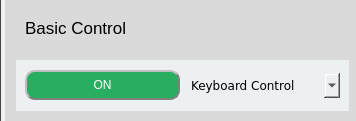
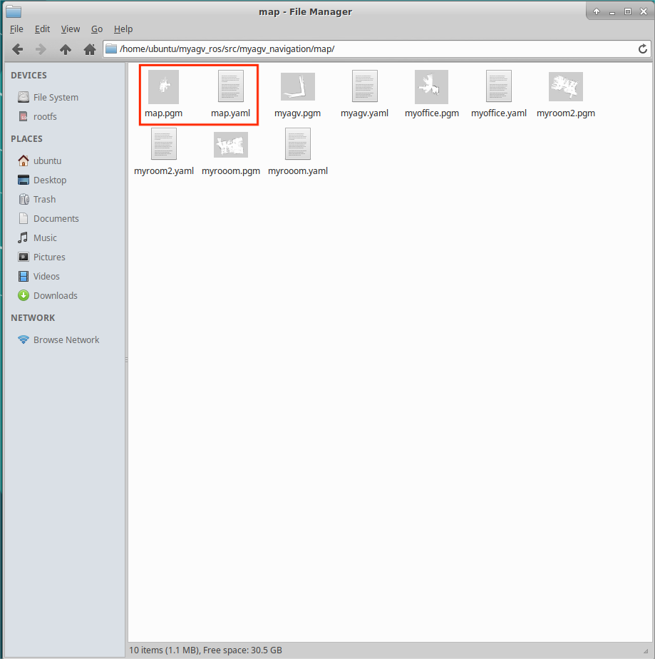

# myAgv 软件用户手册

## 运行程序

1. 克隆 github 的版本库：  
   `https://github.com/elephantrobotics/AGV_UI.git`
2. 切换到分支 **Visualize_OP** :  
   `git checkout Visualize_OP`
3. 安装所有依赖项：  
   `pip install -r requirements.txt`
4. 在终端中执行命令：  
   `python operations.py`

## 1. 切换语言

选择中文和英文，切换相应语言。

## 2. 激光雷达

- 点击按钮打开雷达。按钮变为红色，文字显示 "off"。
- myAgv 的雷达开始旋转。
- 桌面上会出现一个新终端，表明雷达已成功打开。  
   

**限制：**

- 雷达开启：可使用基本控制、制图、导航和地图保存功能。
- 雷达关闭：
  - 可使用 LED 灯光控制和测试功能
  - 在关闭雷达之前，您需要确保已关闭基本控制、映射和导航功能。

## 3. 基本控制

> 通过键盘和手柄控制机器移动有两种方法。

**准备：** 在开启基本控制功能之前，必须先开启雷达。如果雷达未打开，则会弹出提示框，显示 "Radar is not turned on"。

单击下拉框选择所需的控制方法，然后单击左侧的按钮打开。此时，桌面上会打开一个新的终端。

### 3.1 键盘控制

**方向键**

| 按键 | 路线指引   |
| :--- | :--------- |
| i    | 转发       |
| ，   | 后退       |
| j    | 向左移动   |
| l    | 向右移动   |
| u    | 逆时针旋转 |
| o    | 顺时针旋转 |
| k    | 停止       |

### 3.2 手柄控制

#### 2.1 手柄-字母型

> 手柄上有 7 个控制小车运动的按钮，如图所示，1~4 控制小车前后左右运动，5 控制小车逆时针旋转，6 控制小车顺时针旋转，7 是停止按钮。

---

#### 2.2 手柄-数字式

> 手柄上有 7 个控制小车运动的按钮，如图所示，1~4 控制小车前后左右运动，5 控制小车逆时针旋转，6 控制小车顺时针旋转，7 是停止按钮。

## 4. 地图和导航

**前提条件：**

- 打开雷达
- 打开键盘控制

如果未打开，则会弹出提示框，提示需要打开的项目。

### 4.1 构建地图

**构建地图有两种方法，即 Gmapping 和 Cartographer。**

#### Gmapping

点击下拉框选择 Gmapping 映射方法，然后点击 "Open Mapping"按钮开始映射。

- 桌面显示 rviz 界面。
- 选择打开的键盘终端，使用键盘控制汽车。rviz 空间将随着汽车的移动绘制地图。轨迹如图所示：
  

#### Cartographer

点击下拉框选择 Cartographer 映射方法，然后点击 "Open Mapping"按钮开始映射。

- 点击该按钮，将打开一个新的终端。如果终端一直滚动输出数据，则制图师构建文件已成功打开，终端会显示以下状态：
  
- 代码运行成功后，rviz 将被打开，地图和激光雷达信息将显示在 rviz 中，红色箭头为汽车行驶方向。界面如图所示。
  
- 选择打开的键盘终端，使用键盘控制汽车。rviz 空间将随着汽车的移动绘制地图。轨迹如图所示：
  

**限制：** 打开映射后无法使用导航功能；如果需要使用导航功能，请先关闭映射。

#### 4.1.1 保存地图

点击 "Save Map"按钮，桌面上会出现一个新的终端，显示保存的地图信息，如图所示。图中红圈部分就是保存的地图文件：

**默认保存路径在软件运行目录中。**

### 4.2 导航

### 先决条件

#### 1. 将保存的地图文件复制并粘贴到此路径中

> /home/ubuntu/myagv_ros/src/myagv_navigation/map/

#### 2. 修改启动文件

1. 点击左上角的 "Visual Studio Code"，打开代码编辑器。  
   

2. 打开/home/ubuntu/myagv_ros/src/myagv_navigation/launch/路径下的 navigation_active.launch 文件。  
   

3. 将第 5 行中的 myroom2.yaml 替换为我们自己的地图文件名 map.yaml。  
   

4. 保存修改后的文件并退出（VScode 运行时内存占用较大，建议修改代码后关闭 VScode，否则运行 carsystem 会非常卡顿，也可以使用 vim 或其他轻量级编辑器）。

**按照上述步骤操作后，根据所需的导航方法点击相应的按钮。**  
**Rviz 模拟窗口将打开。注意：最好在绘制地图时将汽车的初始位置置于汽车的起始位置。**

### 调整

如果 Rviz 界面上的汽车与实际汽车不一致，请单击顶部工具栏上的 "2D Pose Estimate（二维姿势估算）"进行调整，使 Rviz 界面上的汽车与实际汽车一致，并在调整后进行导航。

1. 点击顶部工具栏中的 "2D 导航目标"。

2. 在地图上点击我们要到达的点，汽车就会开始向目标点行驶，您还可以在 rviz 中看到汽车在起点和目标点之间的规划路径，汽车将沿着这条路线行驶到目标点。

**限制：**

- 您只能从导航和 3D 导航两种方法中选择一种。如果您需要使用另一种方法，请关闭当前方法。
- 打开导航后无法打开地图。如果您需要创建地图，请关闭导航。

## 5. LED 灯光控制

**前提条件：** 关闭雷达
使用圆盘选择光色，拖动滑块改变光色的亮度。图片右侧显示了相应的 HEX 和 RGB 值。

## 6. 测试功能

**限制：在测试期间，不能使用雷达、基本控制和地图导航模块。**

### 6.1 电机

**功能：** 检查电机是否能正常运行
**运行：**

- Select the 'Motor' from the drop-down box and click to start testing
- In this process, it is recommended to place myAgv on the ground for testing; during the process, it will go forward and backward for 4 seconds each, translate left and right for 4 seconds each, and rotate left and right for 8 seconds each.
- After all the above steps are executed, the detection is completed.

### 6.2 LED light

**Functions：** Check whether the Led light can operate normally  
**Running：**

- Select the 'LED' from the drop-down box and click to start testing
- Switch the red, orange, yellow, green, blue, and purple colors in sequence. If the color switching can be observed normally, the LED light is used normally.
- The display time of each color is 1s. After all colors are displayed normally, the detection is completed.

### 6.3 3D Camera

**Functions：** Check whether the 3D camera can operate normally  
**Running：**

- Select the '3D Camera' from the drop-down box and click to start testing
- A new window pops up to display the image captured by the camera; if the image can be displayed, the camera is operating normally.
- The screen is displayed for about 5 seconds, and then the window screen is automatically closed. Testing completed.

### 6.4 2D Camera

**Functions：** Check whether the 2D camera can operate normally  
**Running：**

- Select the '2D Camera' from the drop-down box and click to start testing
- A new window pops up to display the image captured by the camera; if the image can be displayed, the camera is operating normally.
- The screen is displayed for about 5 seconds, and then the window screen is automatically closed. Testing completed.

### 6.5 Pump

**Functions：** Check whether the pump can operate normally  
**Running：**

- Select the 'Pump' from the drop-down box and click to start testing
- The suction pump is turned on and turns off automatically after running for 4 seconds; at this time the detection is completed

### 6.6 Restore

  
**Functions：** Return the stalled motor to normal operation.
**Running：** Clicked the button as the picture shows above.

- Select the 'Pump' from the drop-down box and click to start testing
- The suction pump is turned on and turns off automatically after running for 4 seconds; at this time the detection is completed

## 7. Log Area

All the above operations will be displayed in the log area. Click the "Clear Button" on the right side of the icon to clear the current content.

## 8. Status Detection

**1、 IP Address:** Show current IP address  
**2、 Battery Information:** Display the currently connected battery information

- When connected, the green light and the corresponding power and voltage are displayed; when not connected, the display is gray and the value is 0.

**3、 Motor Current:** Shows whether there is current flowing through and the electricity value

- When the motor is in motion and there is current flowing through it, the motor will light up green and the page will display the current value; otherwise it will be gray.

**4、 Radar Detection:** Shows whether radar is on

- When the radar button is turned on, the green light turns on; when the radar button is turned off, the light turns off and turns gray.

---

[← Previous Page](../../README.md) | [Next Chapter →](../../5.3-FirmwareUse/5.3.1-FirmwareUpdateInfo.md)
