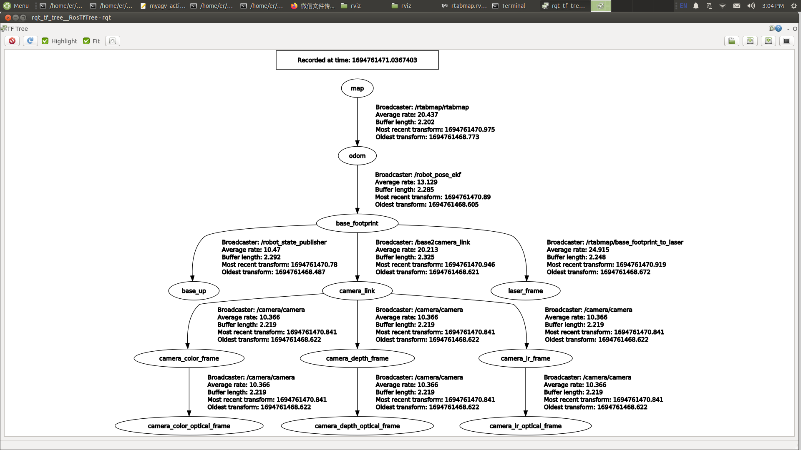

# 使用常见的 ROS 工具

- 启动文件

ROS 中的启动文件是同时启动多个节点的一种手段。它还能自动启动 ROS 主节点管理器，并方便对每个节点进行各种配置，为多个节点的运行提供极大的便利。

（1）`<launch>` 标签

`<launch>` 标签就像一个大括号，定义了一个特定区域。所有启动文件都以 `<launch>` 开始，以 `</launch>` 结束。所有描述性标记必须写在 `<launch>` 和 `</launch>` 之间。

```
<launch>
……
……
</launch>
```

（2）`<node>` 标签

在启动文件中， `<node>` 标签是最常见的标签之一。每个`<node>`标签都包含 ROS 图中节点名称（`name`）、节点所在软件包（`pkg`）和节点类型（`type`）的属性。常用格式如下：

```
<node pkg="package-name" type="executable-name" name="node-name" />
```

| 标签属性          | 属性功能                                                     |
| :---------------- | :----------------------------------------------------------- |
| name="NODE_NAME"  | 为节点指定名称，覆盖由 `ros::init()` 定义的 `node_name` 名称 |
| pkg="PACKAGE_NAME | 包含节点的软件包名称                                         |
| type="FILE_NAME"  | 节点的可执行文件名                                           |
| output="screen"   | 向终端屏幕输出节点的标准输出；默认为日志文件                 |
| respawn="true"    | 设置为 true 时，节点会在终止时自动重启；默认为 false         |
| ns = "NAME_SPACE" | 命名空间，为节点内的相对名称添加命名空间前缀                 |
| args="arguments"  | 节点所需的输入参数                                           |

（3）`<include>` 标签

该标签允许在当前文件中加入另一个 roslaunch XML 文件。

| 标签属性                                   | 属性功能         |
| :----------------------------------------- | :--------------- |
| file ="$(find pkg-name)/path/filename.xml" | 指定要包含的文件 |

e.g.

```
<include file="$(find demo)/launch/demo.launch" />
```

（4）`<remap>` 标签

顾名思义，`<remap>` 标签用于重新映射。ROS 支持主题的重新映射，`<remap>` 标签包括`original-name`和`new-name`，分别代表原名和新名。

例如，假设您有一个订阅"/chatter"主题的节点，但您自己的节点只能发布到"/demo/chatter"主题。由于这两个主题的消息类型相同，而你又想让这些节点进行通信，你可以在启动文件中写入以下内容：

```
<remap from="chatter" to="demo/chatter"/>
```

这样就可以直接将 /chattertopic 重新映射到 /demo/chatter，从而实现两个节点之间的通信，而无需修改任何代码。

（5）`<param>` 标签

`<param>` 标签的功能与命令行中的 rosparam set 命令类似。例如，在参数服务器中添加一个值为 1.0 的名为 demo_param 的参数。

```
<param name="demo_param" type="int" value="1.0"/>
```

（6）`<rosparam>` 标签

`<rosparam>` 标签允许从 YAML 文件一次性导入大量参数。

用法如下：

```
<rosparam command="load" file="$(find pkg-name)/path/name.yaml"/>
```

（7）`<arg>` 标签

"Argument" 是另一个概念，类似于启动文件中的局部变量，仅限于在启动文件中使用，目的是方便重构启动文件，与 ROS 节点内的实现无关。

要设置参数，请使用 <arg> 标记元素，语法如下：

```
<arg name="arg-name" default= "arg-value"/>
```

- Rviz

rviz 是一种三维可视化工具，能很好地兼容基于 ROS 软件框架的各种机器人平台。在 rviz 中，可以使用 XML 来描述机器人、周围物体和任何物理实体的属性，包括尺寸、质量、位置、材料、关节等，并将其直观地呈现在界面中。此外，rviz 还能以图形方式显示机器人传感器数据、机器人运动状态和周围环境变化等实时信息。总之，rviz 可以帮助开发人员实现所有可监控信息的图形化显示。开发人员还可以在 rviz 的控制界面中通过按钮、滑块、数字输入等方式控制机器人的行为。 下图显示了 rviz 在绘制地图过程中以图形方式显示的网格图、三维点云图和激光数据。


- Qt Toolbox

计算图可视化工具（rqt_graph）:  
rqt_graph 工具提供当前 ROS 系统中计算图的图形表示。要在运行图形构建功能时启动该工具，请使用以下命令：

```
rqt_graph
```

成功启动后，将显示计算图表，如下图所示。


TF 关系可视化工具 (rqt_tf_tree)

rqt_tf_tree 工具以图形方式显示运行节点之间的当前 TF 关系。要在运行图形构建功能时启动该工具，请使用以下命令：

```
rosrun rqt_tf_tree rqt_tf_tree
```

成功启动后，将显示 TF 关系图，如下图所示。



---

[← 上一页](6.2.2-ROS_Installation.md) | [下一页 →](6.2.4-Basic_Control_Based_on_ROS.md)
