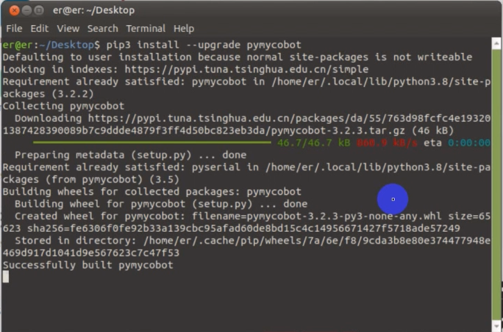
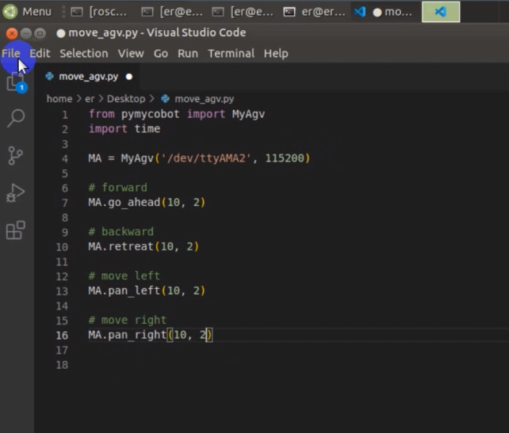

# 配置

pymycobot 是一个 Python 软件包，用于与 myCobot 进行串行通信。它支持 Python2、Python3.5 及更高版本。

使用 pymycobot 之前，请确保构建了 Python 环境。按照以下步骤安装 Python。

## 1 下载和安装 Python

目前，Python 有两个版本：2.x "和 "3.x"。这两个版本互不兼容。本节以版本 `3.x` 为例，因为它越来越受欢迎。

### 1.1 安装 Python

Raspberry Pi 版本自带 Ubuntu（V-20.04）系统和内置 Python 开发环境，因此无需构建和管理。

## 2 准备工作

在终端中输入以下命令

```
pip install --upgrade pymycobot
```



## 3 简单演示

创建一个新的 Python 文件，并键入以下代码。

```python
from pymycobot.myagv import MyAgv
import time

MA = MyAgv('/dev/ttyAMA2', 115200)

# 向前
MA.go_ahead(10,2)

# 向后
MA.retreat(10,2)

# 左移
MA.pan_left(10,2)

# 右移
MA.pan_right(10,2)
```



## 4 运行示例文件：

```
python3 move_agv.py
```

默认情况下，agv 会向四个方向移动 5 秒钟。

---

[← 上一页](README.md) | [下一页 →](6.1.2-API.md)
