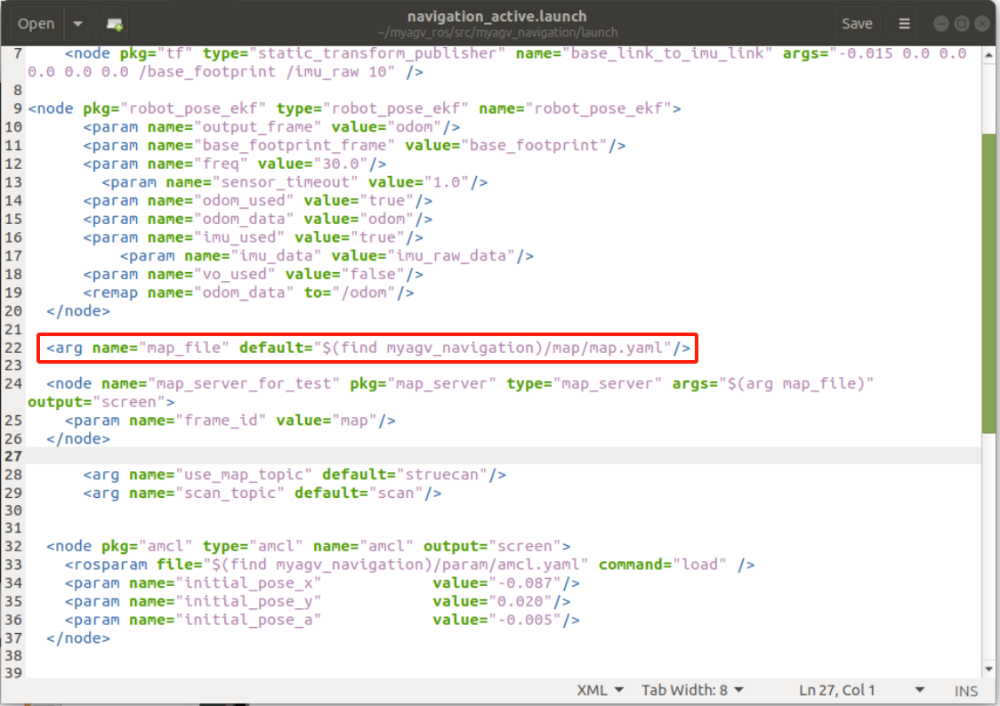

# 地图导航

在此之前，我们已经成功创建了空间地图，并获得了一组地图文件，即位于 ~/myagv_ros/src/myagv_navigation/map 目录下的 **map.pgm 和 map.yaml**。


现在，让我们看看如何使用创建的地图为小车导航。

- 1 修改启动文件

打开并编辑位于 ~/myagv_ros/src/myagv_navigation/launch/ 的 **navigation_active.launch** 文件。

```
cd ~/myagv_ros/src/myagv_navigation/launch
sudo gedit navigation_active.launch
```


找到参数 "map_file"，并**将 default="$(find myagv_navigation)/map/map.yaml "**替换为所需的导航参数文件。例如，如果要加载 **map_505.yaml**，则将 **/map/map.yaml** 更改为 **/map/map_505.yaml**。然后保存修改后的文件并退出。如果不做任何修改，系统将默认加载 **map.yaml** 文件。



- 2 运行启动文件

打开 myagv 电源后，打开终端控制台（快捷键：Ctrl+Alt+T）并输入以下命令：

```
roslaunch myagv_odometry myagv_active.launch
```

打开另一个终端控制台（快捷键：Ctrl+Alt+T）并输入以下命令：

```
roslaunch myagv_navigation navigation_active.launch
```


- 3 您将看到一个 Rviz 仿真窗口已经打开。

左下角导航控制面板说明

① 目标点的最大数量：您可以设置目标点的最大数量。设置的目标点数量不能超过此参数（但可以少于此参数）。

② 循环：如果选中此选项，则在导航到最后一个目标点后，机器人将导航回第一个目标点。例如：1 -> 2 -> 3 -> 1 -> 2 -> 3 -> ...开始导航前必须选中该选项。

③ 任务目标点列表：x/y/yaw，地图上给定目标点的姿态（xy 坐标和 yaw）。设置目标点最大数量并保存后，该列表将生成相应数量的条目。

④ 开始导航：开始任务。

⑤ 取消：取消当前目标点导航任务，机器人将停止移动。再次点击 "开始导航"，机器人将从下一个目标点继续前进。

例如：1 -> 2 -> 3。如果在 1 -> 2 过程中点击 "取消"，机器人将停止。再次点击 "开始导航"，机器人将从当前位置前进到 3。

⑥ 重置：清除所有当前目标点。


- 4 开始导航

设置任务的目标点数量，点击确认并保存。然后点击工具栏上的 "2D 导航目标"，在地图上定义目标点。（每次设置点时，都要先点击 "2D 导航目标"）。目标点区分方向，箭头代表车辆的航向。点击 "开始导航 "开始导航。在 Rviz 中，您将看到一条从起点到目标点的规划路径，车辆将沿着这条路线行驶到达目的地。


- 5 预防措施

**注意：建议将汽车的初始位置放在绘制地图时汽车所在的起点。如果需要修改起始位置，请按照以下步骤操作**。

点击顶部工具栏中的 "2D Pose Estimate（二维姿势估算）"调整位置，使 Rviz 界面中的汽车与实际汽车相匹配。然后，终端将返回汽车相对于地图的坐标和航向角。


打开并编辑位于"~/myagv_ros/src/myagv_navigation/launch/"中的 "navigation_active.launch "文件。找到 "amcl "节点，依次用终端返回的坐标和航向角替换 "initial_pose_x"、"initial_pose_y "和 "initial_pose_a"。再次启动 "navigation_active.launch "后，机器人的起始位置将被更新。


---

[← 上一页](6.2.6-Real-time_Mapping_with_Cartographer.md) | [下一页 →](../../7-ExamplesRobotsUsing/README.md)
