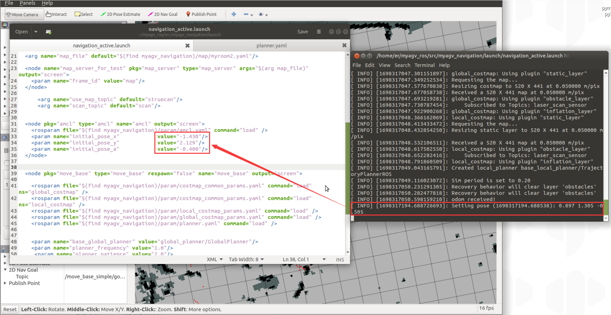

# 1.地图导航

在此之前，我们已经成功创建了空间地图，并获得了一组地图文件，即位于 ~/myagv_ros/src/myagv_navigation/map 目录下的 **map.pgm 和 map.yaml**。


现在，让我们看看如何使用创建的地图为小车导航。

- 1 修改启动文件

打开并编辑位于 ~/myagv_ros/src/myagv_navigation/launch/ 的 **navigation_active.launch** 文件。

```
cd ~/myagv_ros/src/myagv_navigation/launch
sudo gedit navigation_active.launch
```


找到参数 "map_file"，并**将 default="$(find myagv_navigation)/map/map.yaml "**替换为所需的导航参数文件。例如，如果要加载 **map_505.yaml**，则将 **/map/map.yaml** 更改为 **/map/map_505.yaml**。然后保存修改后的文件并退出。如果不做任何修改，系统将默认加载 **map.yaml** 文件。


- 2 运行启动文件

打开 myagv 电源后，打开终端控制台（快捷键：Ctrl+Alt+T）并输入以下命令：

```
roslaunch myagv_odometry myagv_active.launch
```

打开另一个终端控制台（快捷键：Ctrl+Alt+T）并输入以下命令：

```
roslaunch myagv_navigation navigation_active.launch
```


- 3 您将看到一个 Rviz 仿真窗口已经打开。

左下角导航控制面板说明

① 目标点的最大数量：您可以设置目标点的最大数量。设置的目标点数量不能超过此参数（但可以少于此参数）。

② 循环：如果选中此选项，则在导航到最后一个目标点后，机器人将导航回第一个目标点。例如：1 -> 2 -> 3 -> 1 -> 2 -> 3 -> ...开始导航前必须选中该选项。

③ 任务目标点列表：x/y/yaw，地图上给定目标点的姿态（xy 坐标和 yaw）。设置目标点最大数量并保存后，该列表将生成相应数量的条目。

④ 开始导航：开始任务。

⑤ 取消：取消当前目标点导航任务，机器人将停止移动。再次点击 "开始导航"，机器人将从下一个目标点继续前进。

例如：1 -> 2 -> 3。如果在 1 -> 2 过程中点击 "取消"，机器人将停止。再次点击 "开始导航"，机器人将从当前位置前进到 3。

⑥ 重置：清除所有当前目标点。


- 4 开始导航

设置任务的目标点数量，点击确认并保存。然后点击工具栏上的 "2D 导航目标"，在地图上定义目标点。（每次设置点时，都要先点击 "2D 导航目标"）。目标点区分方向，箭头代表车辆的航向。点击 "开始导航 "开始导航。在 Rviz 中，您将看到一条从起点到目标点的规划路径，车辆将沿着这条路线行驶到达目的地。


- 5 预防措施

**注意：建议将汽车的初始位置放在绘制地图时汽车所在的起点。如果需要修改起始位置，请按照以下步骤操作**。

点击顶部工具栏中的 "2D Pose Estimate（二维姿势估算）"调整位置，使 Rviz 界面中的汽车与实际汽车相匹配。然后，终端将返回汽车相对于地图的坐标和航向角。


打开并编辑位于"~/myagv_ros/src/myagv_navigation/launch/"中的 "navigation_active.launch "文件。找到 "amcl "节点，依次用终端返回的坐标和航向角替换 "initial_pose_x"、"initial_pose_y "和 "initial_pose_a"。再次启动 "navigation_active.launch "后，机器人的起始位置将被更新。



# 2.导航框架和导航原理


- move_base ROS节点，它是导航堆栈的主要组件。move_base订阅导航目标move_base_simple/goal,并实时发布运动控制信号cmd_vel，move_base中的各种导航算法模块都是以插件的形式进行调用的。
  - global_planner：用于全局路径规划。
  - local_planner：用于局部路径规划。
  - global_costmap：全局代价地图用于描述全局环境信息。
  - local_costmap：局部代价地图用于描述局部环境信息。
  - recovery_behaviors：恢复策略用于机器人碰到障碍后自动进行逃离恢复。
- amcl：利用粒子滤波算法实现机器人的全局定位，为机器人导航提供全局位置信息。
- odometry source：输入是里程计数据。
- map_server：通过调用SLAM建图得到的地图为导航提供环境地图信息。
- sensor sources：传感器数据，一般传入sensor_msgs/LaserScan二维激光雷达数据或者sensor_msgs/PointCloud三维点云数据，作用于代价地图上，以达到实时避障的效果。

## 2.1 move_base 

move_base 主要以两大规划器组成：global_planner和local_planner


- 全局路径规划(global_planner)：全局路径规划是根据给定的目标位置和全局地图进行总体路径的规划，在导航中，使用Dijkstra或A*算法进行全局路径的规划，计算出机器人到目标位置的最优路线，作为机器人的全局路线。
- 局部路径规划(local_planner)：在实际情况中，机器人往往无法严格按照全局路线行驶，所以需要针对地图信息和机器人附近随时可能出现的障碍物规划机器人每个周期内应该行驶的路线，使之尽量符合全局最优路径。局部路径规划由local_planner模块实现，使用 Dynamic Window Approaches (DWA)算法或者Trajectory Rollout算法搜索躲避和行进的多条路经，综合各评价标准(是否会撞击障碍物，所需要的时间等)选取最优路径，并且计算行驶周期内的线速度和角速度，避免与动态出现的障碍物发生碰撞。


下面分析`navigation_active.launch`文件


可以看到启动`move_base`节点，加载了很多`.yaml`文件，下面介绍该部分参数的含义，`move_base`的导航参数放在`myagv_navigation/param`下，主要区别在于局部路径规划器的参数不同，下面以base_local_planner局部路径规划器作为讲解。


### 2.1.1 base_global_planner_params.yaml

```xml
# Planner selection
base_global_planner: "global_planner/GlobalPlanner"  

GlobalPlanner:                                  # Also see: http://wiki.ros.org/global_planner
  old_navfn_behavior: false                     # Exactly mirror behavior of navfn, use defaults for other boolean parameters, default false
  use_quadratic: true                           # Use the quadratic approximation of the potential. Otherwise, use a simpler calculation, default true
  use_dijkstra: true                            # Use dijkstra's algorithm. Otherwise, A*, default true
  use_grid_path: false                          # Create a path that follows the grid boundaries. Otherwise, use a gradient descent method, default false
  
  allow_unknown:  true                          # Allow planner to plan through unknown space, default true
                                                #Needs to have track_unknown_space: true in the obstacle / voxel layer (in costmap_commons_param) to work
  planner_window_x: 0.0                         # default 0.0
  planner_window_y: 0.0                         # default 0.0
  default_tolerance: 0.0                        # If goal in obstacle, plan to the closest point in radius default_tolerance, default 0.0
  lethal_cost: 253                              
  neutral_cost: 66                              
  cost_factor: 0.55    
```

```xml
base_global_planner: "global_planner/GlobalPlanner"  
```

全局路径规划插件

- [navfn](http://wiki.ros.org/navfn)：基于栅格地图的全局规划器，使用导航功能时计算机器人的路径。实现了dijkstra和A*全局规划算法。(插件名："navfn/NavfnROS")
- [global_planner](http://wiki.ros.org/global_planner)：重新实现了Dijkstra和A*全局路径规划算法,可以看作navfn的改进版。(插件名："global_planner/GlobalPlanner")
- [carrot_planner](http://wiki.ros.org/carrot_planner)：一个简单的全局路径规划器，它获取用户指定的目标点，并尝试将机器人移动到尽可能靠近它的位置，即使目标点位于障碍物中。(插件名："carrot_planner/CarrotPlanner")

```xml
GlobalPlanner:                                  # Also see: http://wiki.ros.org/global_planner
  old_navfn_behavior: false                     # Exactly mirror behavior of navfn, use defaults for other boolean parameters, default false
  use_quadratic: true                           # Use the quadratic approximation of the potential. Otherwise, use a simpler calculation, default true
  use_dijkstra: true                            # Use dijkstra's algorithm. Otherwise, A*, default true
  use_grid_path: false                          # Create a path that follows the grid boundaries. Otherwise, use a gradient descent method, default false
  
  allow_unknown:  true                          # Allow planner to plan through unknown space, default true
                                                #Needs to have track_unknown_space: true in the obstacle / voxel layer (in costmap_commons_param) to work
  planner_window_x: 0.0                         # default 0.0
  planner_window_y: 0.0                         # default 0.0
  default_tolerance: 0.0                        # If goal in obstacle, plan to the closest point in radius default_tolerance, default 0.0
  lethal_cost: 253                              
  neutral_cost: 66                              
  cost_factor: 0.55    
```

参数解析

- old_navfn_behavior：如果你想要让global_planner跟之前的navfn版本效果一样，就设true，所以不建议设置为true。
- use_quadratic：设置为true，将使用二次函数近似函数，否则使用更加简单的计算方式，这样节省硬件计算资源。
- use_dijkstra：如果为true，则使用dijkstra算法。否则，A*。
- use_grid_path：如果为true，则创建沿栅格边界的路径。否则，使用梯度下降法，路径更为光滑点。
- allow_unknown：是否选择探索未知区域。只设计该参数为true还不行，还要在costmap_commons_params.yaml中设置`track_unknown_space`必须同样设置为`true`。
- default_tolerance：当设置的目的地被障碍物占据时,需要以该参数为半径寻找到最近的点作为新目的地点。
- lethal_cost：障碍物致命区域的代价数值。
- neutral_cost：障碍物中等代价值。
- cost_factor：代价地图与每个代价值相乘的系数。

所有参数都是默认值


use_grid_path=True


use_quadratic=False


use_dijkstra=False


Dijkstra


A*


old_navfn_behavior=True


除了这些参数之外，还有三个未列出的参数实际上决定了规划全局路径的质量。它们是成本因子、中性成本和致命成本。实际上，这些参数也存在于navfn中。源代码2中有一段解释了navfn如何计算成本值。

navfn 的代价值设置为
代价 = 代价中性 (COST NEUTRAL) + 代价因子 (COST FACTOR) * 代价地图代价值。

传入的代价地图代价值范围为 0 到 252。注释还指出：
当代价中性 (COST NEUTRAL) 为 50 时，代价因子 (COST FACTOR) 需要约为 0.8，以确保输入值均匀分布在输出范围 50 到
253 上。如果代价因子 (COST FACTOR) 较高，代价值会在障碍物附近趋于稳定，因此规划器会将（例如）整个狭窄走廊的宽度视为同样不理想，因此不会规划沿中心的路径。

实验观察：实验证实了这一解释。将代价因子设置得过低或过高都会降低路径的质量。这些路径不会穿过两侧障碍物的中间，并且曲率相对平坦。

极端的中性代价值也会产生同样的效果。对于致命成本，将其设置为较低的值可能会导致无法生成任何路径，即使可行路径显而易见。下图显示了成本因子和中性成本对全局路径规划的影响。


### 2.1.2 base_local_planner_params.yaml

```xml
TrajectoryPlannerROS:
  # Robot Configuration Parameters
  acc_lim_x: 2
  acc_lim_theta: 0.5 #2
  acc_lim_y: 0.0

  max_vel_x: 0.2
  min_vel_x: 0.01

  max_vel_theta: 0.1 #0.5
  min_vel_theta: -0.1 #-0.5
  min_in_place_vel_theta: 0.25

  holonomic_robot:  false
  escape_vel: -0.0

  # Goal Tolerance Parameters
  yaw_goal_tolerance: 0.25
  xy_goal_tolerance: 0.25
  trans_stopped_vel: 0.05
  theta_stopped_vel: 0.01
  latch_xy_goal_tolerance: false

  # Forward Simulation Parameters
  sim_time: 0.6
  sim_granularity: 0.02
  angular_sim_granularity: 0.02
  vx_samples: 3
  vtheta_samples: 20
  controller_frequency: 5.0

  # Trajectory scoring parameters
  meter_scoring: true # Whether the gdist_scale and pdist_scale parameters should assume that goal_distance and path_distance are expressed in units of meters or cells. Cells are assumed by default (false).
  occdist_scale:  0.1 #The weighting for how much the controller should attempt to avoid obstacles. default 0.01
  path_distance_bias: 2.5  #     The weighting for how much the controller should stay close to the path it was given . default 0.6
  goal_distance_bias: 1.0 #     The weighting for how much the controller should attempt to reach its local goal, also controls speed  default 0.8

  heading_lookahead: 0.325  #How far to look ahead in meters when scoring different in-place-rotation trajectories
  heading_scoring: false  #Whether to score based on the robot's heading to the path or its distance from the path. default false
  heading_scoring_timestep: 0.8   #How far to look ahead in time in seconds along the simulated trajectory when using heading scoring (double, default: 0.8)
  dwa: false #Whether to use the Dynamic Window Approach (DWA)_ or whether to use Trajectory Rollout
  simple_attractor: false
  publish_cost_grid_pc: true  

  # Oscillation Prevention Parameters
  oscillation_reset_dist: 0.02 #How far the robot must travel in meters before oscillation flags are reset (double, default: 0.05)
  escape_reset_dist: 0.05
  escape_reset_theta: 0.05
```
机器人配置参数

- acc_lim_x：机器人的x加速度极限（单位：m/s^2）。
- acc_lim_y：y方向的加速度绝对值（单位：m/s^2），注意：该值只有全向移动的机器人才需配置。
- acc_lim_th：旋转加速度的绝对值（单位：rad/s^2）。
- max_vel_trans：平移速度最大值绝对值（单位：m/s）。
- min_vel_trans：平移速度最小值的绝对值（单位：m/s）。
- max_vel_x：x方向最大速度的绝对值（单位：m/s）。
- min_vel_x：x方向最小值绝对值（单位：m/s），如果为负值表示可以后退。
- max_vel_y：y方向最大速度的绝对值（单位：m/s）。
- min_vel_y：y方向最小速度的绝对值（单位：m/s）。
- max_rot_vel：最大旋转速度的绝对值（单位：rad/s）。
- min_rot_vel：最小旋转速度的绝对值（单位：rad/s）。

目标容差参数

- yaw_goal_tolerance：到达目标点时，偏行角允许的误差（单位：rad）。
- xy_goal_tolerance：到达目标点时，在x&y距离内允许的公差（单位：m）。
- latch_xy_goal_tolerance：设置为true，如果到达容错距离内，机器人就会原地旋转，即使转动跑出容错距离外。

正向模拟参数

- sim_time：向前仿真轨迹的时间（单位：s）。
- sim_granularity：给定轨迹上各点之间的步长（单位：m）。
- vx_samples：x方向速度空间的采样点数。
- vy_samples：y方向速度空间采样点数。
- vth_samples：旋转方向的速度空间采样点数。
- controller_frequency：调用此控制器的频率（单位：Hz）。

轨迹评分参数

- path_distance_bias：定义控制器与给定路径接近程度的权重。
- goal_distance_bias：定义控制器与局部目标点的接近程度的权重。
- occdist_scale：定义控制器躲避障碍物的权重。
- forward_point_distance：从机器人中心点到放置额外计分点的距离（单位：m）。
- stop_time_buffer：碰撞前机器人必须提前停止的时间长度（单位：s）。
- scaling_speed：启动缩放机器人底盘的速度（单位：m/s）。
- max_scaling_factor：机器人底盘的最大缩放参数。
- publish_cost_grid：是否发布规划器在规划路径时的代价网格。如果设置为true，那么就会在~/cost_cloud话题上发布sensor_msgs/PointCloud2类型消息。

防振参数

- oscillation_reset_dist：机器人运动多远距离才会重置振荡标记（单位：m）。

全局规划参数

- prune_plan：机器人前进时，是否清除身后1m外的轨迹。


## 2.1.3 costmap_2D

costmap_2d这个包提供了一种2D代价地图的实现方案，该方案利用输入的传感器数据，构建数据2D或者3D代价地图（取决于是否使用基于voxel的实现），并根据占用网格和用户定义的膨胀半径计算2D代价地图的代价。 两种代价地图需要使用一些共用的或者独立的配置文件：通用配置文件（costmap_common_params.yaml）、全局代价地图配置文件（global_costmap_params.yaml）和局部代价地图配置文件（local_costmap_params.yaml）。


> costmap_common_params.yaml

```
footprint: [[0.17, 0.12], [0.17,-0.12], [-0.17, -0.12], [-0.17, 0.12]]
footprint_padding: 0.01

transform_tolerance: 0.2


always_send_full_costmap: true

obstacle_layer:
  enabled: true

  obstacle_range: 2.0 #2
  raytrace_range: 2.0 #2
  inflation_radius: 0.04
  combination_method: 1
  observation_sources: laser_scan_sensor 
  track_unknown_space: true

  laser_scan_sensor:
    data_type: LaserScan
    topic: /scan
    marking: true
    clearing: true


inflation_layer:
  enabled: true
  cost_scaling_factor: 5.0 #10
  inflation_radius: 0.25

static_layer:
  enabled: true
  map_topic:  "/map"
```

下面分析这个yaml参数

```
footprint: [[0.17, 0.12], [0.17,-0.12], [-0.17, -0.12], [-0.17, 0.12]]
footprint_padding: 0.01
transform_tolerance: 0.2
always_send_full_costmap: true
```

- `footprint`：定义机器人底盘的形状（多边形），这里表示一个大致为 **长 0.34m、宽 0.24m 的矩形**，这个底盘尺寸定义尽量要比实际机器人大。
- `footprint_padding`：在代价地图中给机器人“体型”增加的额外安全空间（0.01米）。
- `transform_tolerance: 0.2`：等待 TF 变换的容忍时间（秒），用于同步坐标转换，防止因延迟导致导航失败。
- `always_send_full_costmap: true`：每次更新都发送完整的代价地图，而不仅是变化的部分（用于调试或确保显示完整地图时使用）。

```
obstacle_layer:
  enabled: true
  obstacle_range: 2.0
  raytrace_range: 2.0
  inflation_radius: 0.04
  combination_method: 1
  observation_sources: laser_scan_sensor 
  track_unknown_space: true
  laser_scan_sensor:
    data_type: LaserScan
    topic: /scan
    marking: true
    clearing: true
```
`enabled`: 启用obstacle_layer（障碍物层）。

`obstacle_range`: 最大可检测障碍物的距离。

`raytrace_range`: 射线清除范围（用于清除不可见的障碍物）。

`inflation_radius`: 该层自己的膨胀半径（通常较小，仅用于传递）。

`combination_method`: 融合不同图层的方法（1 表示最大值）。

`track_unknown_space`: 是否将未知区域视为障碍物。

`laser_scan_sensor`: 使用激光扫描 `/scan` 话题数据构建障碍物信息。

`marking`: 标记障碍物。

`clearing`: 使用激光射线清除障碍物。

```
inflation_layer:
  enabled: true
  cost_scaling_factor: 5.0
  inflation_radius: 0.25
```
`enabled`: 启用inflation_layer（膨胀层）。

`cost_scaling_factor`: 膨胀代价的衰减系数（越大，膨胀边缘代价下降越快）。

`inflation_radius`: 从障碍物边缘向外膨胀的最大半径。

```
static_layer:
  enabled: true
  map_topic: "/map"
```
`enabled`: 启用static_layer（静态地图层）。

`map_topic:`使用 /map 提供的静态地图。

> global_costmap_params.yaml
```
global_costmap:
  global_frame: map
  robot_base_frame: base_footprint
  static_map: true
  update_frequency: 0.3
  publish_frequency:  0.3
  rolling_window: false
  transform_tolerance: 1

  plugins:
     - {name: static_layer, type: 'costmap_2d::StaticLayer'}
     - {name: obstacle_layer, type: 'costmap_2d::VoxelLayer'}
     - {name: inflation_layer, type: 'costmap_2d::InflationLayer'}
```

`marking`: 标记障碍物。

`clearing`: 使用激光射线清除障碍物。

`global_frame`: 使用的全局参考坐标系，一般设为 `/map`。

`robot_base_frame`: 机器人的基础坐标系，通常为 `base_footprint`。

`static_map`: 是否启用静态地图（通常由SLAM 提供）。

`update_frequency`: 地图更新频率（Hz），全局地图不需频繁更新。

`publish_frequency`: 发布频率（Hz），用于可视化。

`rolling_window`: 是否启用滚动窗口，设为 `false` 表示地图固定。

`transform_tolerance`: TF 时间容忍度（单位：秒）。

插件层

`static_layer`: 加载静态地图（地图中的永久性障碍物）。
`obstacle_layer`: 使用上述激光扫描 `/scan` 话题数据构建障碍物信息记录障碍物，适用于点云数据。
`inflation_layer`: 对障碍物进行膨胀处理，生成导航安全区。

> local_costmap_params.yaml
```
local_costmap:
   global_frame: map
   robot_base_frame: base_footprint
   update_frequency: 0.3
   publish_frequency: 2.0
   rolling_window: true
   width: 3.0
   height: 3.0
   resolution: 0.02
   transform_tolerance: 1.2
   inflation_radius: 0.25

   plugins:
   - {name: static_layer,        type: "costmap_2d::StaticLayer"}
   - {name: obstacle_layer,      type: "costmap_2d::ObstacleLayer"}
   - {name: inflation_layer,     type: "costmap_2d::InflationLayer"}
```

`global_frame`: 地图参考坐标，通常使用 `map` 或 `odom`。

`robot_base_frame`: 机器人底盘坐标系。

`update_frequency`: 地图更新频率，实时性重要时建议略高。

`publish_frequency`: 发布频率，较高有助于RViz可视化。

`rolling_window`: 启用滚动窗口，局部地图始终以机器人为中心。

`width`: 局部地图宽度（米）。

`height`: 局部地图高度（米）。

`resolution`: 地图分辨率（每格 2 厘米）。

`transform_tolerance`: TF 延迟容忍时间（单位秒）。

`inflation_radius`: 膨胀半径，用于局部避障安全边界。

插件层

`static_layer`: 加载静态地图（地图中的永久性障碍物）。
`obstacle_layer`: 使用上述激光扫描 `/scan` 话题数据构建障碍物信息记录障碍物，适用于点云数据。
`inflation_layer`: 对障碍物进行膨胀处理，生成导航安全区。

## 2.1.5 更多调参指南

`myagv_navigation/param`里的参数会影响导航的效果，

使用ros的动态调参工具

```
rosrun rqt_reconfigure rqt_reconfigure
```

可以根据自身需求调整，并观察机器人运动状态，直到效果最优，记录当前参数，并修改至`myagv_navigation/param`文件里。

您可以从 [基本导航调优指南](https://wiki.ros.org/navigation/Tutorials/Navigation%20Tuning%20Guide)、[Kaiyu Zheng 编写的 ROS 导航调优指南](http://kaiyuzheng.me/documents/navguide.pdf) 获取有关导航调优的更多信息。


---

[← 上一页](6.2.6-Real-time_Mapping_with_Cartographer.md) | [下一页 →](../../7-ExamplesRobotsUsing/280pi.md)
