# myAGV+280Pi复合机器人


## 1 硬件安装


### 安装机械臂

首先需要将机械臂安装到 myAGV，可使用乐高键或螺丝将机械臂安装在 myAGV 上部的位置，可以根据自己需求安装在前部或后部。


### 连接机械臂

使用 DC 电源线连接到机械臂供电接口，另一端连接机械臂电源接口，小车可以给机械臂供电（12V 5A）。


举例：myCobot280 Pi，其他 Pi 机械臂同理。

1.用六角扳手将这四颗 m4\*8 内六角螺丝拆卸下来


2.将 myCobot 280Pi 机械臂的 X 轴对应的正确方向进行安装，并拧上四颗 m4\*8 固定 280Pi。

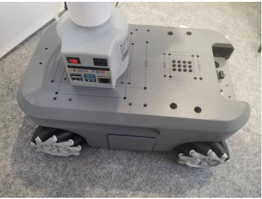

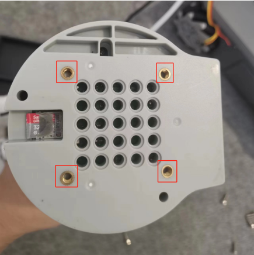


### 电源连接

将12V电源线带端子的一头接到AGV的12V输出接口上


另一端接到机器人的电源输入上

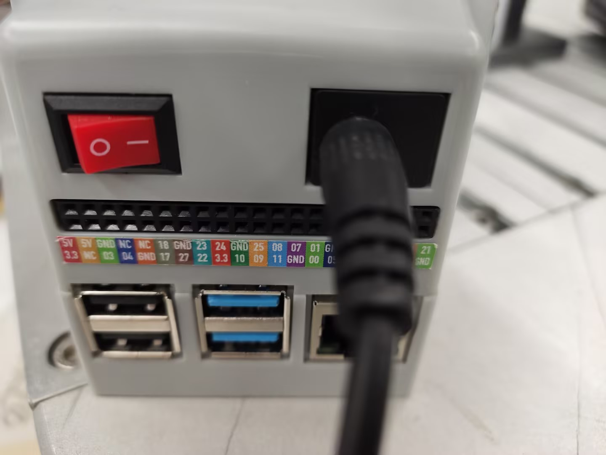

## 2 软件连接
机械臂和AGV在外接显示器和键盘鼠标后，先连接到同一个wifi热点下


然后机械臂先要运行服务器脚本，打开终端运行下面命令
```bash
python Server.py
```
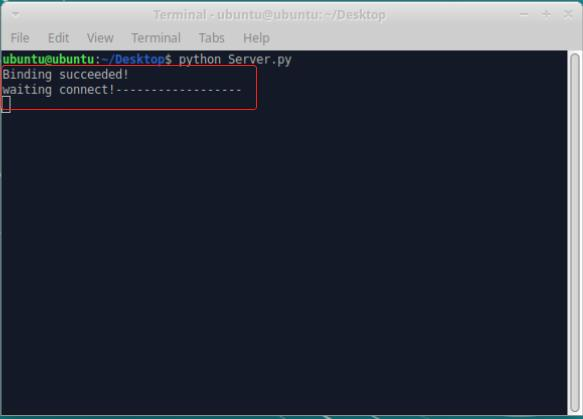

**SSH 远程**
使用SSH后，即可脱离显示器进行操作
下载 MobaXterm 软件：https://mobaxterm.mobatek.net/download.html
打开 MobaXterm 软件，按照以下步骤：


点击SSH图标
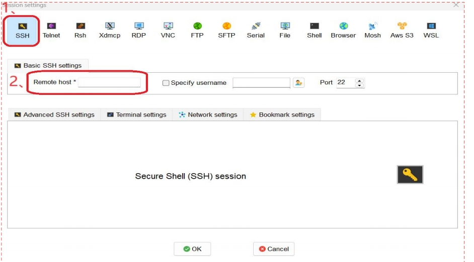

输入myAGV的IP地址（例如：192.168.123.26），然后点击OK，出现下图界面，点击对应IP进行密码登录。
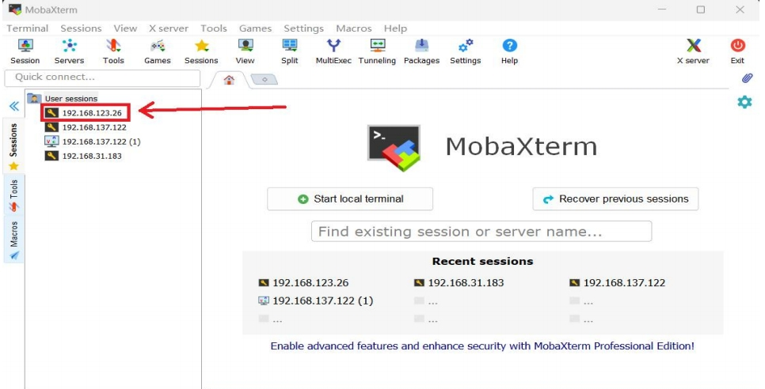

在该界面键盘输入用户名：er，密码：Elephant
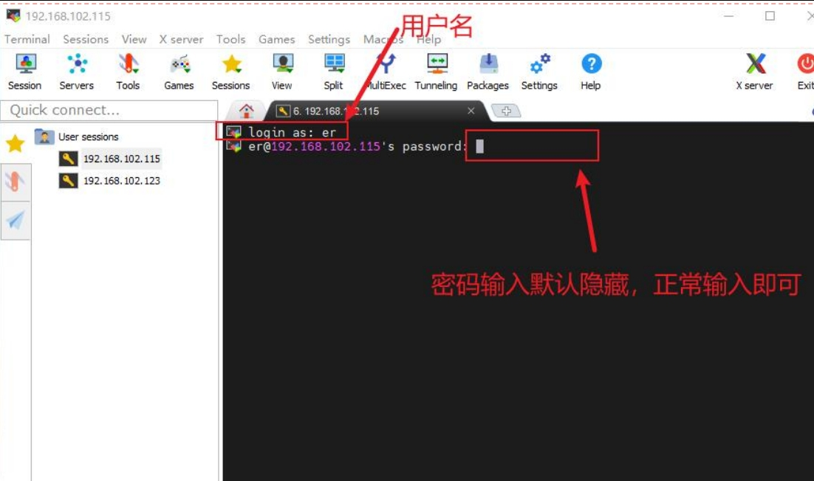

连接成功如下图所示
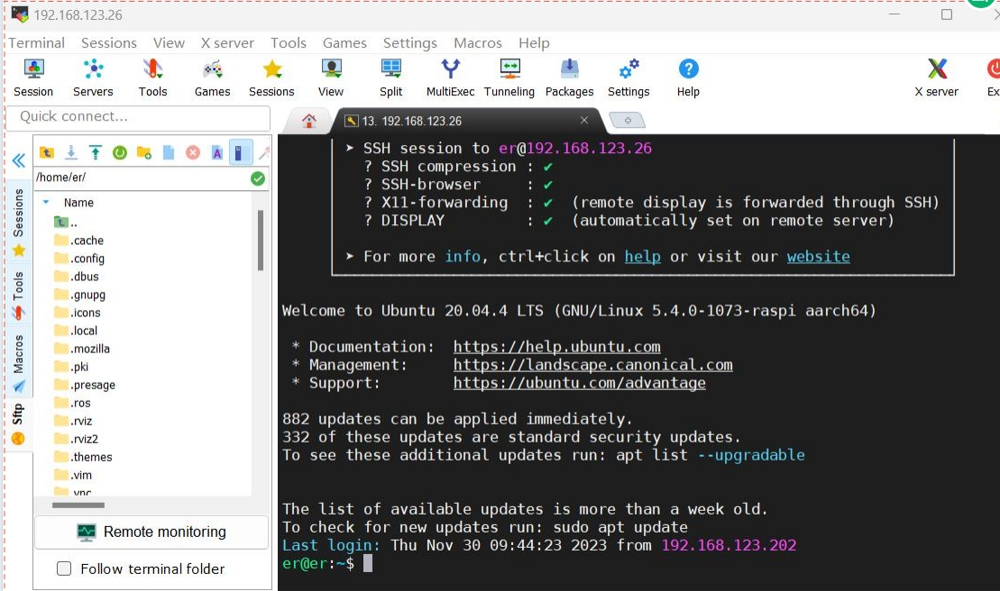

# 3 单元测试


## 机械臂测试
在AGV上新建一个python脚本，然后复制下面的内容后运行脚本， 
```python

from pymycobot import MyCobotSocket
import time
arm=MyCobotSocket("192.168.1.248")#填写机械臂的无线IP
arm.send_angles([0,0,0,0,0,0],50)#机械臂回到各个关节的零点位置
time.sleep(2)
arm.send_angles([0,0,0,0,0,-90],50)#机械臂关节6移动-90°
```

## AGV测试
**启动小车控制节点**
```bash
//跳转到激光雷达启动目录
cd myagv_ros/src/myagv_odometry/scripts
//上电使能雷达,上电后雷达就会通过串口发送数据
./start_ydlidar.sh
```


**启动键盘控制节点**
```bash
roslaunch myagv_odometry myagv_active.launch

```


| 按键 | 方向               |
| :--- | :----------------- |
| i    | 向前移动           |
| ,    | 向后移动           |
| j    | 向左移动           |
| l    | 向右移动           |
| u    | 逆时针旋转         |
| o    | 顺时针旋转         |
| k    | 停止               |
| m    | 顺时针反向旋转     |
| .    | 逆时针反向旋转     |
| q    | 提高线速度和角速度 |
| z    | 降低线速度和角速度 |
| w    | 提高线速度         |
| x    | 降低线速度         |
| e    | 增加角速度         |
| c    | 降低角速度         |

**启动建图节点**

```bash
roslaunch myagv_navigation myagv_slam_laser.launch

```

**注意**：使用键盘操作小车时，请确保运行 myagv_teleop.launch 文件的终端是当前选定的终端；否则，键盘控制程序将无法识别按键。

**启动保存地图节点**
在地图建好后，运行下面指令保存建好的地图
```bash
rosrun map_server map_saver -f /home/er/myagv_ros/src/myagv_navigation/map/map
```


# 4 复合应用
**启动导航节点**
```bash
roslaunch myagv_navigation navigation_active.launch
```


点击顶部工具栏的“2D Pose Estimate” 进行调整，使得Rviz界面的小车和实现的小车可对应上
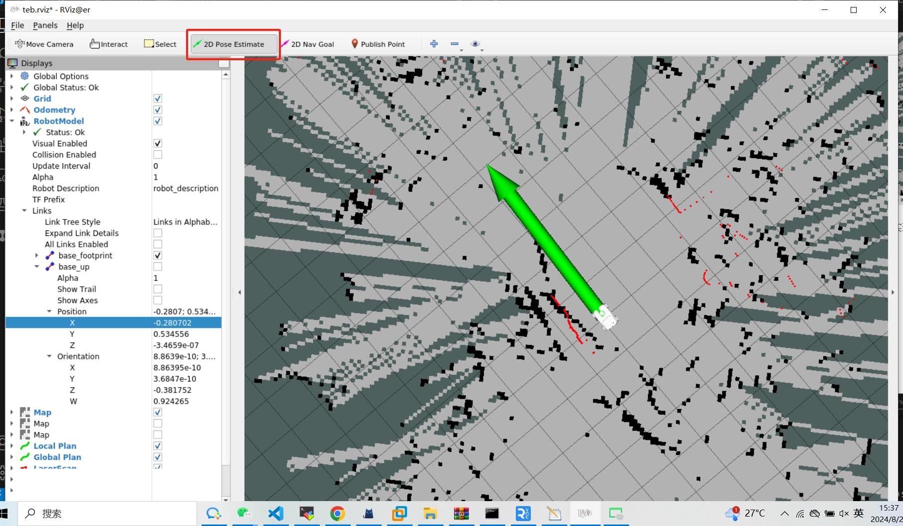

使用键盘节点将AGV开往目的地，点击RobotModel,并记录下AGV在目的地的位姿信息，之后再用键盘节点将AGV驶离目的地
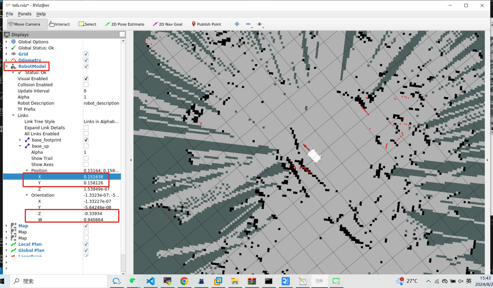


然后先新建一个python脚本，将下面内容复制到脚本内，之后在当前路径运行脚本即可
```python
#!/usr/bin/env python

import rospy
import actionlib
from move_base_msgs.msg import MoveBaseAction, MoveBaseGoal
from geometry_msgs.msg import Pose, Point, Quaternion
import time
from pymycobot import MyCobotSocket
m=MyCobotSocket("192.168.1.232")#填写机械臂的无线IP

def send_goal(x, y,z,w frame_id='map'):
    
    rospy.init_node('send_goal_node', anonymous=True)
    
    
    client = actionlib.SimpleActionClient('move_base', MoveBaseAction)
    
    
    rospy.loginfo("Waiting for move_base action server to start...")
    client.wait_for_server()
    rospy.loginfo("Connected to move_base server")
    
    
    goal = MoveBaseGoal()
    
    
    goal.target_pose.header.frame_id = frame_id
    goal.target_pose.header.stamp = rospy.Time.now()
    
    goal.target_pose.pose.position = Point(x, y, 0.0)
    goal.target_pose.pose.orientation = Quaternion(0.0, 0.0,z,w)
    
    
    rospy.loginfo("Sending goal")
    client.send_goal(goal)
    
   
    wait = client.wait_for_result()
    
    if wait:
        result = client.get_result()
        if client.get_state() == actionlib.GoalStatus.SUCCEEDED:
            rospy.loginfo("Goal reached successfully!")
            m.sync_send_angles([0,0,0,0,0,0],50)#AGV到达目标后执行关节回到零位动作
        else:
            rospy.loginfo("Failed to reach the goal.")
    else:
        rospy.loginfo("Action server not available!")

if __name__ == '__main__':
    try:
        # Example goal positions
        #依次填写记录下的Position的X,Y和Orientation的Z,W
        send_goal(0.144428, 0.152124,-0.390851,0.920454)
        
    except rospy.ROSInterruptException:
        rospy.loginfo("Navigation test interrupted.")

```
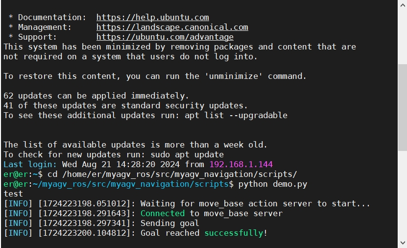

# 5 效果展示
AGV会从当前位置导航到目的地，在成功到达目的地后，机械臂会执行各个关节回到零位的动作


